# KidsBlock_教程

---

## 1. KidsBlock 软件的下载、安装和使用方法

参考链接：[https://www.keyesrobot.cn/projects/KidsBlock/en/latest/](https://www.keyesrobot.cn/projects/KidsBlock/en/latest/)

注意：本教程选用的是“**Keyes STEM development board**”主控板，打开KidsBlock软件，点击进入**设备**选择页面，找到并点击选中““**Keyes STEM development board**”主控板，这样就可以进入对应的编程界面。

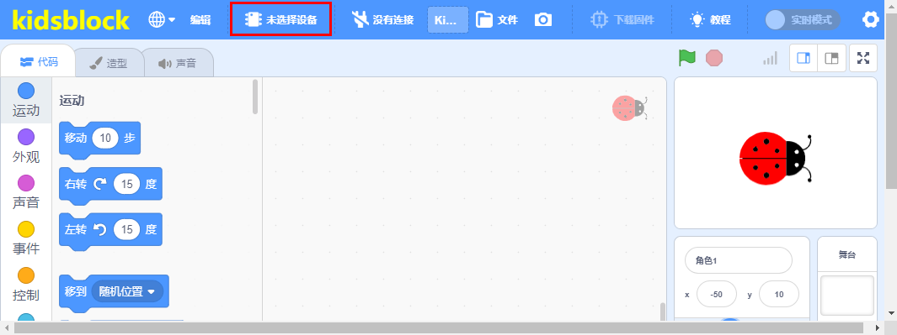

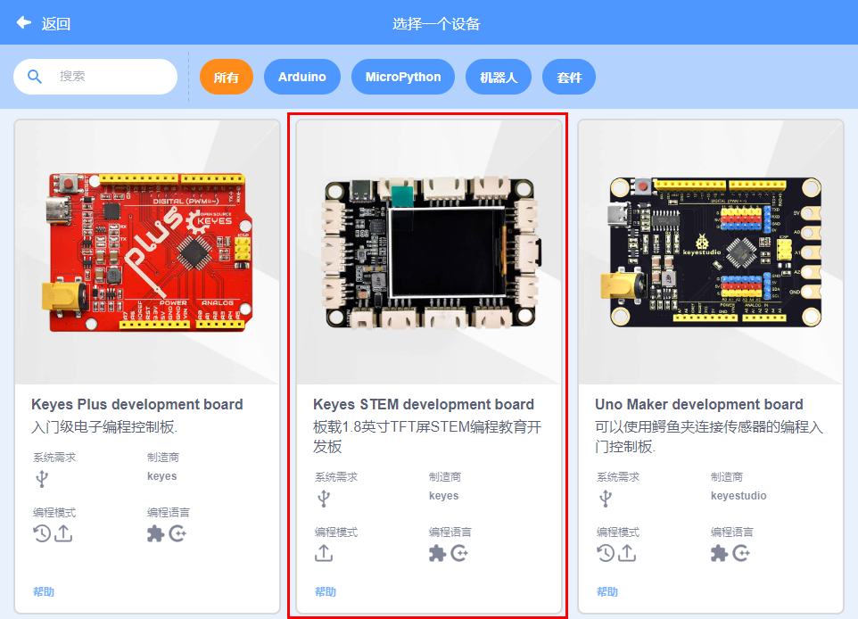

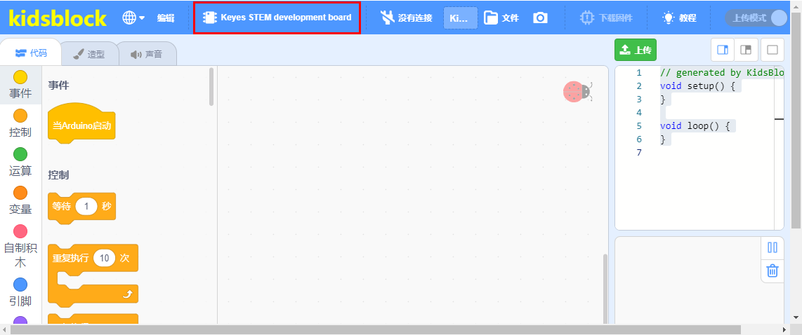

将主板用USB线连接接到电脑上，然后点击来连接对应的串口端口。

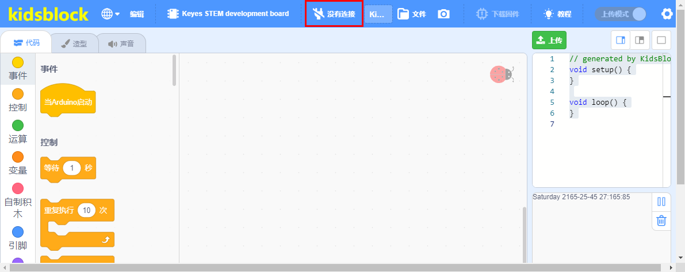

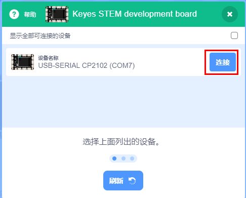

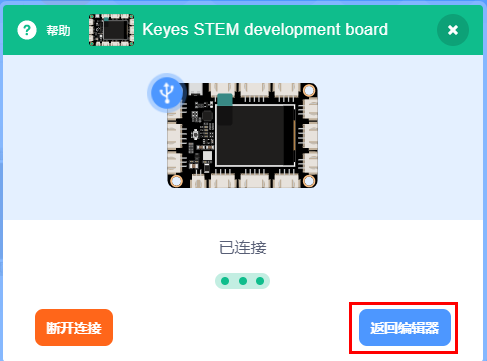

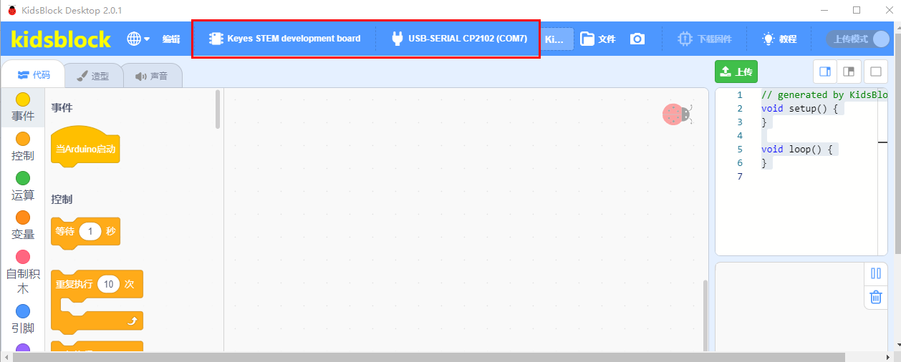

---

## 2. 添加 KidsBlock 库文件

在前面(即第1步)操作完后，在编程界面左下角点击进入库文件添加界面。

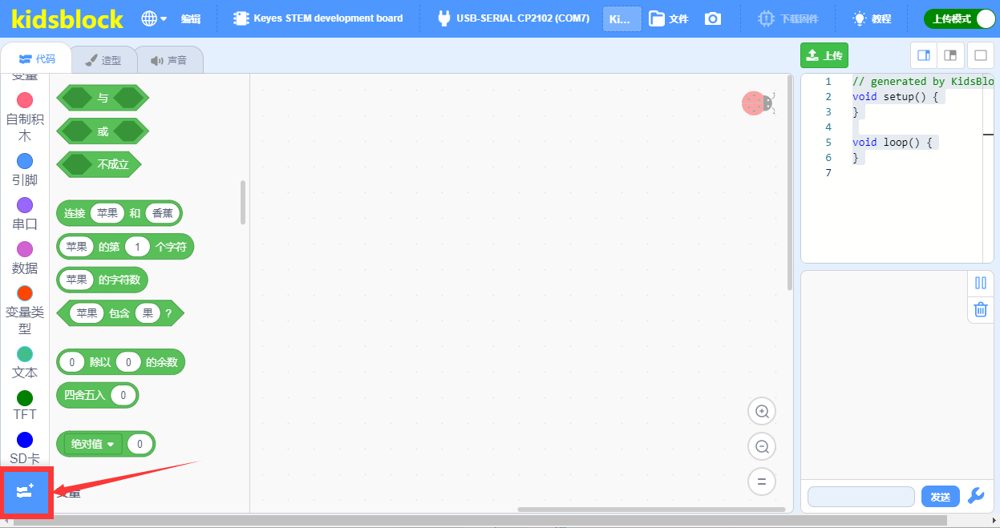

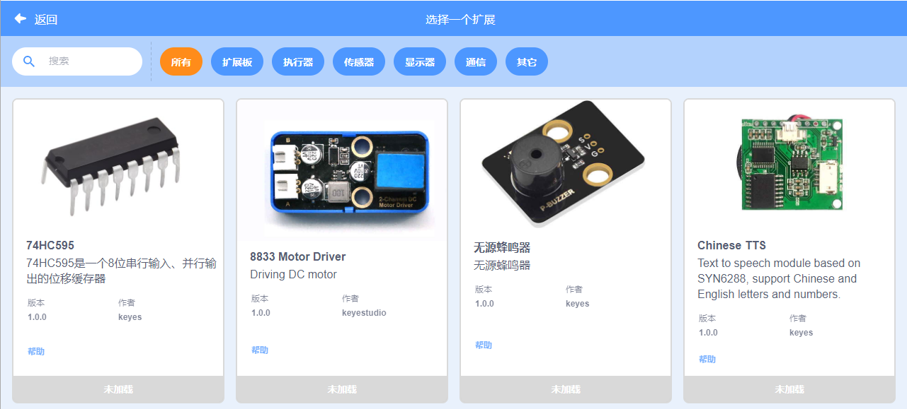

点击“**执行器**”，寻找到“**无源蜂鸣器**”，“**直流电机**”和“**舵机**”并且分别点击选中。

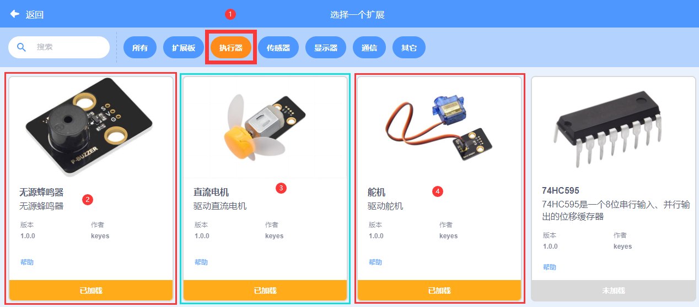

点击“**传感器**”，寻找到“**DHTsensor**”和“**超声波传感器**”并且分别点击选中。

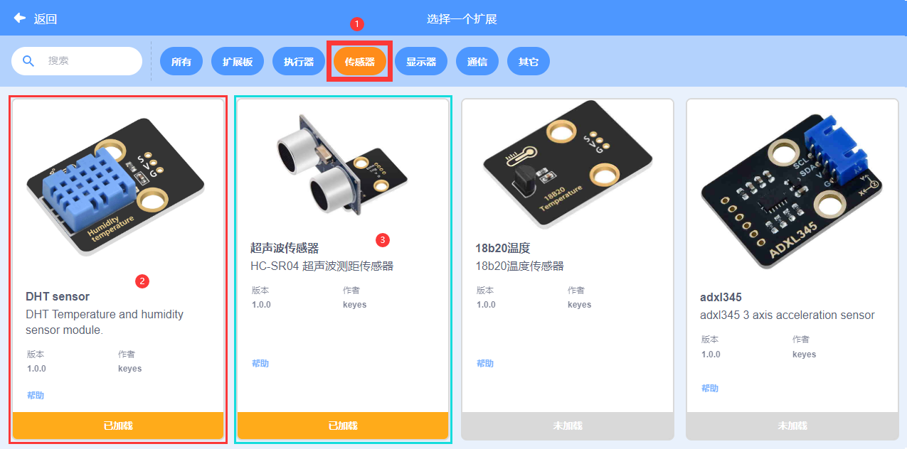

点击“**显示器**”，寻找到“**4位数码管TM1650_IIC**”和“**8*8点阵 IIC**”并且分别点击选中。

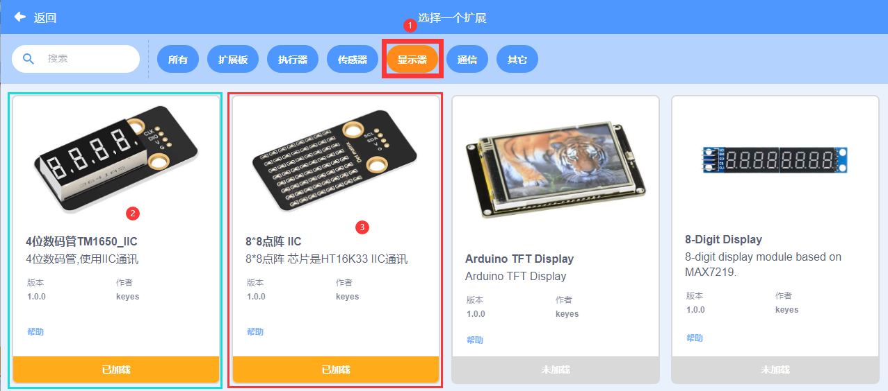

点击“**通信**”，寻找到“**红外接收模块**”并且点击选中。

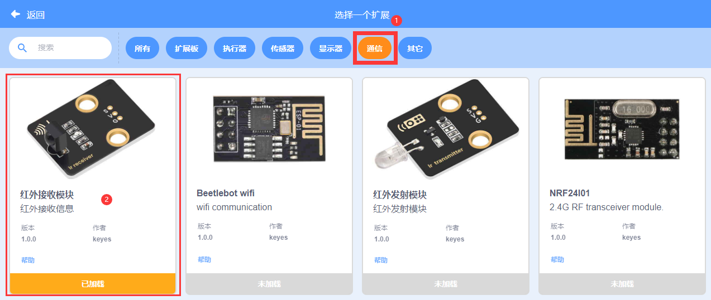

上述所有的库文件添加完后，点击KidsBlock软件左上角的返回编程界面。这样，就可以在编程界面的左侧看到所添加的所有库文件。

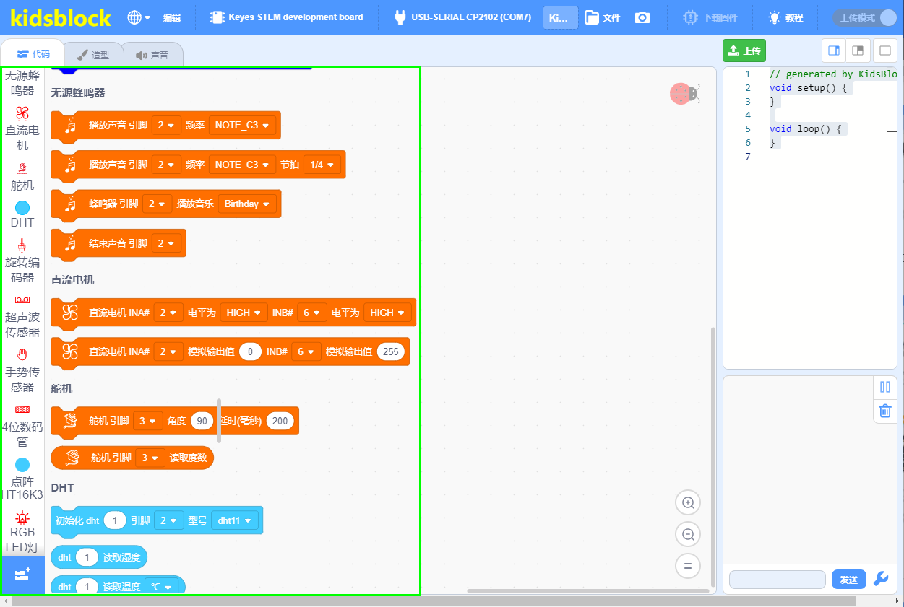

---

## 3. 单个传感器/模块项目课程

上面操作完后，打开套件工具包，我们可以看到套件中有很多传感器/模块，有主板和连接线等。这里，我们将多种传感器/模块利用自带连接线单独连接在主板。然后上传对应的实验代码，单独测试各个传感器/模块的功能。我们下面的课程是先从简单到复杂学习单个模块/传感器的原理，后面再学习一些模块/传感器的扩展应用以巩固加深我们对该套件的理解。

**特别注意：** 实验时，模块/传感器连接线材时，必须按照教程里的接线方法及位置，电源与信号脚不能错接，否则会损坏模块/传感器。

第01课 Hello World

**1. 项目介绍**

对于Arduino的初学者，先从一些简单的开始学习吧！在这个项目中，你只需要一个主板，USB线和计算机就可以完成“Hello World!”项目。它不仅是主板和计算机的通信测试，也是Arduino的初级项目。这也是一个入门实验，让你进入计算机的编程世界。

---

**2. 实验组件**

|  |  |
| :----------------------: | :-------------------: |
|主板 x1| USB线 x1 |

---

**3. 模块接线图**

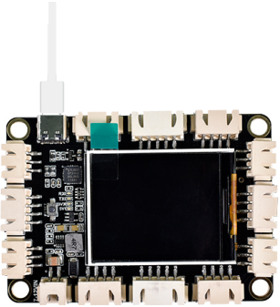

---

**4. 实验代码**

本项目中使用的代码保存在文件夹“<u>**...\项目代码\KidsBlock_代码**</u>”中，我们可以在此路径下打开代码文件''<u>**01_HelloWorld**</u>"。

将主控板通过USB线连接到计算机后，开始导入我们提供的示例代码。先单击，然后点击，进入KidsBlock_代码文件夹中选中文件“**01_HelloWorld**”后单击“**打开**”。这样，文件“**01_HelloWorld**”导入成功。

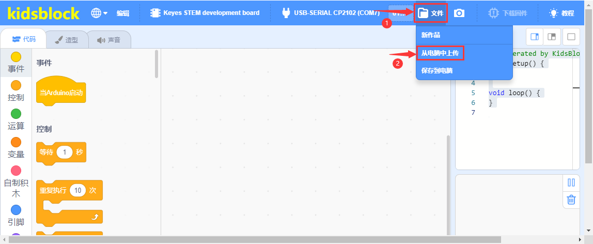

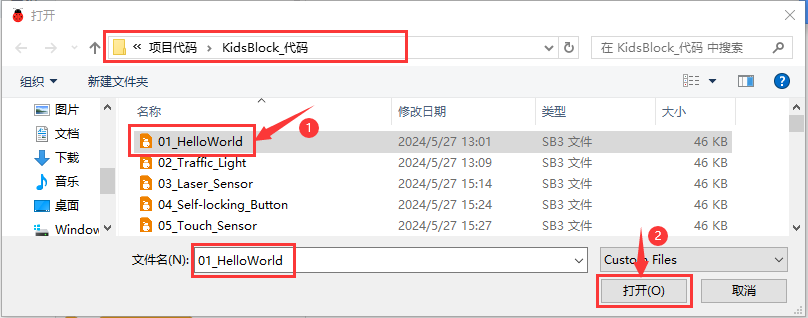

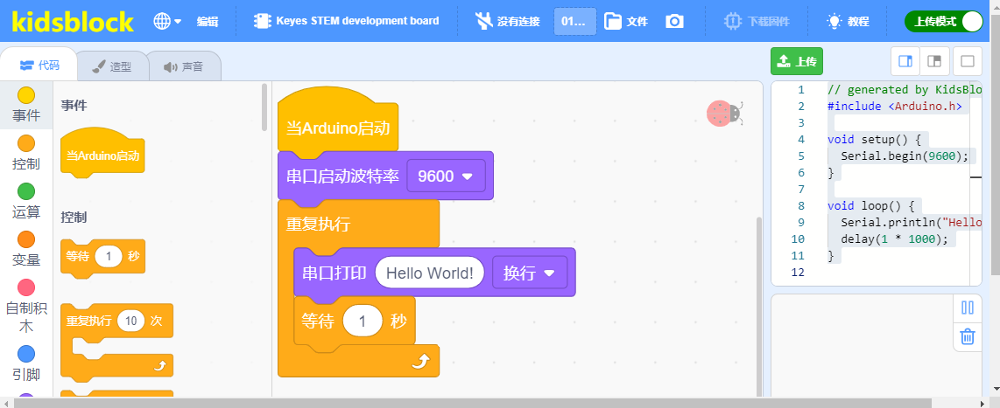

为了避免将代码上传至主板时出现错误，必须选择与计算机连接正确的串口端口。点击连接好串口端口，这样可以看到连接好的串口端口。

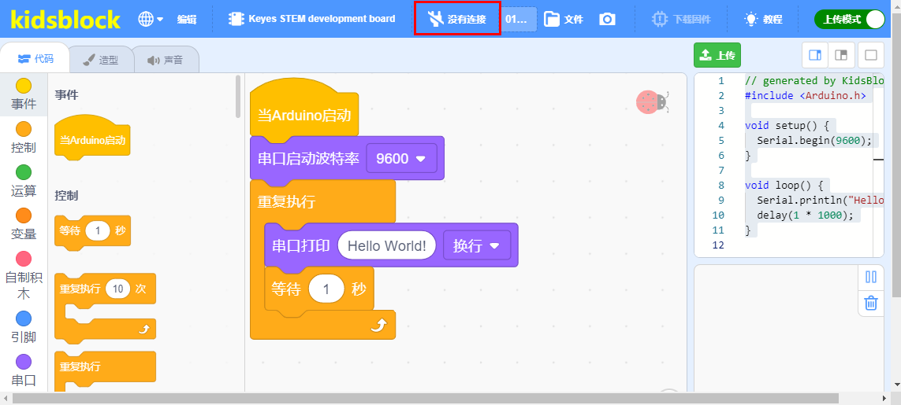

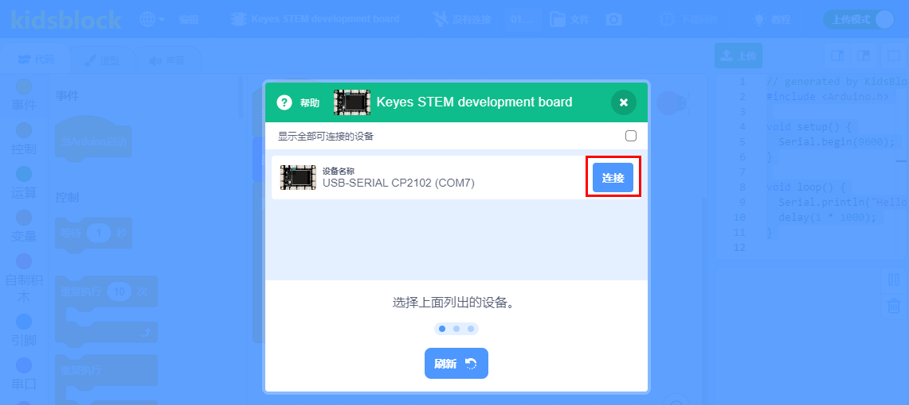

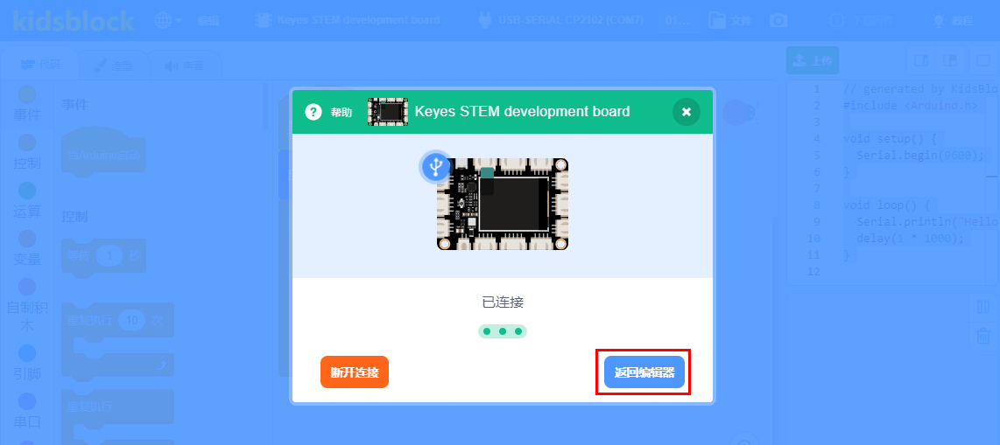

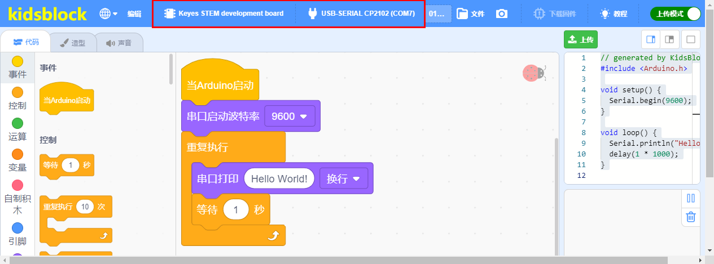

主控板和串口端口选择正确后，单击将代码上传到主控板上。

代码上传成功。

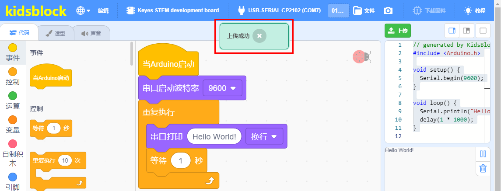

---

**5. 实验结果**

代码上传成功后，利用MicroUSB线连接到计算机上电，在串口监视器窗口单击图标设置波特率为 **9600** ，这样串口监视器窗口不断地打印“**<u>Hello World!</u>**”。

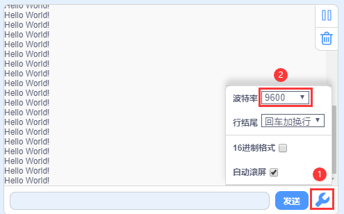

---

**6. 代码说明**

设置串口波特率，一般是设置为9600。

换行输出数据。从串行端口输出数据，跟随一个回车和一个换行符。

将程序的执行暂停一段时间,也就是延时。单位是秒。 

当启动主板时，将运行代码。

循环语句，顾名思义就是重复做一件事。

---

第02课 LED闪烁

**1. 项目介绍**

LED，即发光二极管的简称。由含镓（Ga）、砷（As）、磷（P）、氮（N）等的[化合物](https://baike.baidu.com/item/化合物/1142931)制成。当电子与[空穴](https://baike.baidu.com/item/空穴/3517781)复合时能辐射出可见光，因而可以用来制成发光二极管。在电路及仪器中作为指示灯，或者组成文字或数字显示。砷化镓二极管发红光，磷化镓二极管发绿光，碳化硅二极管发黄光，氮化镓二极管发蓝光。因化学性质又分有机发光二极管OLED和无机发光二极管LED。

为了实验的方便，我们将红色LED发光二极管做成了一个红色LED模块。它的控制方法非常简单，只要让LED两端有一定的电压就可以点亮LED。在这个项目中，我们用一个最基本的测试代码来控制LED，亮一秒钟，灭一秒钟，来实现闪烁的效果。你可以改变代码中LED灯亮灭的时间，实现不同的闪烁效果。我们通过编程控制信号端S的高低电平，从而控制LED的亮灭。LED模块信号端S为高电平时LED亮起，S为低电平时LED熄灭。

---

**2. 模块参数**

工作电压：DC 3.3~5V

控制信号：数字信号

工作温度：-10°C ~ +50°C

尺寸：32mm x 23.5mm x 12mm

接口：2.54mm间距，3pin防反接口

---

**3. 模块原理图**

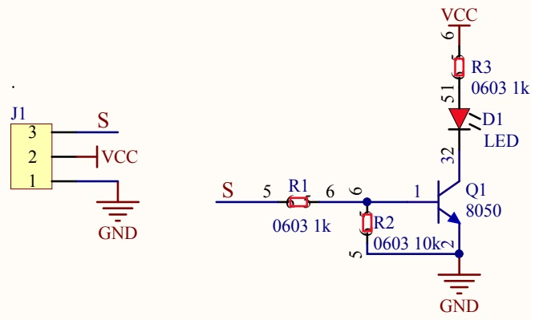

这是一个常用的LED模块，它采用F5-红发红LED（外观红色，显示红光）元件。同时，模块上自带一个间距为 2.54mm 的 3pin 防反插红色端子。控制时，模块上G引脚，V引脚供电后，信号端S为高电平时，模块上LED亮起；否则，信号端S为低电平时，模块上LED不亮。常用的LED模块有红色LED模块，黄色LED模块，绿色LED模块和蓝色LED模块等。

模块兼容各种单片机控制板，如arduino系列单片机。

---

**4. 实验组件**

|  | |       |  | 
| ------------------------ | ------------------------ | ---------------------------- | ---------------------------- | 
|主板 x1 | 红色LED模块 x1    | 3P线(反向) x1 | USB线 x1   |
 
---

**5. 模块接线图**

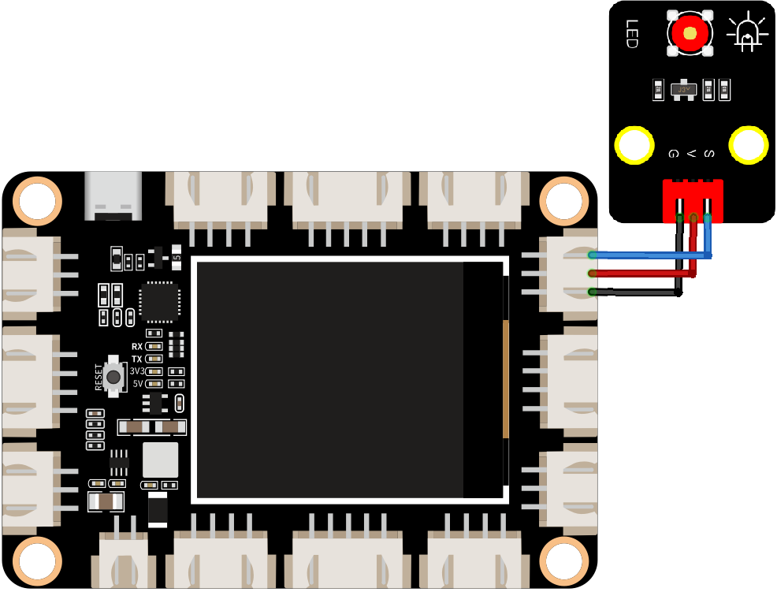

---

**6. 实验代码**

本项目中使用的代码保存在文件夹“<u>**...\项目代码\KidsBlock_代码**</u>”中，我们可以在此路径下打开代码文件''**02_LED_Blinking**"。

**注意：为了避免上传代码不成功，请不要在上传代码前连接模块。代码上传成功后，拔下USB线断电，按照接线图正确接好模块后再用USB线连接到计算机上电，观察实验结果。**

参照第01课的示例，导入提供的示例代码并连接好串口端口，然后上传示例代码。

---

**7. 实验结果**

代码上传成功后，拔下USB线断电，按照接线图正确接好模块后再用USB线连接到计算机上电，能看到模块上的红色LED亮1秒，然后熄灭1秒，循环交替。

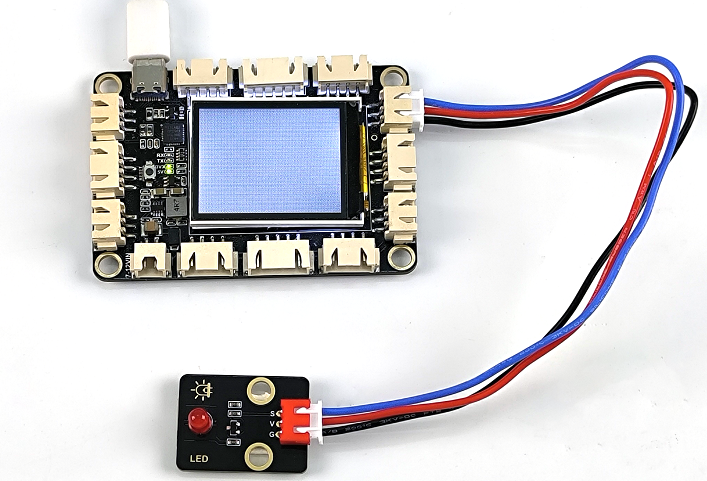

---

**8. 代码说明**

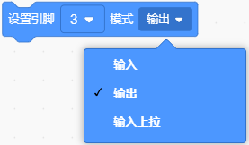

向指定引脚设置“输入”或“输出”，选择“输入”代表给该引脚设置输入模式；选择“输出”代表给引脚设置输出模式；选择“输入上拉”代表给该引脚设置输入模式并且使该引脚变成高电平。

向指定引脚设置“高”或“低”，选择“高”代表给该引脚设置高电平，有电压，有电流，则LED点亮；选择“低”代表给引脚设置低电平，没电压，没有电流，则LED不亮。

将程序的执行暂停一段时间，也就是延时。单位是秒。 

---

第03课 交通灯

**1. 项目介绍**

交通灯，也就是马路上十字路口的红绿灯，在我们的日常生活中很常见。交通灯是由红、黄、绿三种颜色组成的，根据一定的时间规律循环交替亮起或熄灭。每个人都应该遵守交通规则，这可以避免许多交通事故。

想学习交通灯的原理吗？我们可以用红、黄、绿3个LED外接电路来模拟马路上的交通灯。因此我们特别设计了这款交通灯模块，采用红色LED模块，黄色LED模块和绿色LED模块来模拟交通灯。

---

**2. 实验组件**

|  |  | |
| ------------------------ | ------------------------ | ---------------------------- |  
| 主板 x1  | 红色LED模块 x1  |绿色LED模块 x1  |
| |        |  |
| 黄色LED模块 x1  |3P线(反向) x3 | USB线 x1 |

---

**3. 模块接线图**

---

**4. 实验代码**

本项目中使用的代码保存在文件夹“<u>**...\项目代码\KidsBlock_代码**</u>”中，我们可以在此路径下打开代码文件''**03_Traffic_Light**"。

**注意：为了避免上传代码不成功，请上传代码前不要连接模块。代码上传成功后，拔下USB线断电，按照接线图正确接好模块后再用USB线连接到计算机上电，观察实验结果。**

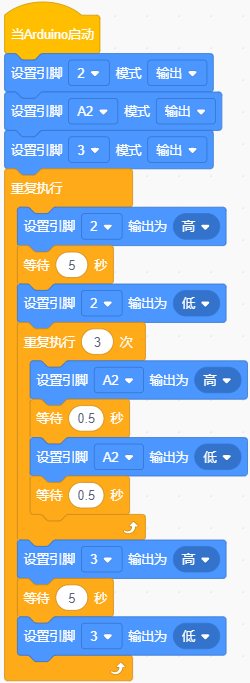

参照第01课的示例，导入提供的示例代码并连接好串口端口，然后上传示例代码。

---

**5. 实验结果**

代码上传成功后，拔下USB线断电，按照接线图正确接好模块后再用USB线连接到计算机上电，你会看到：1.首先，绿灯会亮5秒，然后熄灭；2.其次，黄灯会闪烁3次，然后熄灭；3.然后，红灯会亮5秒，然后熄灭；4.继续运行上述1-3个步骤。

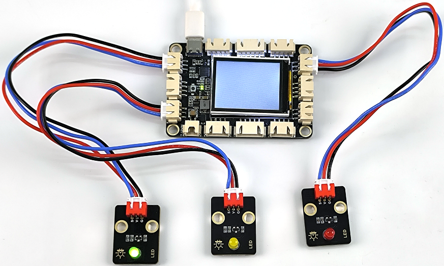

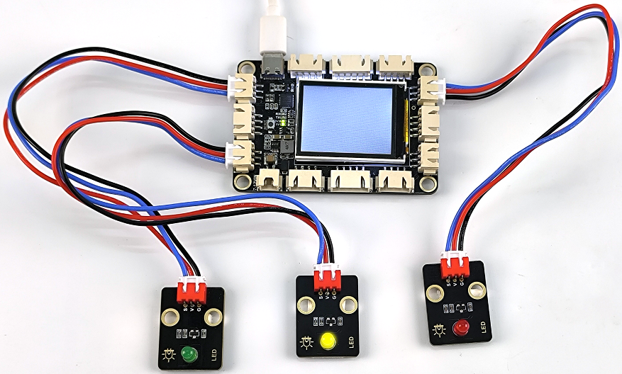

---

**6. 代码说明**

有条件的循环控制语句，当满足循环次数时就退出循环，比如：3表示循环执行3次，数字3是可以改成其他数字的。

剩余的可以参照第02课的代码说明。

---

第04课 呼吸灯

**1. 项目介绍**

在第02课我们学习了如何让LED闪烁。但是LED的玩法远不仅如此。在日常生活中你有没有遇到过灯光慢慢变亮或者慢慢变暗呢？这叫呼吸灯。所谓呼吸灯，就是控制LED逐渐变亮，然后逐渐变暗，循环交替。上一课我们学会了直接用高电平点亮LED，低电平熄灭LED。如果要让LED不那么亮但又不完全熄灭，介于中间状态，只需控制流过LED的电流就可以实现。电流减小LED变暗，电流增大LED变亮。所以只需要调节LED两端的电压减小或增大（电流也会随之减小或增大）就能控制LED的亮暗程度了。

数字端口电压输出只有LOW与HIGH两个开关，对应的就是0V与3.3V（或5V）的电压输出。可以把LOW定义为0，HIGH定义为1，1秒内让单片机输出500个0或者1的信号。如果这500个信号全部为1，那就是完整的3.3V；如果全部为0，那就是0V。如果010101010101这样输出，刚好一半，端口输出的平均电压就为1.65V了。这和放映电影是一个道理。我们所看的电影并不是完全连续的，它其实是每秒输出25张图片，人的肉眼分辨不出来，看上去就是连续的了，PWM也是同样的道理。如果想要不同的电压，就控制0与1的输出比例就可以了。当然这和真实的连续输出还是有差别的，单位时间内输出的0,1信号越多，控制的就越精确。

这一课学习使用PWM来控制0与1的输出比例实现控制电压。

---

**2. 实验组件**

|  | |       |  | 
| ------------------------ | ------------------------ | ---------------------------- | ---------------------------- | 
|主板 x1 | 红色LED模块 x1    | 3P线(反向) x1 | USB线 x1   |
 
---

**3. 模块接线图**

---

**4. 实验代码**

本项目中使用的代码保存在文件夹“<u>**...\项目代码\KidsBlock_代码**</u>”中，我们可以在此路径下打开代码文件''**04_Breathing_LED**"。

**注意：为了避免上传代码不成功，请不要在上传代码前连接模块。代码上传成功后，拔下USB线断电，按照接线图正确接好模块后再用USB线连接到计算机上电，观察实验结果。**

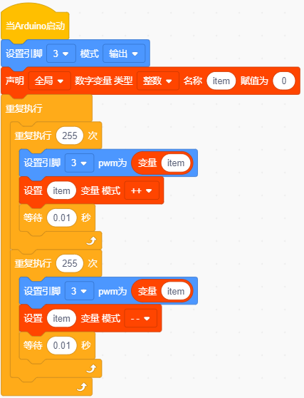

参照第01课的示例，导入提供的示例代码并连接好串口端口，然后上传示例代码。

---

**5. 实验结果**

代码上传成功后，拔下USB线断电，按照接线图正确接好模块后再用USB线连接到计算机上电，能看到模块上的红色LED从暗逐渐变亮，再从亮逐渐变暗，就像呼吸一样。

---

**6. 代码说明**

这是创建“变量”的指令方块，可以声明“全局”或“局部”，还可以设置变量的类型、名称和赋值，item是变量名称。

设置变量item初始值为0。

获取变量item。

设置变量item模式为每执行一次循环让item加1或每执行一次循环让item减1。

我们知道数字口只有0和1两个状态，那如何发送一个模拟值到一个数字引脚呢？就要用到该方块。观察一下主板，查看数字引脚，你会发现其中6个引脚旁标有“~”，这些引脚不同于其他引脚，它们可以输出PWM信号。

该指令方块用于给PWM口写入一个0 ~ 255的模拟值。所以，pwm值可以设置0 ~ 255之间的值。特别注意的是，此指令方块只能写入具有PWM功能的数字引脚，也就是D3，D5，D6引脚。

---

第05课 自锁按键

**1. 项目介绍**

自锁按键模块主要是由一个自锁按键组成，上电后，按下白色按键，模块信号端输出低电平，将白色按键按起，模块信号端输出高电平。第02课我们学习了怎么让单片机的引脚输出一个高电平或者低电平，这节课程我们就来学习怎么读取引脚的电平。

自锁按键模块的白色按键按下，单片机读取到低电平，将白色按键按起读取到高电平。通过读取传感器上S端的高低电平，判断自锁按键是按下还是按起，并且在串口监视器上显示测试结果。

---

**2. 模块参数**

工作电压：DC 3.3V~5V 

工作温度：-10°C ~ +50°C

控制信号：数字信号

尺寸：32mm x 23.8mm x 15.6mm

接口：2.54mm间距，3pin防反接口

---

**3. 模块原理图**

按键有四个引脚，其中1和3是相连的，2和4是相连的，在我们未按下按键时，1、3与2、4是断开的，信号端S读取的是被1KΩ的上拉电阻R1所拉高的高电平，而当我们按下按键时，1、3和2、4连通。信号端S连接到了GND，此时读取到的电平为低电平，即按下按键，传感器信号端为低电平，模块上的LED灯亮起；按键按起时，信号端为高电平，模块上的LED灯灭。

---

**4. 实验组件**

|  |  |       |  | 
| ------------------------ | ------------------------ | ---------------------------- |---------------------------- |
| 主板 x1  | 自锁按键模块 x1  | 3P线(反向) x1 | USB线 x1 |

---

**5. 模块接线图**

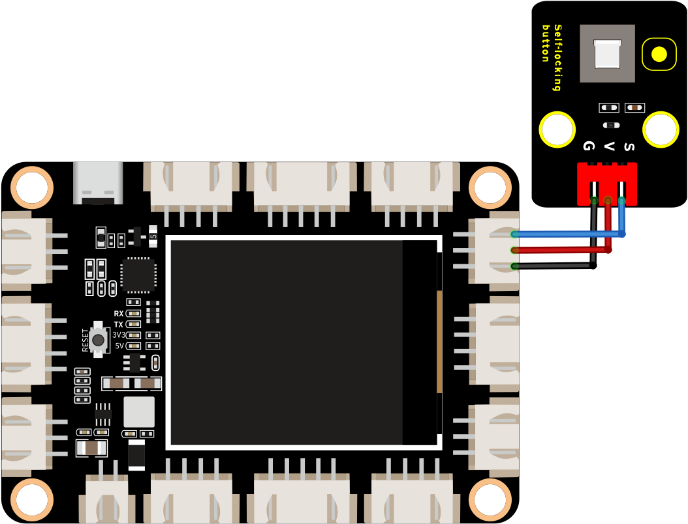

---

**6. 实验代码**

本项目中使用的代码保存在文件夹“<u>**...\项目代码\KidsBlock_代码**</u>”中，我们可以在此路径下打开代码文件''**05_Self-locking_Button**"。

**注意：为了避免上传代码不成功，请上传代码前不要连接模块。代码上传成功后，拔下USB线断电，按照接线图正确接好模块后再用USB线连接到计算机上电，观察实验结果。**

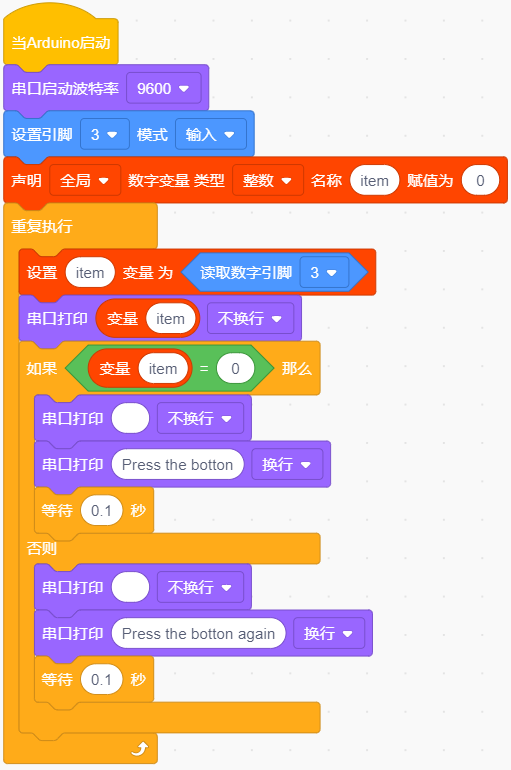

参照第01课的示例，导入提供的示例代码并连接好串口端口，然后上传示例代码。

---

**7. 实验结果**

代码上传成功后，拔下USB线断电，按照接线图正确接好模块后再用USB线连接到计算机上电，打开串口监视器，设置波特率为 **<u>9600</u>**。

当按下模块上的白色按键时，按键值value为0，串口监视器打印出“**0     Press the button**”；再次按下白色按键（即白色按键被按起）时，按键值value为1，串口监视器打印出“**1   Press the botton again**”字符。

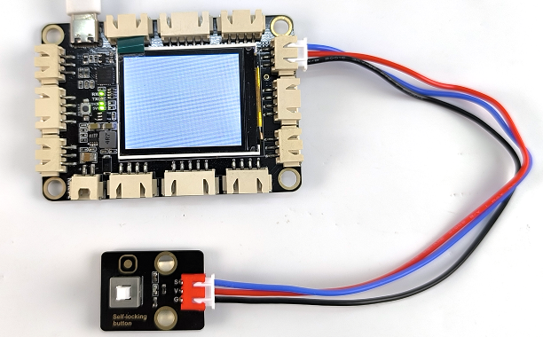

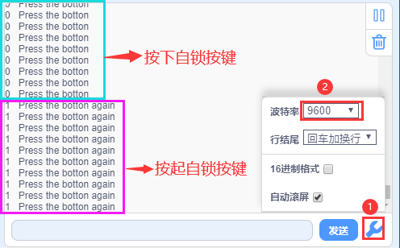

---

**8. 代码说明**

定义自锁按键管脚为D3。“输入”设置为输入模式。通过配置为“输入”必须使用上拉或下拉电阻（我们的模块已经使用上拉电阻R1）。该电阻的目的是在开关断开时将引脚拉至已知状态。通常选择一个4.7K/10K欧姆的电阻，因为它的阻值足够低，可以可靠地防止输入悬空。同时，该阻值也要足够高，以使开关闭合时不会消耗太多电流。如果使用下拉电阻，则当开关断开时，输入引脚将为低电平；当开关闭合时，输入引脚将为高电平。如果使用上拉电阻，则当开关断开时，输入引脚将为高电平；当开关闭合时，输入引脚将为低电平。 

这是创建“变量”的指令方块，可以声明“全局”或“局部”，还可以设置变量的类型、名称和赋值，item是变量名称。

设置变量item初始值为0。

获取变量item。

如果里的表达式为真，则执行 “那么” 块内的代码。如果里表达式为假 ，则执行 “否则” 块内的代码。

读取按键的数字电平，高HIGH或者低LOW。如果该引脚未连接任何东西，则可以返回HIGH或LOW（并且可以随机更改）。主板上的输入引脚A0、A1、A2、A3、A4、A5可以用作数字引脚，分别对应数字引脚D14、D15、D16、D17、D18、D19。

初始化串口通信，并设置波特率为9600。

设置串口打印方式的指令方块，“**换行**”表示换行打印，“**不换行**”表示不换行打印，“**HEX**”表示以十六进制形式打印。

---

第06课 电容触摸传感器

**1. 项目介绍**

电容触摸模块主要由1个触摸检测芯片 TTP223-BA6 构成。模块上提供一个触摸按键，功能是用可变面积的按键取代传统按键。当我们上电之后，传感器需要约0.5秒的稳定时间，此时间段内不要触摸按键，此时所有功能都被禁止，始终进行自校准，校准周期约为4秒。

---

**2. 模块参数**

工作电压：DC 3.3V~5V

工作电流：3mA

最大功率：0.015W

输出信号：数字信号

工作温度：-10°C ~ +50°C

尺寸：32mm x 23.8mm x 9mm

接口：2.54mm间距，3pin防反接口

---

**3. 模块原理图**

TTP223N-BA6 的输出通过 AHLB（4）引脚选择高电平或低电平有效。通过 TOG（6）引脚选择直接模式或触发模式。

| TOG  | AHLB | 引脚Q的功能           |
| ---- | ---- | --------------------- |
| 0    | 0    | 直接模式，高电平有效  |
| 0    | 1    | 直接模式，低电平有效  |
| 1    | 0    | 触发模式，上电状态为0 |
| 1    | 1    | 触发模式，上电状态为1 |

从原理图我们可以知道 TOG 脚和 AHLB 脚是悬空的，此时输出为直接模式，高电平有效。

当我们用手指触摸模块上的感应区时，信号端 S 输出高电平（上一课学习的自锁按键模块与之相反，当自锁按键感应到按下输出低电平），板载红色LED点亮，我们通过读取模块上 S 端的高低电平，判断电容触摸模块上的感应区是否感应到触摸。

注意：我们上电之后，传感器需要约0.5sec的稳定时间，此时间段内不要对键进行触摸，此时所有功能都被禁止，始终进行自校准，当键没被触摸时，重校准周期约为4.0sec。

---

**4. 实验组件**

|  | | |  |
| ------------------------ | ------------------------ | ---------------------------- |---------------------------- |
|主板 x1|  电容触摸传感器 x1 | 3P线(反向) x1 | USB线 x1 |
 

---

**5. 模块接线图**

---

**6. 实验代码**

本项目中使用的代码保存在文件夹“<u>**...\项目代码\KidsBlock_代码**</u>”中，我们可以在此路径下打开代码文件''**06_Touch_Sensor**"。

**注意：为了避免上传代码不成功，请不要在上传代码前连接模块。代码上传成功后，拔下USB线断电，按照接线图正确接好模块后再用USB线连接到计算机上电，观察实验结果。**

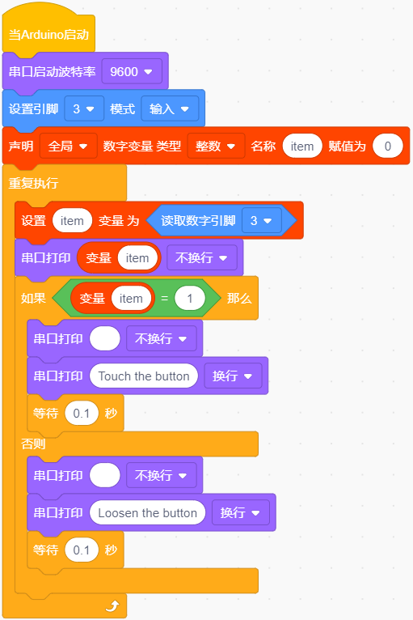

参照第01课的示例，导入提供的示例代码并连接好串口端口，然后上传示例代码。

---

**7. 实验结果**

代码上传成功后，拔下USB线断电，按照接线图正确接好模块后再用USB线连接到计算机上电，打开串口监视器，设置波特率为 **<u>9600</u>**。

当电容触摸传感器模块上的感应区感应到触摸时，板载红色LED点亮，value 值为 1，串口监视器打印出“**1  Touch the button**”；当没有感应到触摸时，板载红色LED熄灭，value 值为 0，串口监视器打印出“**0 Loosen the button**”。

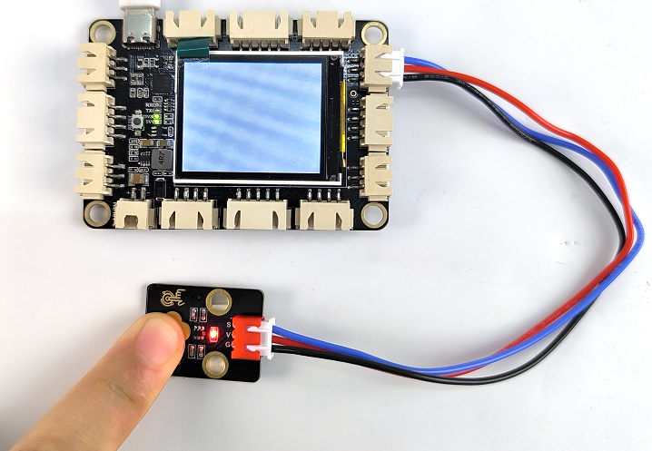

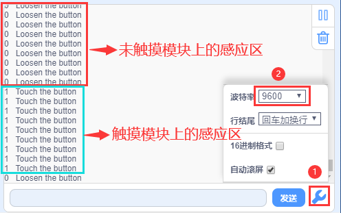

---

**8. 代码说明**

可以参照第05课的代码说明，这里就不多做介绍了。

---

第07课 检测障碍物

**1. 项目介绍**

避障传感器主要由一对红外线发射与接收管元件组成。实验中，我们通过读取传感器上S端高低电平，判断是否存在障碍物。

---

**2. 模块参数**

工作电压: DC 3.3V~5V 

工作电流: 6.8mA

最大功率: 0.034W

输出信号: 数字信号

最大感应距离: 17.3cm

工作温度：-10°C ~ +50°C

尺寸：32mm x 23.8mm x 11mm

接口：2.54mm间距，3pin防反接口

---

**3. 模块原理图**

NE555时基电路提供给发射管TX发射出一定频率的红外信号，红外信号会随着传送距离的加大逐渐衰减，如果遇到障碍物，就会形成红外反射。当检测方向RX遇到反射回来的信号比较弱时，接收检测引脚输出高电平，说明障碍物比较远；当反射回来的信号比较强，接收检测引脚输出低电平，说明障碍物比较近，此时指示灯亮起。传感器上有两个电位器，一个用于调节发送功率，一个用于调节接收频率，通过调节两个电位器，我们可以调节它的有效距离。

---

**4. 实验组件**

|  | |  | 
| ------------------------ | ------------------------ | ---------------------------- |
|主板 x1|  避障传感器 x1 | 3P线(反向) x1 |
| | |     |
| USB线 x1| 一字螺丝刀 x1 |    |

---

**5. 模块接线图**

---

**6. 实验代码**

本项目中使用的代码保存在文件夹“<u>**...\项目代码\KidsBlock_代码**</u>”中，我们可以在此路径下打开代码文件"**07_Obstacle_Avoidance_Sensor**"。

**注意：为了避免上传代码不成功，请上传代码前不要连接模块。代码上传成功后，拔下USB线断电，按照接线图正确接好模块后再用USB线连接到计算机上电，观察实验结果。**

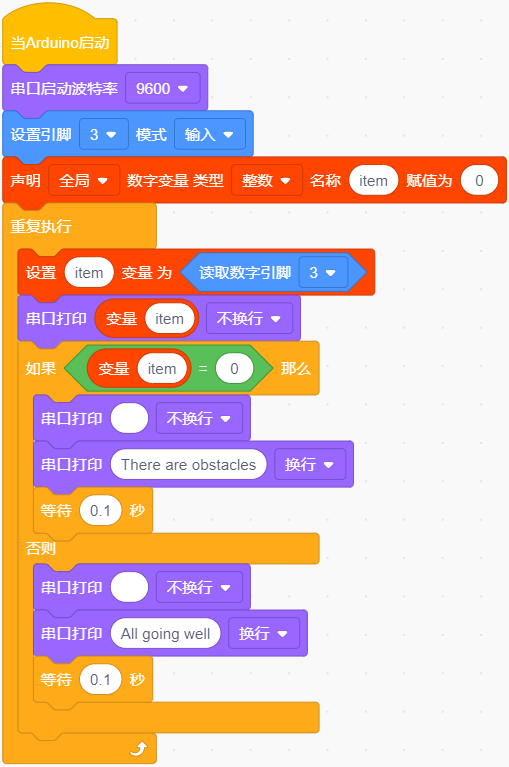

参照第01课的示例，导入提供的示例代码并连接好串口端口，然后上传示例代码。

---

**7. 实验结果**

代码上传成功后，拔下USB线断电，按照接线图正确接好模块后再用USB线连接到计算机上电，接着开始调节传感器模块上的两个电位器感应距离。避障传感器上有两个电位器，分别是接收频率调节电位器和发射功率调节电位器，如下图所示。

先调节发射功率调节电位器，先用一字螺丝刀将电位器顺时针拧到尽头，然后逆时针慢慢往回调，当调节到SLED灯亮起时，微调使传感器上SLED灯介于亮与不亮之间的**不亮**状态。

接着设置接收频率调节电位器，同样用一字螺丝刀将电位器顺时针拧到尽头，然后逆时针慢慢往回调，当SLED灯亮起时，微调使传感器上SLED灯介于亮与不亮之间的**不亮**状态，此时能检测障碍物的距离最长。

打开串口监视器，设置波特率为 **<u>9600</u>**。当传感器检测到障碍物时，value 值为 **0**，SLED 灯亮，串口监视器打印出 “**0   There are obstacles**” ；没有检测到障碍物时，value 值为 **1**，SLED 灯灭，串口监视器打印出 “**1   All going well**” 。

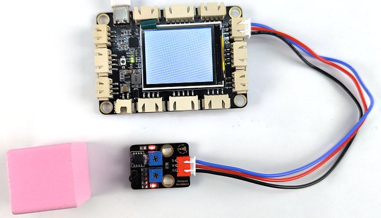

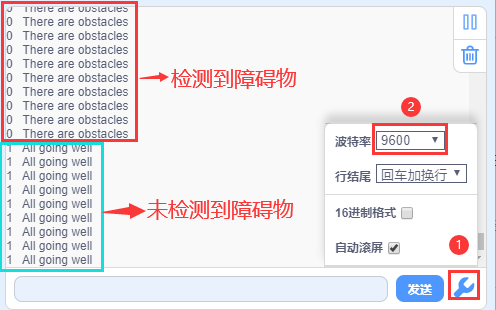

---

**8. 代码说明**

可以参照第05课的代码说明，这里就不多做介绍了。

---

第08课 附近有人吗

**1. 项目介绍**

人体红外热释传感器主要由一个RE200B-P传感器元件组成。它是一款基于热释电效应的人体热释运动传感器，能检测到人体或动物身上发出的红外线，配合菲涅尔透镜能使传感器探测范围更远更广。

实验中，通过读取模块上S端高低电平，判断附近是否有人在运动；并且在串口监视器上显示测试结果。

---

**2. 模块参数**

工作电压: DC 3.3V~5V 

工作电流: 3.6mA

最大功率: 0.018W

静态电流: <50 uA

输出信号: 数字信号

触发方式: L不可重复触发/H重复触发

视野角度：Y = 90°，X = 110°（视野角度为理论数值）

最大检测距离: ≤5米

工作温度：-10°C ~ +50°C

尺寸：32mm x 23.8mm x 7.4mm

接口：2.54mm间距为，3pin防反接口

---

**3. 模块原理图**

这个模块的原理图可能较前面的模块稍复杂，我们一部分一部分来看。先看电压转换部分，作用是将5V输入电压转换为3.3V输入电压。因为我们模块上用到的热释电红外传感器的工作电压是3.3V，不能直接用5V电压供电使用。有了这个电压转换部分，3.3V输入电压和5V输入电压都适用于此热释电红外传感器。

当红外热释传感器没有检测到红外信号时，红外热释传感器的1脚输出低电平，此时模块上的LED两端有电压差，有电流流过，LED被点亮，MOS管Q1导通（Q1是NPN MOS管，型号为2N7002。由于红外热释传感器的1脚输出低电平，所以Q1的源极Vs=0，而Q1的栅极Vg=3.3V，于是Q1的栅极G和Q1的源极S之间的电压 Vgs = 3.3V 大于Q1的阈值电压 2.5V，Q1导通。），信号端S检测到低电平。

当红外热释传感器检测到红外信号时，红外热释传感器的1脚输出高电平，此时模块上的LED熄灭，MOS管Q1不导通，则信号端S检测到被10K上拉电阻R5拉高的高电平。

---

**4. 实验组件**

|  ||   |  |   
| ------------------------ | --------------------------- | ---------------------------- |---------------------------- |
|主板 x1 | 人体红外热释传感器 x1 | 3P线(反向) x1 | USB线 x1   |    

---

**5. 模块接线图**

---

**6. 实验代码**

本项目中使用的代码保存在文件夹“<u>**...\项目代码\KidsBlock_代码**</u>”中，我们可以在此路径下打开代码文件''**08_PIR_Motion**"。

**注意：为了避免上传代码不成功，请上传代码前不要连接模块。代码上传成功后，拔下USB线断电，按照接线图正确接好模块后再用USB线连接到计算机上电，观察实验结果。**

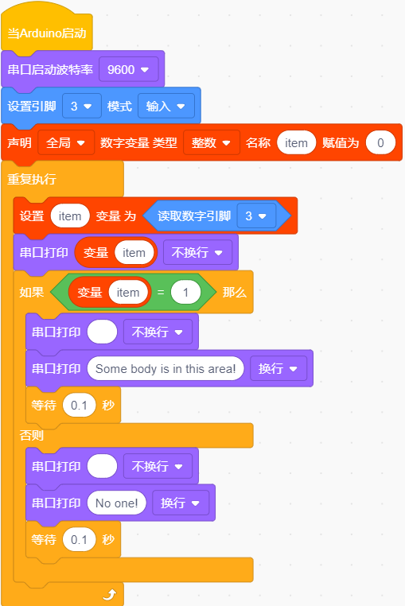

参照第01课的示例，导入提供的示例代码并连接好串口端口，然后上传示例代码。

---

**7. 实验结果**

代码上传成功后，拔下USB线断电，按照接线图正确接好模块后再用USB线连接到计算机上电，打开串口监视器，设置波特率为 **<u>9600</u>**。

当传感器检测到附近有人在运动时，value值为1，模块上LED熄灭，串口监视器显示“**1   Somebody is in this area!**”；没有检测到附近有人在运动时，value值为0，模块上LED点亮，串口监视器显示“**0   No one!**”。

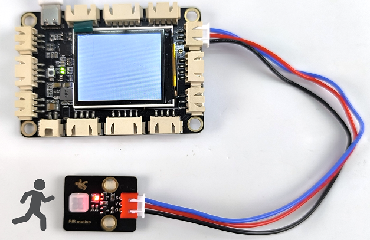

---

**8. 代码说明**

可以参照第05课的代码说明，这里就不多做介绍了。

---

第09课 播放声音

**1. 项目介绍**

蜂鸣器是一种一体化结构的电子讯响器，采用直流电压供电，广泛应用于计算机、打印机、复印机、报警器、电子玩具、汽车电子设备、电话机、定时器等电子产品中作发声器件。蜂鸣器主要分为有源蜂鸣器和无源蜂鸣器。在这个实验中，我们来学习尝试控制有源蜂鸣器发出声音。有源蜂鸣器元件内部自带震荡电路，使用时，我们只需要给无源蜂鸣器元件足够的电压，无源蜂鸣器就会自动响起。

---

**2. 模块参数**

工作电压：DC 3.3 ~ 5V 

工作电流：22.5mA

最大功率：0.12W

频率：2300HZ

控制信号：数字信号

工作温度：-10°C ~ +50°C

尺寸：32mm x 23.8mm x 12.3mm

接口：2.54mm间距，3pin防反接口

---

**3. 模块原理图**

从原理图我们可以得知，蜂鸣器的1脚通过串联一个电阻R2连接到电压正极；蜂鸣器的2脚连接到NPN三极管Q1的C极，集电极；Q1的B极，也就是基极通过串联一个电阻R1连接到S信号端；发射集接到GND。

当三极管Q1导通时，蜂鸣器的2脚连通GND，有源蜂鸣器便会工作。那么如何让三极管Q1导通呢？**NPN三极管的导通条件是基极（B）电压比发射极（E）电压高 0.3V 以上，只需要基极（B）被上拉至高电平即可。** 虽然三极管Q1的基极（B）有一个下拉电阻R3导致其不导通，但是R3电阻的阻值大，使其为弱下拉电阻。三极管Q1的基极（B）还连接了一个阻值小的强上拉电阻R1，只要我们用单片机IO口给S信号端输入高电平，强上拉电阻R1会将三极管Q1的基极（B）强上拉为高电平，三极管Q1就会导通，有源蜂鸣器就会工作。

---

**4. 实验组件**

|  | |       |  |    
| ------------------------ | ------------------------ | ---------------------------- |---------------------------- |  
| 主板 x1|  有源蜂鸣器模块 x1  |3P线(反向) x1 | USB线 x1  |      

---

**5. 模块接线图**

---

**6. 实验代码**

本项目中使用的代码保存在文件夹“<u>**...\项目代码\KidsBlock_代码**</u>”中，我们可以在此路径下打开代码文件''**09_Active_Buzzer**"。

**注意：为了避免上传代码不成功，请上传代码前不要连接模块。代码上传成功后，拔下USB线断电，按照接线图正确接好模块后再用USB线连接到计算机上电，观察实验结果。**

参照第01课的示例，导入提供的示例代码并连接好串口端口，然后上传示例代码。

---

**7. 实验结果**

代码上传成功后，拔下USB线断电，按照接线图正确接好模块后再用USB线连接到计算机上电，模块上有源蜂鸣器响起1秒，停1秒，循环交替。

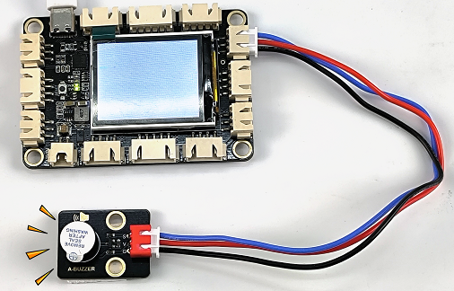

---

**8. 代码说明**

可以参照第02课的代码说明，这里就不多做介绍了。

---

第10课 演奏音乐

**1. 项目介绍**

在之前的项目中，我们研究了有源蜂鸣器，它只能发出一种声音，可能会让你觉得很单调。这个项目将学习另一种蜂鸣器，无源蜂鸣器。与有源蜂鸣器不同，无源蜂鸣器可以发出不同频率的声音。在这个项目中，我们将使用控制板控制无源蜂鸣器演奏歌曲。

---

**2. 模块参数**

工作电压: DC 3.3V~5V 

工作电流: 50mA

最大功率: 0.25W

控制信号：数字信号

方波大小：大约2KHz

工作温度：-10°C ~ +50°C

尺寸：32mm x 23.8mm x 12.3mm

接口：2.54mm间距，3pin防反接口

---

**3. 模块原理图**

这是一个无源蜂鸣器，上一课我们介绍过，有源蜂鸣器自带振荡源，是有正负之分的，只需要提供5V电压信号就会发声，发出的声音音调单一、频率固定。而无源蜂鸣器内部不带震荡电路，是没有正负之分的，类似于喇叭，只要加载不同的频率的电信号就可以实现发声，根据不同的频率所发出的声音也是不一样的。改变单片机引脚输出的工作频率，从而改变蜂鸣器鸣叫的音调。还可以改变输出电平的占空比，从而改变蜂鸣器输出声音的大小。

---

**4. 实验组件**

|  |    |        |  |
| ------------------------ | --------------------------- | ---------------------------- |---------------------------- | 
|主板 x1 |无源蜂鸣器模块 x1 |3P线(反向) x1 | USB线 x1 |

---

**5. 模块接线图**

---

**6. 实验代码**

本项目中使用的代码保存在文件夹“<u>**...\项目代码\KidsBlock_代码**</u>”中，我们可以在此路径下打开代码文件''**10_Passive_Buzzer**"。

**注意：为了避免上传代码不成功，请上传代码前不要连接模块。代码上传成功后，拔下USB线断电，按照接线图正确接好模块后再用USB线连接到计算机上电，观察实验结果。**

参照第01课的示例，导入提供的示例代码并连接好串口端口，然后上传示例代码。

---

**7. 实验结果**

代码上传成功后，拔下USB线断电，按照接线图正确接好模块后再用USB线连接到计算机上电，无源蜂鸣器模块先播放7种不同的音调，然后播放三首歌曲。

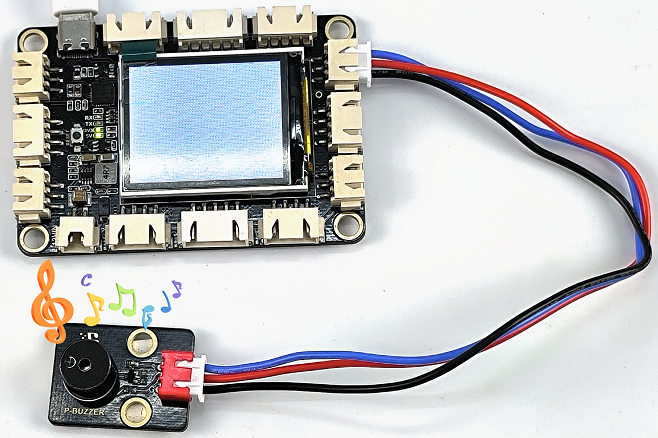

---

**8. 代码说明**

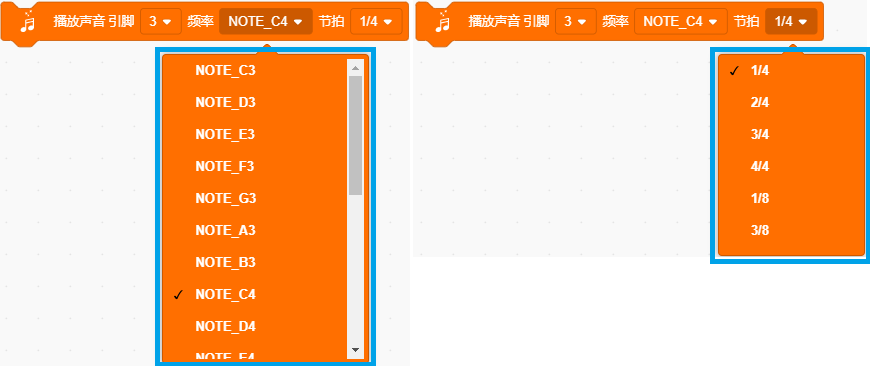

向指定引脚设置无源蜂鸣器的播放频率和节拍。

向指定引脚设置无源蜂鸣器播放特定的音乐。

向指定引脚设置无源蜂鸣器不发出声音。

---

第11课 风扇转动

**1. 项目介绍**

130电机模块上的HR1124S是应用于直流电机方案的单通道H桥驱动器芯片。HR1124S的H桥驱动部分采用低导通电阻的PMOS和NMOS功率管。低导通电阻保证芯片低的功率损耗，使得芯片安全工作更长时间。此外HR1124S拥有低待机电流，低静态工作电流，这些性能使HR1124S易用于玩具方案。

实验中，我们可通过输出到两个信号端IN+和IN-的电压方向来控制电机的转动方向，让电机转动起来。

---

**2. 模块参数**

工作电压: DC 3.3V~5V 

最大输入电流：1A

电机驱动电压：5V

电机最大驱动电流：1A（输入DC 5V）

电机最大驱动电流：0.4A（输入DC 3.3V）

控制信号: 数字信号

工作温度：-10°C ~ +50°C

尺寸：32mm x 23.8mm x 24.5mm

接口：2.54mm间距，4pin防反接口

---

**3. 模块原理图**

HR1124S芯片的作用是助于驱动电机。而电机所需电流较大，无法用三极管驱动更无法直接用IO口驱动。让电机转动起来的方法很简单，给电机两端添加电压即可。不同电压方向电机转向也不相同，额度电压内，电压越大，电机转动得越快；反之电压越低，电机转动得越慢，甚至无法转动。所以我们可以用PWM口来控制电机的转速，这一课我们先学习用高低电平来控制电机。

---

**4. 实验组件**

|  | | |
| ------------------------ | ------------------------ | ---------------------------- |
|主板 x1|  130电机模块 x1     |4P线(反向) x1 |
|     | ||
|  USB线 x1   | 电池盒 x1   | AA电池 x6 |

**注意：电机与风扇叶是分开装的，需要组合到一起。**

**5. 模块接线图**

**注意：请勿用手握住风扇叶，请将风扇叶对着空旷的地方，以免受伤。**

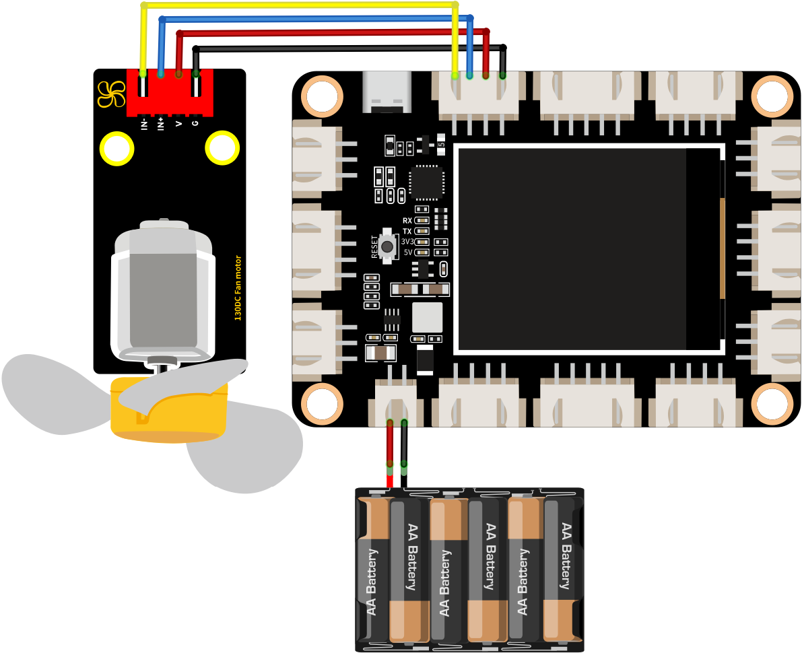

---

**6. 实验代码**

本项目中使用的代码保存在文件夹“<u>**...\项目代码\KidsBlock_代码**</u>”中，我们可以在此路径下打开代码文件''**11_130_Motor**"。

**注意：为了避免上传代码不成功，请上传代码前不要连接模块。代码上传成功后，拔下USB线断电，按照接线图正确接好模块后外接电源供电，上电后，观察实验结果。**

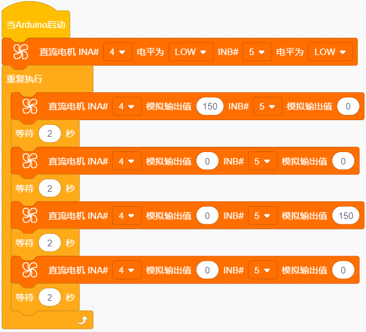

参照第01课的示例，导入提供的示例代码并连接好串口端口，然后上传示例代码。

---

**7. 实验结果**

**注意：请勿用手握住风扇叶，请将风扇叶对着空旷的地方，以免受伤。**

注意： 由于风扇在转动时，所需的电流比其他传感器要大，会引起电路中电压电流波动，特别是风扇进行正反转时，电压电流波动过大，导致主板的电压电流过低，会导致复位。

代码上传成功后，拔下USB线断电，按照接线图正确接好模块，给主板外接电源供电（将装有电池的电池盒接到主板上）。上电后风扇逆时针转动2秒；停止2秒；顺时针转动2秒；停止2秒；循环交替。

 

---

**8. 代码说明**

将管脚设置为D4、D5，当D4输出为低电平即INA(IN+)输入低电平，D5输出为低电平即INB(IN-)输入低电平时（输入与输出是相对的，这个实验中对于我们单片机的引脚来说，单片机输出高低电平，模块就为输入了，即从单片机输出到模块；例如按键模块则相反，是模块输出到单片机），即：当两个管脚都设置为低电平时，电机停止转动。

当D4输出为高电平即INA(IN+)输入高电平，D5输出为低电平即INB(IN-)输入低电平时，电机逆时针旋转。

当D4输出为低电平，D5输出为高电平时，电机顺时针旋转。

---

第12课 读取电位器的值

**1. 项目介绍**

旋转电位器是一个模拟传感器。前面我们学习过的传感器，都是数字传感器。例如我们前面学习的人体红外热释传感器，当传感器检测到附近有人在运动时，我们读取到高电平（5V），当未检测到附近有人在运动时，我们读取到低电平（0V），而在0~5V中间的电压值，我们数字IO口无法读取到，当然人体红外热释传感器也只能输出高低电平。而模拟传感器就可以通过我们主板上的模拟口读取中间的电压值，那么，在本实验中我们使用旋转电位器通过模拟口来读取中间的电压值（即：模拟值）。

---

**2. 模块参数**

工作电压: DC 3.3V~5V 

工作电流: 20 mA

工作功率: 0.1 W

输出信号: 模拟信号

工作温度：-10°C ~ +50°C

尺寸：32mm x 23.8mm x 28.4mm

接口：2.54mm间距，3pin防反接口

---

**3. 模块原理图**

旋转电位器原理是靠电刷在电阻体上滑动，在电路中获取与输入电压形成一定关系地输出电压。旋转电位器传感器选用了一个10K可调电阻。通过旋转电位器上的旋杆，我们可以改变电阻大小，信号端S检测到电压变化（0 ~ 5V），而这个电压变化是一个连续变化的模拟量，也就是在0~5V内可以取任意值，我们必须先对这个模拟量进行ADC采集，来测量连续的这些模拟量。A/D 是模拟量到数字量的转换，依靠的是模数转换器(Analog to Digital Converter)，简称ADC。我们的主板已经集成了ADC采集，可以直接使用。

我们的主板默认分辨率为10位，即ADC位数是10位。一个n位的ADC表示这个ADC共有2的n次方个刻度，10位的ADC，输出的是从0～1023一共1024个数字量，也就是2的10次方个数据刻度，每个刻度就是5V/1024≈0.0049V，这也叫分辨率。

ADC：ADC是一种电子集成电路，用于将模拟信号(如电压)转换为由1和0表示的数字信号。我们在主板上的ADC的范围是默认的10位（ADC的位数表示将模拟量转换成数字量后所用的二进制位数），其可存储数字量范围为：0 ~ 2^10即0 ~ 1023。假设它的参考电压是5V，也就是说把参考电压分成1024份，最小分辨率为5V/1024，模拟值的范围对应于ADC值。因此，ADC拥有的比特越多，模拟的分区就越密集，最终转换的精度也就越高。

纵坐标数字0 : 0V ~ 5.0/1024 V 范围内的模拟量（横坐标）;

纵坐标数字1 : 5.0/1024 V ~ 2 * 5.0/1024 V 范围内的模拟量（横坐标）;

......

模拟将被相应地划分。换算公式如下：

DAC：这一过程的可逆需要DAC，数字到模拟转换器。数字I/O端口可以输出高电平和低电平(0或1)，但不能输出中间电压值，这就是DAC有用的地方。主板上8位精度的DAC可以将VCC(这里是5.0V)分成2^8=256个部分。例如，当数字量为1时，输出电压值为5.0V/256 * 1=0.0195V，当数字量为128时，输出电压值为5.0V/256 * 128=2.5V，DAC的精度越高，输出电压值的精度就越高。

换算公式如下：

---

**4. 实验组件**

|  | 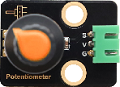  |  |  |    
| ------------------------ | ------------------------- | ---------------------------- | ---------------------------- | 
| 主板 x1| 旋转电位器 x1 |3P线(反向) x1 | USB线 x1  |    

---

**5. 模块接线图**

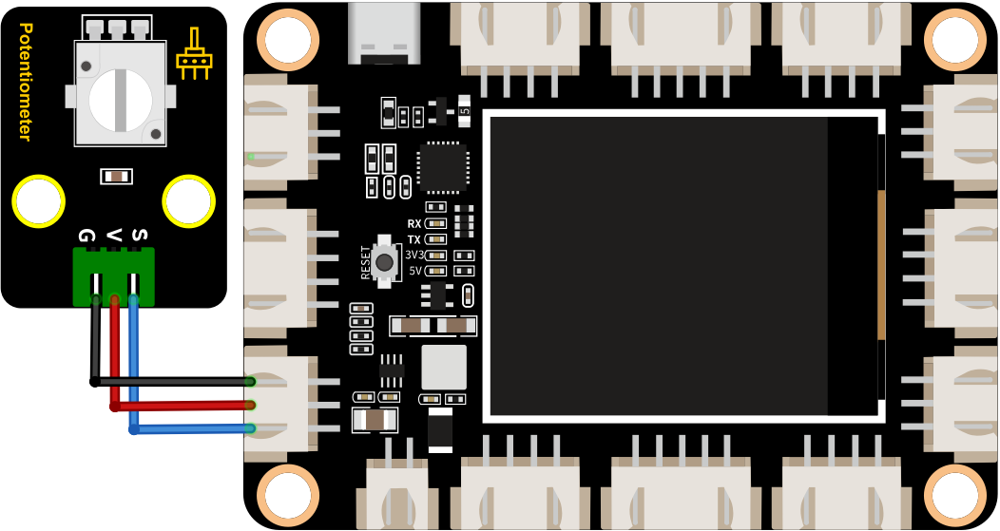

---

**6. 实验代码**

本项目中使用的代码保存在文件夹“<u>**...\项目代码\KidsBlock_代码**</u>”中，我们可以在此路径下打开代码文件''**12_Potentiometer**"。

**注意：为了避免上传代码不成功，请上传代码前不要连接模块。代码上传成功后，拔下USB线断电，按照接线图正确接好模块后再用USB线连接到计算机上电，观察实验结果。**

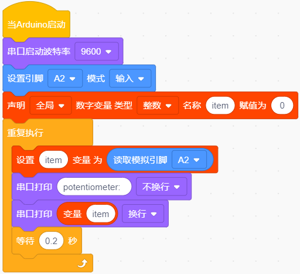

参照第01课的示例，导入提供的示例代码并连接好串口端口，然后上传示例代码。

---

**7. 实验结果**

代码上传成功后，拔下USB线断电，按照接线图正确接好模块后再用USB线连接到计算机上电，打开串口监视器，设置波特率为 **<u>9600</u>**。

滑动电位器手柄时，串口监视器打印出此时电位器的模拟值。

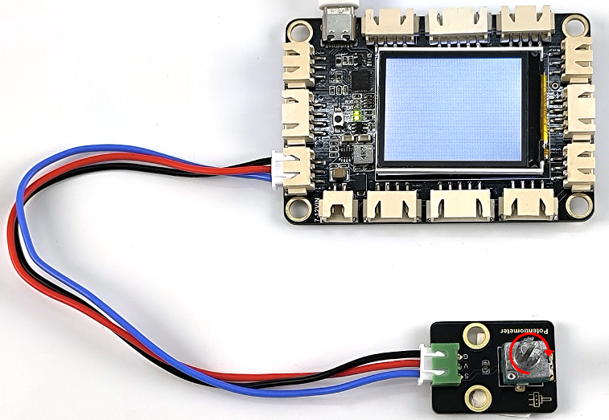

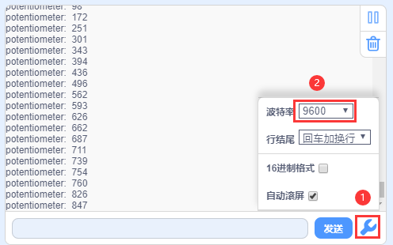

---

**8. 代码说明**

定义旋转电位器的模拟管脚为A2，“输入”设置为输入模式。 

从指定的模拟引脚读取模拟值。为了兼容性，默认analogRead()分辨率为 10 位。详细了解请参考链接：[https://vimsky.com/examples/usage/arduino-language-functions-analog-io-analogread-ar.html](https://vimsky.com/examples/usage/arduino-language-functions-analog-io-analogread-ar.html) 。这个函数是从指定的模拟引脚PIN_ANALOG_IN读取电位器的模拟信号，模拟信号的范围：0~1023。 

将电位器的模拟信号赋值于变量val。

---

第13课 检测光照强度

**1. 项目介绍**

光敏电阻传感器是一个常用的光敏电阻传感器，它主要由一个光敏电阻元件组成。光敏电阻元件的阻值随着光照强度的变化而变化，此传感器就是利用光敏电阻元件这一特性，设计电路将阻值变化转换为电压变化。光敏电阻传感器可以模拟人对环境光线的强度的判断，方便做出与人友好互动的应用。

---

**2. 模块参数**

工作电压: DC 3.3V~5V 

工作电流: 0.2mA

最大功率: 0.001W

输出信号: 模拟信号

工作温度：-10°C ~ +50°C

尺寸：32 x 23.8 x 7.4 mm

接口：2.54 mm间距，3pin防反接口

---

**3. 模块原理图**

当没有光照射时，电阻大小为0.2 MΩ，光敏电阻的信号端（2脚）检测的电压接近0。随着光照强度增大，光线传感器的电阻值越来越小，所以信号端能检测到的电压越来越大。

---

**4. 实验组件**

|   |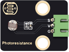 |       |  |    
| ------------------------ | ------------------------ | ---------------------------- |---------------------------- |
| 主板 x1  | 光敏电阻传感器 x1  |3P线(反向) x1 | USB线 x1  |     

---

**5. 模块接线图**

---

**6. 实验代码**

本项目中使用的代码保存在文件夹“<u>**...\项目代码\KidsBlock_代码**</u>”中，我们可以在此路径下打开代码文件''**13_Photoresistor**"。

**注意：为了避免上传代码不成功，请上传代码前不要连接模块。代码上传成功后，拔下USB线断电，按照接线图正确接好模块后再用USB线连接到计算机上电，观察实验结果。**

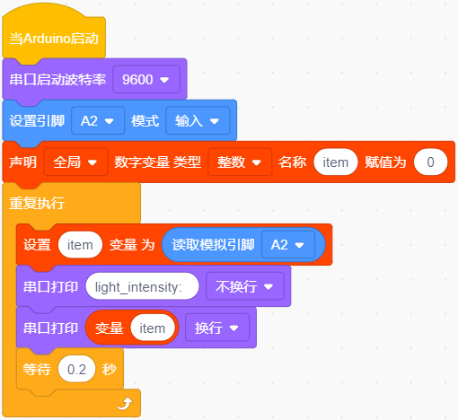

参照第01课的示例，导入提供的示例代码并连接好串口端口，然后上传示例代码。

---

**7. 实验结果**

代码上传成功后，拔下USB线断电，按照接线图正确接好模块后再用USB线连接到计算机上电，打开串口监视器，设置波特率为 **<u>9600</u>**。

串口监视器打印出光敏传感器的模拟值。光照越强，可以看到模拟值越大。

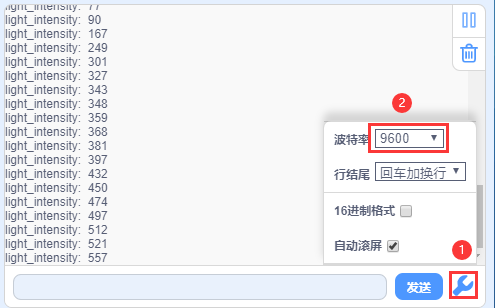

---

**8. 代码说明**

可以参照第12课的代码说明，这里就不多做介绍了。

---

第14课 检测声量

**1. 项目介绍**

声音传感器是可以检测声音大小的。实验中，我们利用这个传感器测试当前环境中的声音对应的模拟值。声音越大，模拟值越大；并在串口监视器上显示测试结果。

---

**2. 模块参数**

工作电压: DC 3.3V~5V 

工作电流: 15mA

最大功率: 0.075W

输出信号: 模拟信号

工作温度：-10°C ~ +50°C

尺寸：32mm x 23.8mm x 10.3mm

接口：2.54mm间距，3pin防反接口

---

**3. 模块原理图**

声音传感器主要由一个高感度麦克风元件和LM386音频功率放大器芯片组成。高感度麦克风元件用于检测外界的声音。利用LM386音频功率放大器芯片设计对高感度麦克风检测到的声音进行放大的电路，最大倍数为200倍。使用时我们可以通过旋转传感器上电位器，调节声音的放大倍数。顺时针调节电位器到尽头，放大倍数最大。

---

**4. 实验组件**

|   | |  | 
| ------------------------ | ------------------------ | ---------------------------- |
|主板 x1 |  声音传感器 x1 | 3P线(反向) x1 |
|  |  |       | 
|USB线 x1 |一字螺丝刀 x1 |      |

---

**5. 模块接线图**

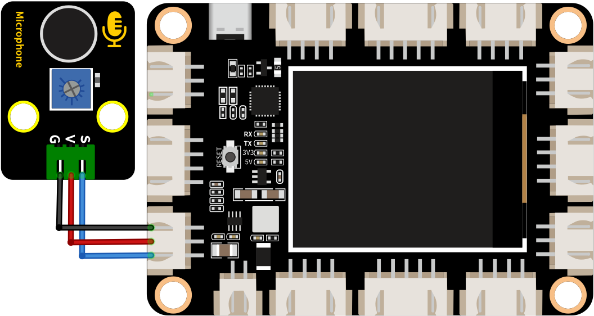

---

**6. 实验代码**

本项目中使用的代码保存在文件夹“<u>**...\项目代码\KidsBlock_代码**</u>”中，我们可以在此路径下打开代码文件''**14_MicroPhone**"。

**注意：为了避免上传代码不成功，请上传代码前不要连接模块。代码上传成功后，拔下USB线断电，按照接线图正确接好模块后再用USB线连接到计算机上电，观察实验结果。**

参照第01课的示例，导入提供的示例代码并连接好串口端口，然后上传示例代码。

---

**7. 实验结果**

代码上传成功后，拔下USB线断电，按照接线图正确接好模块后再用USB线连接到计算机上电，打开串口监视器，设置波特率为 **<u>9600</u>**。

串口监视器打印出声音传感器接收到的声音对应的模拟值。对准MIC头大声说话，可以看到接收到的声音对应的模拟值变大。（**注意：如果声音变化对应的模拟值没有变化并且一直都是数字0，需要用一字螺丝刀顺时针旋转电位器来调节。**）

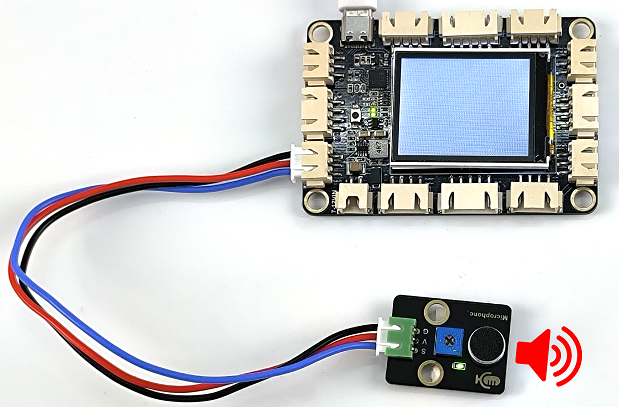

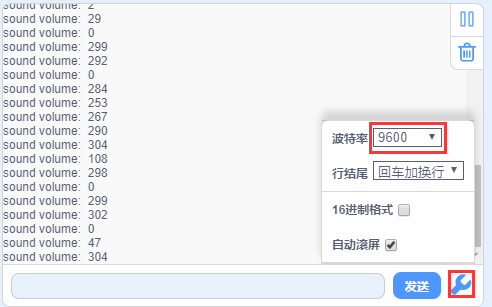

---

**8. 代码说明**

可以参照第12课的代码说明，这里就不多做介绍了。 

---

第15课 检测水量

**1. 项目介绍**

水滴传感器是一个模拟输入模块，也叫雨水、雨量传感器。可用于各种天气状况的监测，检测是否下雨及雨量的大小，转成模拟信号输出，并广泛应用于汽车自动刮水系统和智能天窗系统等。

---

**2. 模块参数**

工作电压: DC 3.3V~5V 

工作电流: 1.5mA

最大功率: 0.075W

输出信号: 模拟信号

工作温度：-10°C ~ +50°C

尺寸：32mm x 23.8mm x 9.3mm

接口：2.54mm间距，3pin防反接口

---

**3. 模块原理图**

水滴传感器通过电路板上裸露的印刷平行线检测水量的大小。水量越多，就会有更多的导线被联通，随着导电的接触面积增大，雨滴感应区 2 脚输出的电压就会逐步上升。信号端 S 检测到的模拟值就越大。除了可以检测水量的大小，它还可以检测空气中的水蒸气。

---

**4. 实验组件**

| | |       |  |   
| ------------------------ | ------------------------ | ---------------------------- | ---------------------------- |
|主板 x1 | 水滴传感器 x1 | 3P线(反向) x1 | USB线 x1   |     
 

---

**5. 模块接线图**

---

**6. 实验代码**

本项目中使用的代码保存在文件夹“<u>**...\项目代码\KidsBlock_代码**</u>”中，我们可以在此路径下打开代码文件''**15_Steam_Sensor**"。

**注意：为了避免上传代码不成功，请上传代码前不要连接模块。代码上传成功后，拔下USB线断电，按照接线图正确接好模块后再用USB线连接到计算机上电，观察实验结果。**

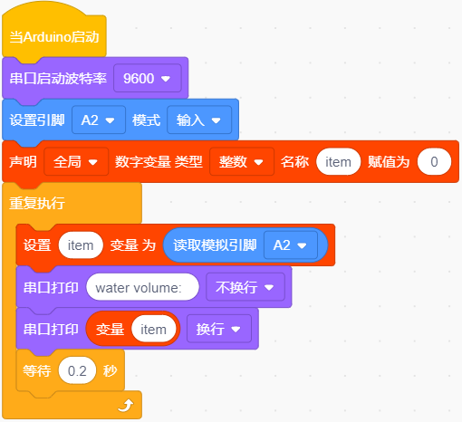

参照第01课的示例，导入提供的示例代码并连接好串口端口，然后上传示例代码。

---

**7. 实验结果**

代码上传成功后，拔下USB线断电，按照接线图正确接好模块后再用USB线连接到计算机上电，打开串口监视器，设置波特率为 **<u>9600</u>**。

在水滴传感器的感应区滴几滴水（**小心用水，注意不要滴到感应区以外的其他任何地方，包括主板**），串口监视器打印出此时水滴传感器的模拟值。水量变化，模拟值也会发生变化。水量越多，输出的模拟越大。

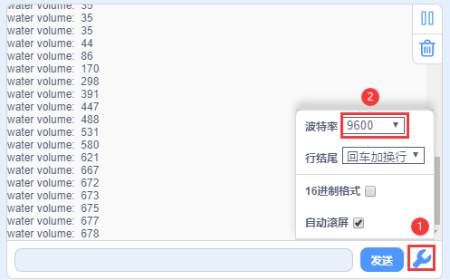

---

**8. 代码说明**

可以参照第12课的代码说明，这里就不多做介绍了。

---

第16课 检测温度

**1. 项目介绍**

NTC-MF52AT模拟温度传感器的原理与光敏电阻传感器类似，只是感应的器件不同。将传感器信号端接到主板的模拟口，可以读出对应的模拟值，电压值和温度值。我们可以利用模拟值，输出电压值，通过特定公式，计算出当前环境的温度值。

---

**2. 模块参数**

工作电压: DC 3.3V~5V 

工作电流: 20mA

最大功率: 0.1W

输出信号: 模拟信号

工作温度：-10°C ~ +50°C

尺寸：32mm x 23.8mm x 7.4mm

接口：2.54mm间距，3pin防反接口

---

**3. 模块原理图**

NTC-MF52AT模拟温度传感器主要由NTC-MF52AT热敏电阻元件组成。NTC-MF52AT热敏电阻元件能够感知周边环境温度的变化，随着温度的升高，热敏电阻的阻值降低，4.7K电阻两端的电压上升，从而引起信号端S的电压变化。

**NTC 热敏电阻温度计算公式：Rt = R * EXP( B * (1/T1-1/T2) ) 。**

其中，T1和T2指的是K度，即开尔文温度。K度=273.15(绝对温度)+摄氏度。

Rt 是热敏电阻在周围温度为T1（当前温度）时的电阻值。

R是热敏电阻在周围温度为T2常温（常温取25℃）时的标称阻值。参考规格书可知我们用的NTC-MF52AT模拟温度传感器在 25℃ 下热敏电阻的零功率电阻值为10KΩ ± 5%（即R=10K），T2=(273.15+25) 。

B值是热敏电阻的重要参数，为材料常数，在25℃下测得。参考规格书可知B值为 3950±1%。

EXP() 是e^()，e的n次方。

通过转换可以得到温度T1与电阻Rt的关系：T1=1 / (ln(Rt/R) /B+1/T2) ，这里可以将ln换算成log，即T1=1/ ( log(Rt/R)/B + 1/T2 ) 。

那么我们唯一需要知道的就是Rt的值。回到上面的原理图，设热敏电阻两端电压为VRt，固定的 R1电阻两端的电压为VR，由电阻分压知识VR/VRt = R1/Rt可以知道：Rt = R1 * (5.0-VR)/VR 。而我们实际得到的VR是转换后的模拟值，需要转换成电压值，即VR = AnalogValue / 1023 * 5.0。

**注意**：计算出来的温度是开尔文温度，因此需要减去K值，对应的摄氏温度 t = T1 - 273.15，同时加上0.5的误差矫正。

---

**4. 实验组件**

|   |  |        |  |    
| ------------------------ | --------------------------- | ---------------------------- |---------------------------- |
| 主板 x1| NTC-MF52AT模拟温度传感器 x1 | 3P线(反向) x1 | USB线 x1   |  
 
---

**5. 模块接线图**

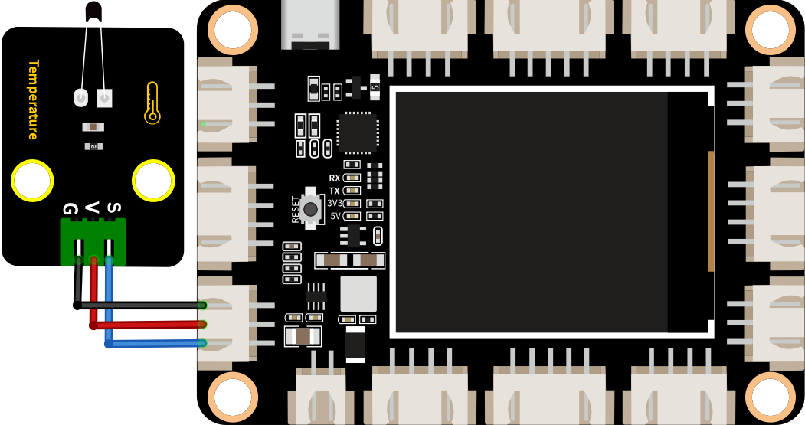

---

**6. 实验代码**

本项目中使用的代码保存在文件夹“<u>**...\项目代码\KidsBlock_代码**</u>”中，我们可以在此路径下打开代码文件''**16_Temperature_Sensor**"。

**注意：为了避免上传代码不成功，请上传代码前不要连接模块。代码上传成功后，拔下USB线断电，按照接线图正确接好模块后再用USB线连接到计算机上电，观察实验结果。**

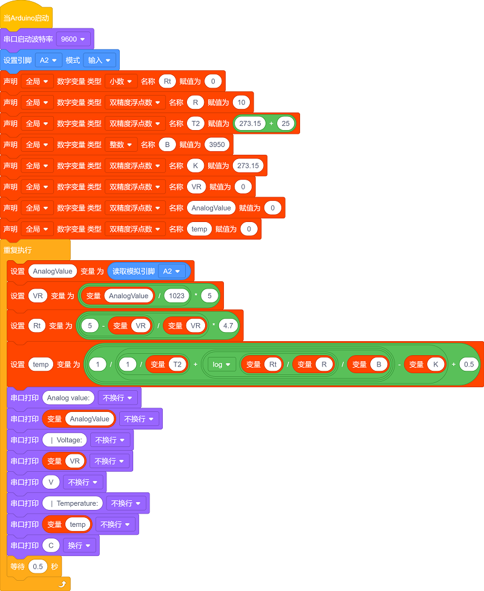

参照第01课的示例，导入提供的示例代码并连接好串口端口，然后上传示例代码。

---

**7. 实验结果**

代码上传成功后，拔下USB线断电，按照接线图正确接好模块后再用USB线连接到计算机上电，打开串口监视器，设置波特率为 **<u>9600</u>**。

串口监视器打印出模拟温度传感器(热敏传感器)当前所处环境下的模拟值、电压值和温度值。

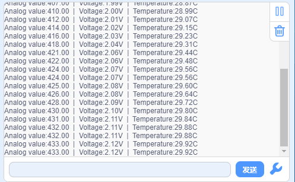

---

**8. 代码说明**

  
将R1电阻两端转换后的模拟值转换成电压值，数据类型为单精度浮点型。 

 
计算热敏电阻在当前温度下的电阻值。

计算当前环境的温度，数据类型为单精度浮点型。                 

---

第17课 摇杆模块

**1. 项目介绍**

你看过游戏手柄吗？游戏手柄上有按键，还有摇杆。摇杆是什么工作原理呢？在我们这个套件中，就有一个摇杆模块，它的主要元件是PS2手柄摇杆。控制时，我们需要将模块的X引脚和Y引脚连接至单片机的模拟口。B引脚连接至单片机数字口，V引脚接至单片机电源输出端（3.3-5V），G引脚接单片机GND。通过读取两个模拟值和一个数字口的高低电平情况，可以判断模块上摇杆的工作状态。

---

**2. 模块参数**

工作电压: DC 3.3V~5V 

工作电流: 12mA

最大功率: 0.06W

输出信号: 信号端X、Y模拟电压输出(模拟信号)，信号端B是数字电平输出(数字信号) 

工作温度：-10°C ~ +50°C

尺寸：47.6mm x 23.8mm x 34.5mm

接口：2.54mm间距，5pin防反接口

---

**3. 模块原理图**

其实摇杆模块的原理非常简单，内部相当于两个可调电位器（左右和上下）和一个按键。按键没有按下时被R1下拉为低电平，按下时接通VCC即为高电平，与我们前面学习过的按键模块的电平值是相反的。摇动摇杆时内部的电位器就会根据摇杆的摇动调节，从而输出不同的电压，可以读取到模拟值。

---

**4. 实验组件**

|   | |       |  |     
| ------------------------ | ------------------------ | ---------------------------- |---------------------------- |
| 主板 x1      |   摇杆模块 x1 | 5P线(反向) x1 | USB线 x1  |      

---

**5. 模块接线图**

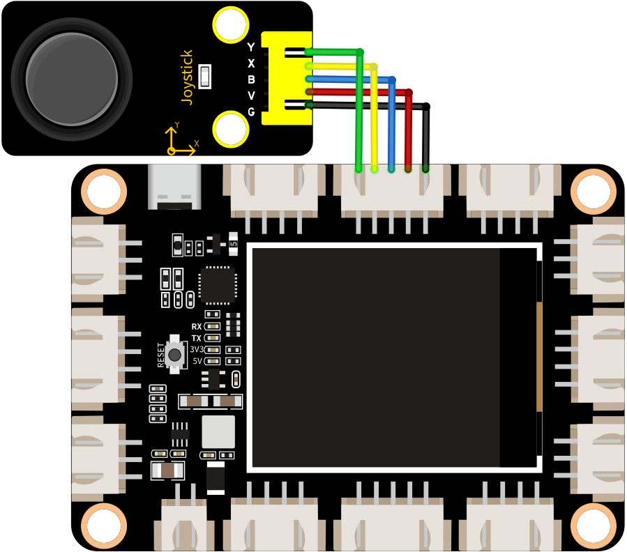

---

**6. 实验代码**

本项目中使用的代码保存在文件夹“<u>**...\项目代码\KidsBlock_代码**</u>”中，我们可以在此路径下打开代码文件''**17_Joystick**"。

**注意：为了避免上传代码不成功，请上传代码前不要连接模块。代码上传成功后，拔下USB线断电，按照接线图正确接好模块后再用USB线连接到计算机上电，观察实验结果。**

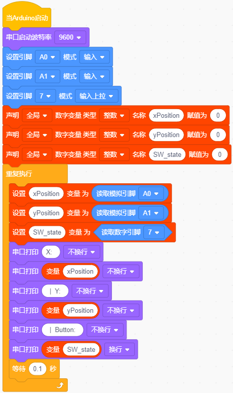

参照第01课的示例，导入提供的示例代码并连接好串口端口，然后上传示例代码。

---

**7. 实验结果**

代码上传成功后，拔下USB线断电，按照接线图正确接好模块后再用USB线连接到计算机上电，打开串口监视器，设置波特率为 **<u>9600</u>**。

串口监视器窗口将打印出当前摇杆X轴(X引脚)和Y轴(Y引脚)对应的模拟值以及Z轴(B引脚)对应的数字值，移动摇杆或按下它将改变串口监视器中的模拟值和数字值。当按下摇杆时，Button值为1；未按下摇杆时，Button值为0。X值从左到右由0增长到1023。Y值从下到上由0增长到1023。

在X轴上移动摇杆，使数据从小到大。

在Y轴上移动摇杆，使数据从小到大。

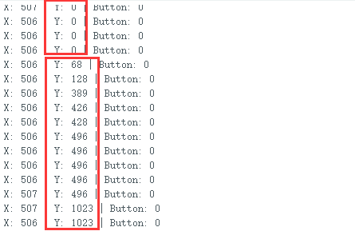

按下摇杆。

---

**8. 代码说明**

将引脚设置为输入上拉模式。 

剩余的请参照第05课和第12课的代码说明。

---

第18课 舵机转动

**1. 项目介绍**

之前，我们学习了如何控制电机的速度和旋转方向。在本实验中，我们将学习伺服（舵机）系统，它是一种旋转驱动器类型的电机，可以控制旋转到特定的角度。

---

**2. 模块参数**

工作电压: DC 3.3V~5V 

工作温度：-10°C ~ +50°C

尺寸：32.25mm x 12.25mm x 30.42mm

接口：2.54mm间距，3pin接口

---

**3. 模块原理图**

舵机密封包装，由直流电机，一套提供扭矩的变速齿轮组，可调电位器和电子控制板组成。

多数舵机只能旋转180度，舵机输出的转矩比简单直流电动机更高。被广泛用于控制模型汽车、模型飞机、机器人等。舵机一般有三线，通常连接到公或母3拼线。其中两线用于电源：正极（2-正极线，红线)，负极（3-负极线，棕线），以及一个信号线（1-信号线，橙线）。如图，套件中的舵机：

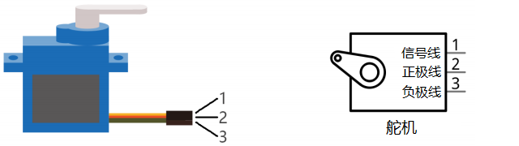

我们使用PWM信号驱动舵机，该信号占空比一定，频率为50Hz。PWM单个周期高电平持续时间为0.5ms ~ 2.5ms，与舵机角度的0° ~ 180°线性对应。部分对应值如下：

改变舵机信号值，舵机将旋转到指定角度。

注意: 由于舵机品牌不同，对于同一信号，不同品牌的舵机旋转的角度也会有所不同。

---

**4. 实验组件**

|  |   |  |
| ------------------------ | ------------------- | --------------------- | 
| 主板 x1 | 舵机驱动模块 x1|USB线 x1  |
|   | |     |
| 舵机 x1 | 4P线(反向) x1|           |

---

**5. 实验①**

（1）实验接线图

（2）实验代码

本项目中使用的代码保存在文件夹“<u>**...\项目代码\KidsBlock_代码**</u>”中，我们可以在此路径下打开代码文件''**18.1_Servo**"。

参照第01课的示例，导入提供的示例代码并连接好串口端口，然后上传示例代码。

（3）实验结果

代码上传成功后，拔下USB线断电，按照接线图正确接好舵机，再用USB线连接到计算机上电。上电后，舵机由0度转到90度，停顿1秒；再转到180度，停顿1秒；然后回到0度，停顿1秒，循环转动。

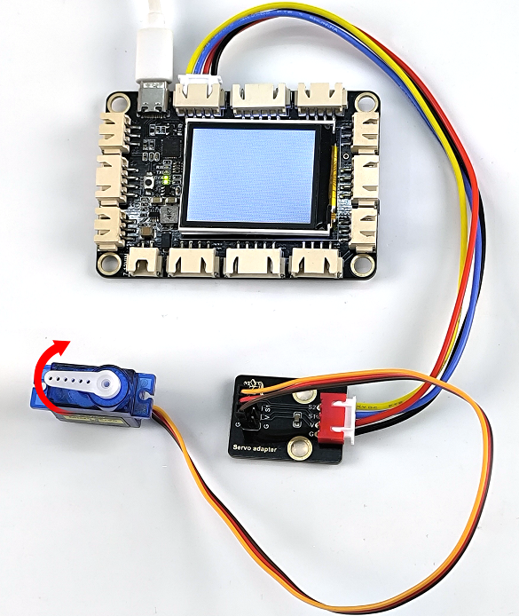

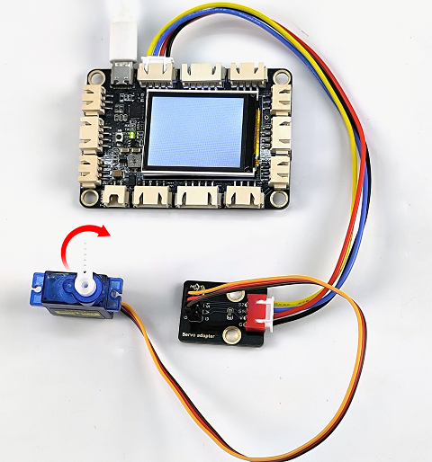

---

**6. 实验②**

（1）实验接线图

（2）实验代码

本项目中使用的代码保存在文件夹“<u>**...\项目代码\KidsBlock_代码**</u>”中，我们可以在此路径下打开代码文件''**18.2_Servo**"。

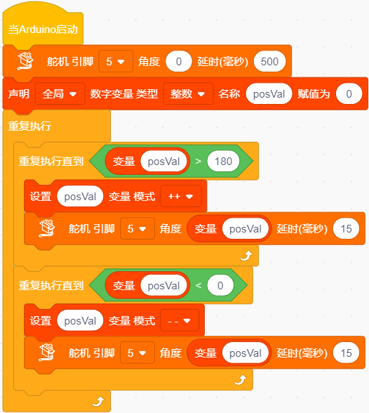

（3）实验结果

代码上传成功后，拔下USB线断电。按照接线图正确接好舵机，再用USB线连接到计算机上电，上电后，舵机在0度 ~ 180度之间来回转动，每15ms转动一度。

---

**7. 代码说明**

Arduino专门为了主板推出的servo库，用来操作舵机。创建一个舵机对象来控制舵机，设置控制舵机的引脚和转动的角度。

向舵机写入一个数值，来直接控制舵机的轴，角度控制。舵机转动到posVal角度值，舵机每隔15毫秒转动一次，角度逐渐增加1°。

向舵机写入一个数值，来直接控制舵机的轴，角度控制。舵机转动到posVal角度值，舵机每隔15毫秒转动一次，角度逐渐减少1°。

条件循环语句，如果满足中的条件就一直执行循环，如果不满足就终止执行循环。

---

第19课 超声波测距

**1. 项目介绍**

蝙蝠和某些海洋动物都能够利用高频率的声音进行回声定位或信息交流。它们能通过口腔或鼻腔把从喉部产生的超声波发射出去，利用折回的声波来定向，并判定附近物体的位置、大小以及是否在移动。超声波是一种频率高于20000赫兹的声波，它的方向性好，穿透能力强，易于获得较集中的声能，在水中传播距离远，可用于测距、测速、清洗、焊接、碎石、杀菌消毒等。在医学、军事、工业、农业上有很多的应用。超声波因其频率下限大于人的听觉上限而得名。科学家们将每秒钟振动的次数称为声音的频率，它的单位是赫兹(Hz)。

在这个套件中，有一个HC-SR04超声波传感器，它可以发送出一种频率很高的人类无法听到的超声波信号，这些超声波的信号碰到障碍物，就会立刻反射回来。在接收到返回的信息之后，根据发射信号和接收信号的时间差，计算出传感器和障碍物的详细距离，和蝙蝠飞行的原理一样。

---

**2. 模块参数**

超声波传感器工作电压：DC 5V 

超声波传感器工作电流：15mA

超声波传感器工作频率：40Hz

超声波传感器射程范围：2cm~4m

超声波传感器测量角度：<= 15度

超声波传感器输入触发信号：10 uS 的TTL脉冲

超声波传感器输出回响信号：输出TTL电平信号与射程成正比

工作温度：-10°C ~ +50°C

超声波传感器尺寸：45.5mm x 26.7mm x 17.6mm

超声波转接板模块尺寸：32mm x 23.8mm x 18.5mm

超声波转接板模块接口：2.54mm间距，4pin防反接口

---

**3. 模块原理图**

最常用的超声测距的方法是回声探测法。当有脉冲电压触发时（单片机给Trig引脚发送高电平），超声波发射器探头里的晶片就会振动，继而产生超声波。在超声波发射时刻的同时计数器开始计时，超声波在空气中传播，途中碰到障碍物面阻挡就立即反射回来（Echo引脚发送高电平信号给单片机），超声波接收器收到反射回的超声波就立即停止计时。

超声波是一种声波，其声速V与温度有关。一般情况下超声波在空气中的传播速度为340m/s，根据计时器记录的时间t，就可以计算出超声波探头发射点距障碍物面的距离s，即：s=340t/2 。

HC-SR04超声波测距模块可提供范围为2厘米至4米的非接触式距离感测功能，测距精度可达高到3mm。超声波传感器包括超声波发射器、超声波接收器与控制电路。其基本工作原理：

(1)采用IO口Trig触发测距，给至少10us的高电平信号;

(2)模块自动发送8个40khz的方波，自动检测是否有信号返回；

(3)有信号返回，通过IO口Echo输出一个高电平，高电平持续的时间就是超声波从发射到返回的时间。

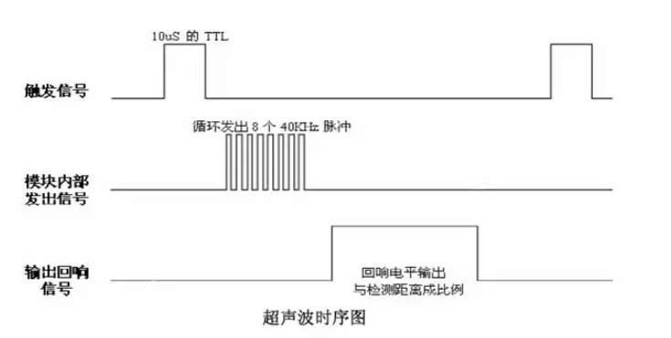

---

**4. 实验组件**

|   | |   |
| ------------------------ | ------------------------ | ---------------------------- |
|主板 x1  | 超声波转接模块 x1 |  USB线 x1|
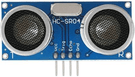 |  |     |
|HC-SR04 超声波传感器 x1 | 4P线(反向) x1 |    |

---

**5. 模块接线图**

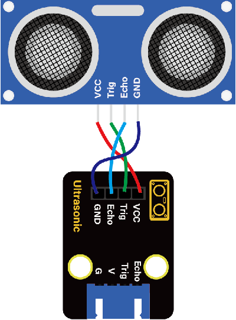

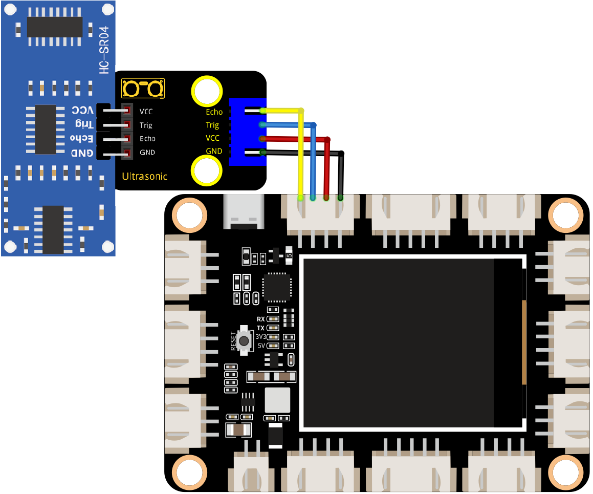

---

**6. 实验代码**

本项目中使用的代码保存在文件夹“<u>**...\项目代码\KidsBlock_代码**</u>”中，我们可以在此路径下打开代码文件''**19_Ultrasonic**"。

**注意：为了避免上传代码不成功，请上传代码前不要连接模块。代码上传成功后，拔下USB线断电，按照接线图正确接好模块后再用USB线连接到计算机上电，观察实验结果。**

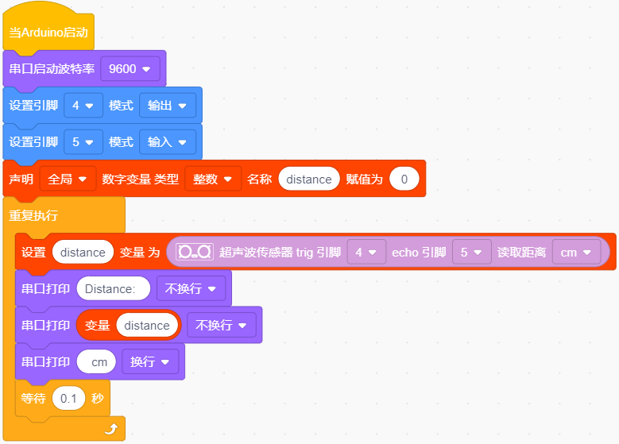

参照第01课的示例，导入提供的示例代码并连接好串口端口，然后上传示例代码。

---

**7. 实验结果**

代码上传成功后，拔下USB线断电，按照接线图正确接好模块后再用USB线连接到计算机上电，打开串口监视器，设置波特率为 **<u>9600</u>**。

放置障碍物在超声波传感器探头前感应，串口监视器窗口打印出超声波传感器与障碍物之间的距离值。

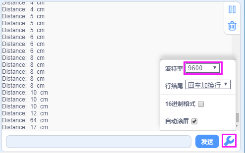

---

**8. 代码说明**

这是用于向指定引脚测量距离的超声波传感器指令方块，距离单位可以选择cm或inch。

---

第20课 红外遥控与接收

**1. 项目介绍**

红外线遥控是目前使用最广泛的一种通信和遥控手段。因红外线遥控装置具有体积小、功耗低、功能强、成本低等特点，录音机、音响设备、空凋机以及玩具等其它小型电器装置上纷纷采用红外线遥控。红外遥控的发射电路是采用红外发光二极管发出经过调制的红外光波；红外接收电路由红外接收二极管、三极管或硅光电池组成，它们将红外发射器发射的红外光转换为相应的电信号，再送到后置放大器。

红外接收模块选择的是VS1838B红外接收传感器元件，该元件是集接收、放大、解调一体的器件，内部IC就已经完成了解调，输出的就是数字信号。它可接收标准38KHz调制的遥控器信号。

---

**2. 模块参数**

工作电压: DC 3.3V~5V 

工作电流: 1.5mA

最大功率: 0.25 W

工作温度：-10°C ~ +50°C

控制信号: 数字信号

尺寸：32 x 23.8 x 10.8 mm

接口：2.54mm间距，3pin防反接口

---

**3. 模块原理图**

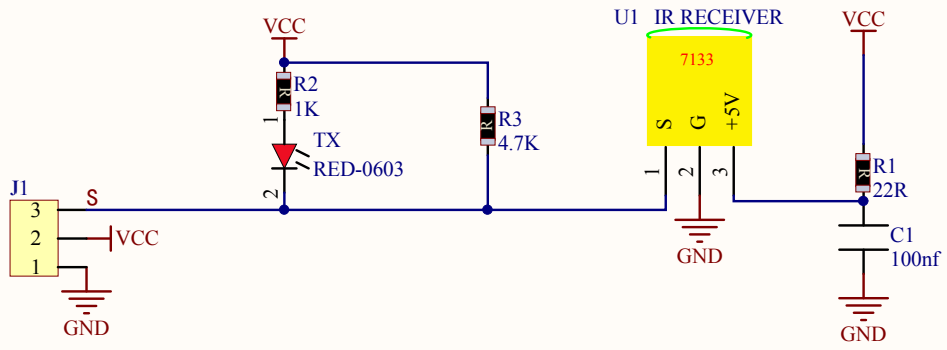

红外遥控系统的主要部分为调制、发射和接收。红外遥控是以调制的方式发射数据，就是把数据和一定频率的载波进行“与”操作，这样既可以提高发射效率又可以降低电源功耗。调制载波频率一般在30khz到60khz之间，大多数使用的是38kHz，占空比1/3的方波。红外接收的信号端加上了4.7K的上拉电阻R3，工作时，首先等待检测低电平，接收到信号后，信号端立即由高电平转为低电平。

---

**4. 实验组件**

|    |  |  |  
| ------------------------ | ------------------------ | -------------------------------- |
| 主板 x1   | 红外接收模块 x1  | USB线 x1  |
| |  |    | 
| Keyes 遥控器 x1  | 3P线(反向) x1 |    |

---

**5. 模块接线图**

---

**6. 实验代码**

本项目中使用的代码保存在文件夹“<u>**...\项目代码\KidsBlock_代码**</u>”中，我们可以在此路径下打开代码文件''**20_IR_Receiver**"。

**注意：为了避免上传代码不成功，请上传代码前不要连接模块。代码上传成功后，拔下USB线断电，按照接线图正确接好模块后再用USB线连接到计算机上电，观察实验结果。**

参照第01课的示例，导入提供的示例代码并连接好串口端口，然后上传示例代码。

---

**7. 实验结果**

代码上传成功后，拔下USB线断电，按照接线图正确接好模块后再用USB线连接到计算机上电，打开串口监视器，设置波特率为 **<u>9600</u>**。

找到红外遥控器，拔出绝缘片。对准红外接收模块的红外接收传感器的接收头，按下遥控器任意按键，接收到信号后，串口监视器窗口打印出当前接收到的按键值，同时，红外接收传感器上的LED会闪烁。

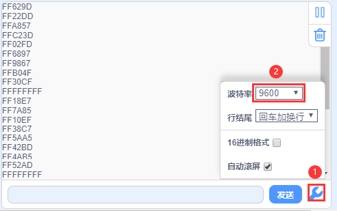

Keyes 遥控器上每一个按键都对应着一个按键值，如下图所示。

---

**8. 代码说明**

这是用于向指定引脚初始化红外接收的指令方块

这是接收到红外遥控的数据的指令方块。

这是读取红外接收数据的指令方块。

这是刷新红外接收数据，并接收下一个值的指令方块。

---

第21课 检测温湿度

**1. 项目介绍**

XHT11温湿度传感器是一款低价的入门级温湿度传感器，它主要由一个电阻式感湿元件和一个NTC测温元件组成。XHT11为4针单排引脚封装，采用单线制串行接口，只需加适当的上拉电阻，信号传输距离可达20米以上，XHT11温湿度传感器具有超快响应、抗干扰能力强、性价比极高等优点。

---

**2. 模块参数**

工作电压: DC 3.3V~5V 

工作电流: 2.1mA

最大功率: 0.015W

温度范围: -25 ~ +60°C (± 2℃)

湿度范围: 5 ~ 95%RH（25C°左右精度为±5%RH）

输出信号: 数字双向单总线

工作温度: -25°C ~ +60°C

尺寸：32mm x 23.8mm x 9.7mm

接口：2.54mm间距，3pin防反接口

---

**3. 模块原理图**

单片机与 XHT11之间的通讯和同步,采用单总线数据格式,一次通讯时间4ms左右,数据分小数部分和整数部分,具体格式在下面说明,当前小数部分用于以后扩展,现读出为零，操作流程：一次完整的数据传输为40bit，高位先出。

**数据格式：** 8bit湿度整数数据+8bit湿度小数数据+8bi温度整数数据+8bit温度小数数据+8bit校验和。

**8位校验和：** 8bit湿度整数数据+8bit湿度小数数据+8bi温度整数数据+8bit温度小数数据"相加所得结果的末8位。

---

**4. 实验组件**

|    |  | |  |      
| ------------------------ | -------------------------- | ---------------------------- |---------------------------- |
| 主板 x1  | XHT11温湿度传感器 x1 | 3P线(反向) x1 | USB线 x1 |   
   
---

**5. 模块接线图**

---

**6. 实验代码**

本项目中使用的代码保存在文件夹“<u>**...\项目代码\KidsBlock_代码**</u>”中，我们可以在此路径下打开代码文件''**21_XHT11**"。

**注意：为了避免上传代码不成功，请上传代码前不要连接模块。代码上传成功后，拔下USB线断电，按照接线图正确接好模块后再用USB线连接到计算机上电，观察实验结果。**

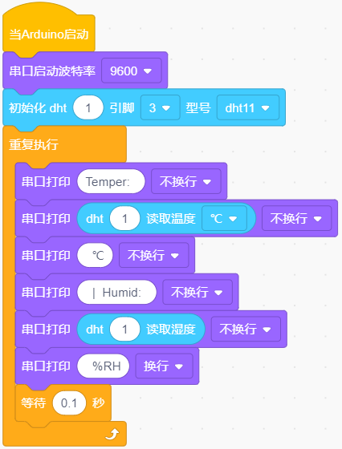

参照第01课的示例，导入提供的示例代码并连接好串口端口，然后上传示例代码。

---

**7. 实验结果**

代码上传成功后，拔下USB线断电，按照接线图正确接好模块后再用USB线连接到计算机上电，打开串口监视器，设置波特率为 **<u>9600</u>**。

串口监视器打印出XHT11温湿度传感器检测到当前环境的温湿度值。

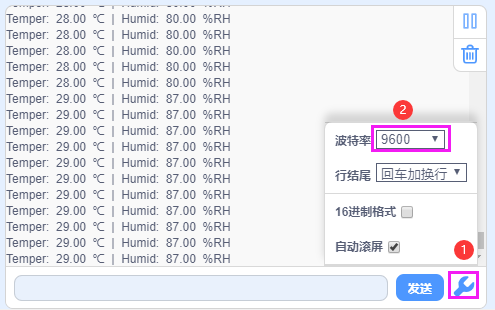

---

**8. 代码说明**

初始化温湿度传感器的管脚和型号，这里型号选用dht11.

读取温度。

读取湿度。

---

第22课 四位数码管显示数字

**1. 项目介绍**

TM1650四位数码管模块选用的是0.36 英寸红色共阴4位数码管，其驱动芯片是TM1650。TM1650是一种带键盘扫描接口的LED驱动控制专用电路的芯片。内部集成有MCU输入输出控制数字接口、数据锁存器、LED 驱动、键盘扫描等电路。TM1650性能稳定、质量可靠、抗干扰能力强，可适用于24小时长期连续工作的应用场合。TM1650采用两线串行传输协议通讯（注意：该数据传输协议不是标准的I2C协议）。该芯片只需要通过两个引脚与MCU通讯就可以完成数码管的驱动，可以节省MCU引脚资源。

实验中使用TM1650四位数码管模块时，我们只需要2根信号线即可使单片机控制4位数码管，大大节约了控制板IO口资源。

---

**2. 模块参数**

工作电压: DC 3.3V~5V 

工作电流: 42mA

最大功率: 0.21W

数码管显示颜色: 红色

LED极性: 共阴

通讯方式：2线高速串行接口（CLK,DAT）

工作温 ：-10°C ~ +50°C

尺寸：47.6mm x 23.8mm x 10.6mm

接口：2.54mm间距，4pin防反接口

---

**3. 模块原理图**

TM1650与MCU之间的通讯采用2线高速串行接口（CLK,DAT），这两个连线分别是数据线DAT和同步时钟线CLK。其中DAT为双向数据传输线，TM1650既用该线从MCU接收数据，也用该线向MCU发送数据。

实验中我们使用封装好的库函数。如果大家有兴趣也可以接着往下学习了解 3.1 TM1650通讯时序格式和 3.2 指令集说明，然后再去了解底层的库函数是如何实现的。

3.1 TM1650通讯时序格式

TM1650采用下图1 中2线串行传输协议通讯：

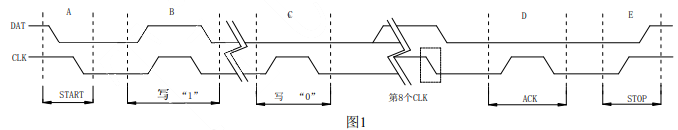

（1）开始信号（START）/结束信号(STOP)

开始信号：保持 CLK 为“1”电平，DAT 从“1”跳“0”，认为是开始信号，如上图1的 A 段；

结束信号：保持 CLK 为“1”电平，DAT 从“0”跳“1”，认为是结束信号，如上图1的 E 段；

（2）ACK 信号

如果本次通讯正常，芯片在串行通讯的第 8 个时钟下降沿后，TM1650 主动把 DAT 拉低，直到 CLK 检测到上升沿，DAT 释放为输入状态（对芯片而言）,如上图1的 D 段。

（3）写“1”和写“0”

写“1”：保持 DAT 为“1”电平，CLK 从“0”跳到“1”,再从“1”跳到“0”，则认为是写入“1” ，如上图 1的 B 段。

写“0”：保持 DAT 为“0”电平，CLK 从“0”跳到“1”,再从“1”跳到“0”，则认为是写入“0” ，如上图 1的 C 段。

（4）一个字节（8 位）数据传输格式

一个字节数据的传输格式如图上 2，数据发送时 MSB 在前，LSB 在后，即高位先进。微处理器的数据通过 2 线 串行接口和 TM1650 通信，当 CLK 是高电平时，DAT 上的信号必须保持不变；只有 CLK 上的时钟信号为低电平时， DAT 上的信号才能改变。数据输入的开始条件是 CLK 为高电平时，DAT 由高变低；结束条件是 CLK 为高时，DAT 由低电平变为高电平。 

（5）写显示操作

ADDRESS：显示地址（68H、6AH、6CH、6EH）； 

DATA：显示数据。

（6）完整操作时序

command1：系统命令 48H； 

command2：系统参数设置；

ADDRESS：显示地址（68H、6AH、6CH、6EH）；

DATA：显示数据。

备注：

1.设置系统参数和写入显存数据是两个独立的过程，它们之间的顺序不影响实际应用； 

2.每次输入系统命令（48H）和系统参数设置命令都会改变系统参数，请特别注意待机指令操作。

3.2 指令集说明

（1）数据命令设置 

注意：使用的指令是 16 进制 H，输入数据和读取数据都是从高位开始。

所以在代码中我们数据命令设置为 0x48，使用TM1650点亮数码管的功能，而不使用按键扫描的功能。

（2）显示命令设置

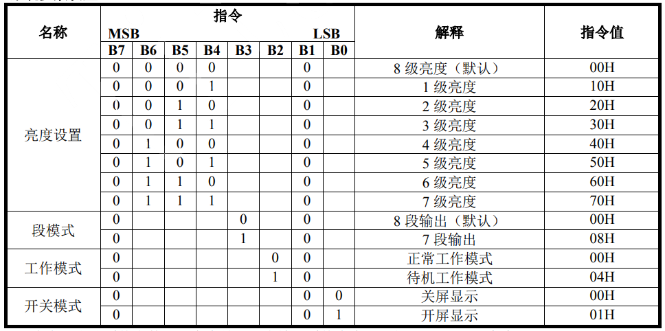

注意：在发送上述系统显示命令前需要先输入系统命令48H,如48H+11H=1级亮度开屏显示。

B[7:0]：这里实际是一个字节数据，只是不同位部分代表不同功能。

B[6:4]：设置数码管亮度。注意：000 最亮。

B[3]：设置是否显示小数点。

B[0]：设置数码管的开屏、关屏。

（3）显存地址

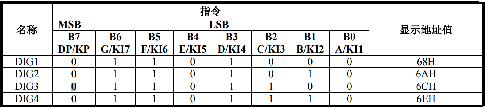

如果要显示小数点，则必须先需要将段模式设置为 8 段输出。

---

**4. 实验组件**

|   ||        |  |     
| ------------------------ | ----------------------------- | ---------------------------- |---------------------------- |
|主板 x1   |TM1650四位数码管模块 x1  | 4P线(反向) x1 | USB线 x1| 
  
---

**5. 模块接线图**

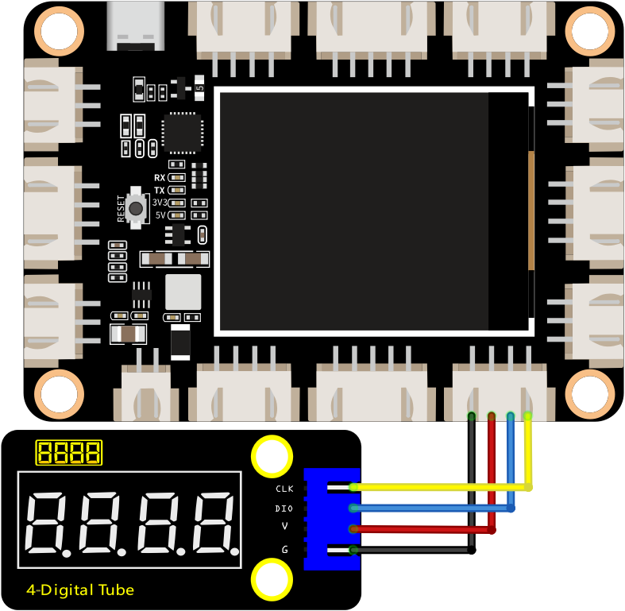

---

**6. 实验代码**

本项目中使用的代码保存在文件夹“<u>**...\项目代码\KidsBlock_代码**</u>”中，我们可以在此路径下打开代码文件''**22_Four_Digita_Tube**"。

**注意：为了避免上传代码不成功，请上传代码前不要连接模块。代码上传成功后，拔下USB线断电，按照接线图正确接好模块后再用USB线连接到计算机上电，观察实验结果。**

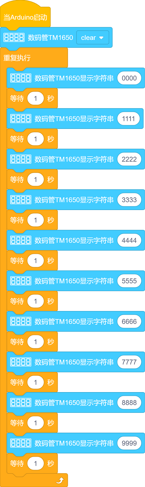

参照第01课的示例，导入提供的示例代码并连接好串口端口，然后上传示例代码。

---

**7. 实验结果**

代码上传成功后，拔下USB线断电。按照接线图正确接好模块后再用USB线连接到计算机上电。4位数码管显示数字，从0000开始，每隔1秒逐渐到9999。

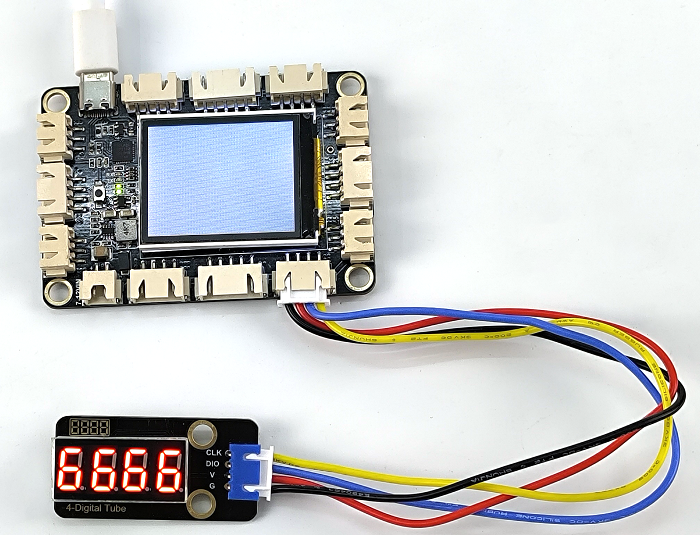

---

**8. 代码说明**

初始化四位数码管，清除原来显示的内容。

四位数码管显示字符串。

---

第23课 点阵显示图案

**1. 项目介绍**

点阵，多个LED组成的阵列，他们的集合称为“阵”，其中单个单元称为“点”。8 X 8点阵共由64个发光二极管组成，且每个发光二极管是放置在行线和列线的交叉点上。

第02课我们学习了一个IO口控制一个led，这节课我们来学习用更少的IO口控制更多的led。

---

**2. 模块参数**

工作电压: DC 3.3V~5V 

工作电流: 190mA

最大功率: 0.95W

通讯方式：I2C通讯

I2C通信地址：0X70

点阵屏显示颜色：蓝色

工作温度：-10°C ~ +50°C

尺寸：32mm x 23.8mm x 9.3mm

接口：2.54mm间距，4pin防反接口

---

**3. 模块原理图**

如原理图所示，如果想要点亮第一行第一列的LED灯，只需要将C1置高电平、R1置低电平就可以了。如果我们想让第一行led全部点亮，只需要将R1置为低电平，C1~C8全部置为高电平就可以了。原理非常简单，但是这样设置的话我们总共需要用到16个IO口，非常浪费单片机资源。为了节省IO口不浪费单片机资源，我们特别设计了这个HT16K33_8X8点阵模块，利用HT16K33芯片驱动1个8*8点阵，只需要利用单片机的I2C通信端口就能控制点阵的64个发光二极管。

我们这款Keyes HT16K33_8X8点阵模块已经固定了通信地址，地址为0x70。

---

**4. 实验组件**

|     |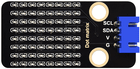 |  |  |     
| ------------------------ | ---------------------------- | ---------------------------- |---------------------------- |
| 主板 x1   | HT16K33_8X8点阵模块 x1 |4P线(反向) x1 | USB线 x1 | 

---

**5. 模块接线图**

---

**6. 实验代码**

本项目中使用的代码保存在文件夹“<u>**...\项目代码\KidsBlock_代码**</u>”中，我们可以在此路径下打开代码文件''**23_8×8_Dot_Matrix**"。

**注意：为了避免上传代码不成功，请上传代码前不要连接模块。代码上传成功后，拔下USB线断电，按照接线图正确接好模块后再用USB线连接到计算机上电，观察实验结果。**

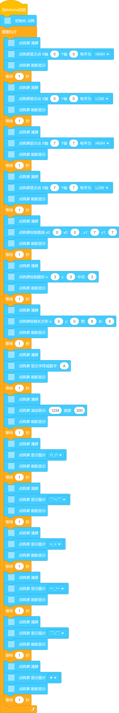

参照第01课的示例，导入提供的示例代码并连接好串口端口，然后上传示例代码。

---

**7. 实验结果**

代码上传成功后，拔下USB线断电。按照接线图正确接好模块后再用USB线连接到计算机上电。HT16K33_8X8点阵模块的（0，0）处LED闪烁，（7，7）处LED闪烁，绘制直线，绘制圆形和长方形，显示字符“A”，以速度200滚动显示数字“1234”，显示内置的各种图案。

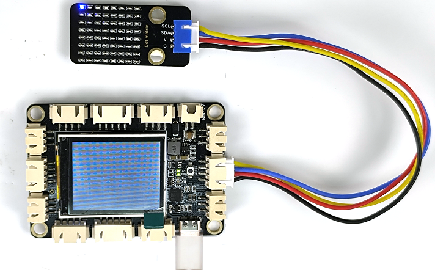

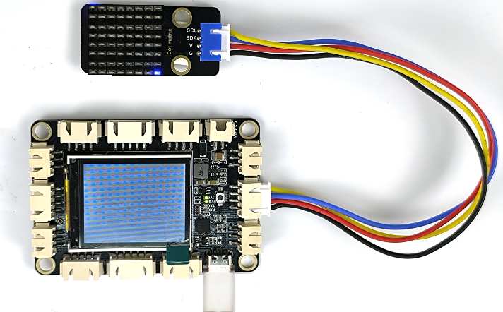

......

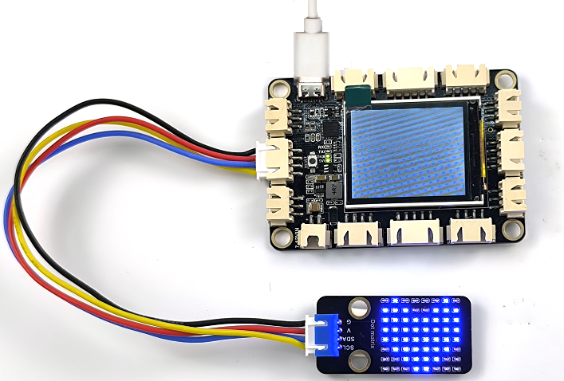

---

**7. 代码说明**

初始化8*8点阵。

熄灭8*8点阵上所有的LED

设置8*8点阵上某个LED点亮或熄灭。

刷新8*8点阵点亮。

8*8点阵在某两个位置之间绘制直线。

8*8点阵在（3,3）为圆心，半径为3画圆。

8*8点阵显示数字或字符，这里是显示字符A。

8*8点阵以200速度滚动显示数字1234，速度值可以任意设置。

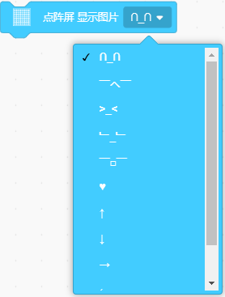

8*8点阵显示内置的图案。

---

第24课 TFT 屏显示

**1. 项目介绍**

在这个套件中，有一款完全兼容Arduino IDE开发环境的主板，主板上集成了一块1.8寸TFT显示屏。TFT显示屏的分辨率为128 * RGB * 160，显示方向可以调整，横屏竖屏均可。TFT显示屏的驱动IC为ST7735S，采用SPI通信方式，具有显示效果好。

---

**2. 模块参数**

材料：TFT LCD

工作电压：3.3V~5V

TFT可视角度：120度

像素个数：128列 × 160行

分辨率：128 ×（RGB）× 160

通信方式：SPI通信

驱动芯片：ST7735S

总功耗：0.11W

工作温度：-10℃~+60℃

显示类型：a-Si TFT

背光：2片LED，平行

视角：12H

尺寸：1.8寸

---

**3. 模块原理图**

---

**4. 实验组件**

|  |  |  
| ------------------------ | --------------------------- |
| 主板 x1| USB线 x1 |
      
---

**5. 模块接线图**

---

**6. 实验代码**

本项目中使用的代码保存在文件夹“<u>**...\项目代码\KidsBlock_代码**</u>”中，我们可以在此路径下打开代码文件''**24_TFT_Screen**"。

**注意：为了避免上传代码不成功，请上传代码前不要连接模块。代码上传成功后，拔下USB线断电，按照接线图正确接好模块后再用USB线连接到计算机上电，观察实验结果。**

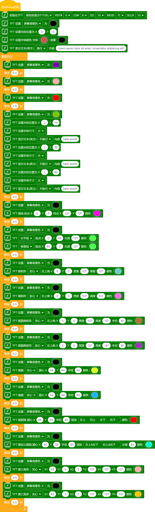

参照第01课的示例，导入提供的示例代码并连接好串口端口，然后上传示例代码。

---

**7. 实验结果**

代码上传成功后，拔下USB线断电。按照接线图正确接好模块后再用USB线连接到计算机上电，TFT显示屏依次显示如下：

......

---

**8. 实验说明**

初始化TFT屏管脚和标签。

设置TFT屏背景色。

设置TFT屏光标位置。

设置TFT屏背景色和字体颜色。

设置TFT屏换行或不换行的显示文本。

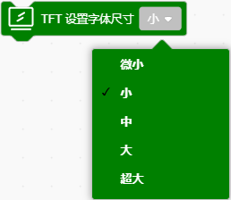

设置TFT屏字体尺寸大小。

设置TFT屏在某两个位置之间画直线。

---

## 4. 传感器/模块组合项目课程

前面课程中，我们单独测试了传感器/模块的功能，功能比较单一。在此，我们可以将多个传感器/模块搭配使用，组合出各种各样的功能。传感器/模块种类比较多，我们只是选择几款比较经典的组合实验。你们也可以根据自己的想法，自己设置代码，组合出你想要的特别的功能。

---

第25课 模拟小台灯

**1. 项目介绍**

从前面的实验课程中我们学习了自锁按键模块，按下自锁按键时，单片机读取到低电平；再次按自锁按键（按起自锁按键）时，读取到高电平。在这一实验课程中，我们将自锁按键模块和红色LED模块组合模拟小台灯，实现按下自锁按键时，红色LED模块上LED点亮；再次按下自锁按键（按起自锁按键）时，红色LED模块上LED不亮。

---

**2. 实验组件**

|   ||   |
| ------------------------ | ------------------------ | ------------------------ | 
| 主板 x1   | 自锁按键模块 x1    |USB线  x1  |
|  |  |      |
|  红色LED模块 x1  | 3P线(反向) x2 |    |

---

**3. 模块接线图**

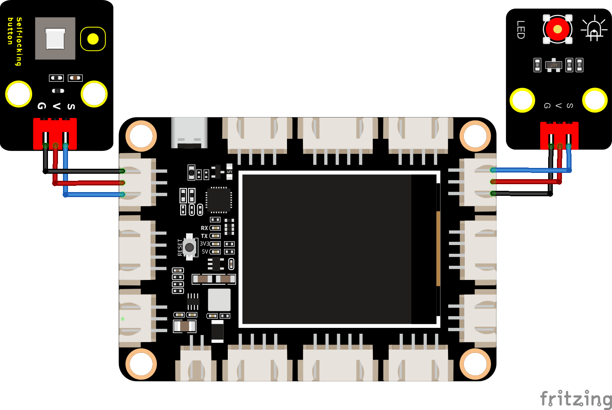

---

**4. 实验代码**

本项目中使用的代码保存在文件夹“<u>**...\项目代码\KidsBlock_代码**</u>”中，我们可以在此路径下打开代码文件''**25_Small_Table_Lamp**"。

**注意：为了避免上传代码不成功，请上传代码前不要连接模块。代码上传成功后，拔下USB线断电，按照接线图正确接好模块后再用USB线连接到计算机上电，观察实验结果。**

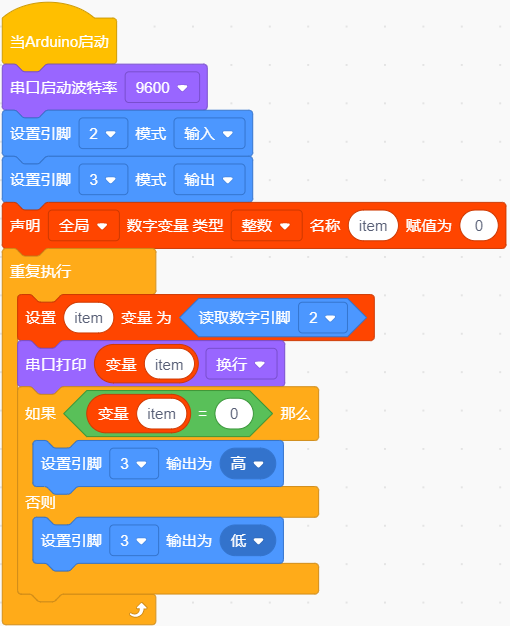

参照第01课的示例，导入提供的示例代码并连接好串口端口，然后上传示例代码。

---

**5. 实验结果**

代码上传成功后，拔下USB线断电，按照接线图正确接好模块后再用USB线连接到计算机上电，按下自锁按键，红色LED模块上的LED点亮，再次按下自锁按键(自锁按键按起)，红色LED模块上的LED不亮。循环进行。

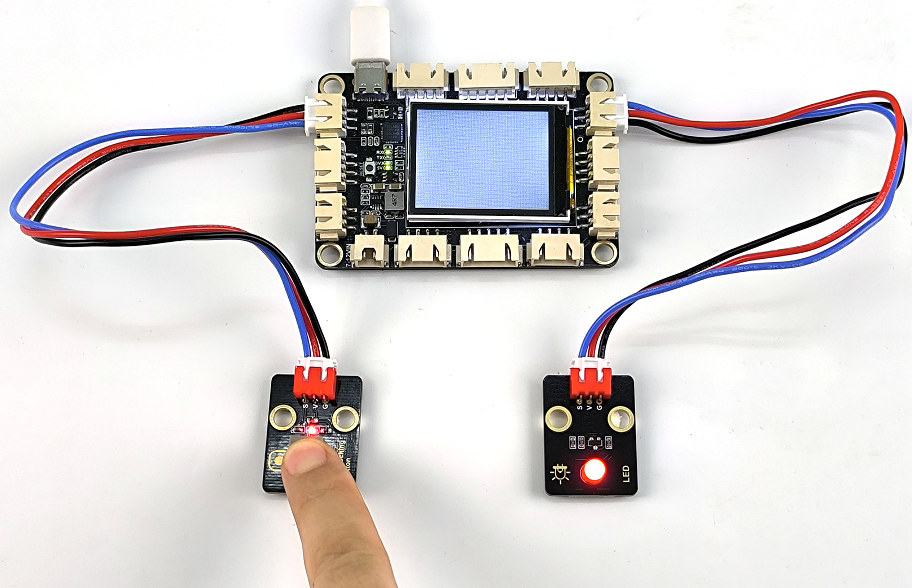

---

**6. 代码说明**

读取自锁按键的值并将其值赋给变量val。

 
这是判断语句，如果里的表达式为真，则执行 “那么” 块内的代码。如果里表达式为假 ，则执行 “否则” 块内的代码。 

红色LED模块上的LED点亮。

红色LED模块上的LED不亮。

---

第26课 自动感应门

**1. 项目介绍**

在前面实验课程中中，我们使用一个输入模块控制另一个输出模块。在这一实验中，我们还是用一个模块控制另一个模块。

生活中，我们可以利用一个检测传感器控制一个有源蜂鸣器响起，做声光报警设备，如人体检测（人体红外热释传感器）等等。这一实验课程中我们将避障传感器，舵机驱动板和舵机组合实验，实现避障传感器检测到障碍物时舵机转动带动门开的效果。

---

**2. 实验组件**

|  |  |  |   | 
| ------------------------ | ------------------------ | ------------------------ | ---------------------------- | 
|主板 x1| 舵机驱动模块 x1      | 避障传感器 x1      | 舵机 x1 |
||        |  | |
|  4P线(反向) x1 |3P线(反向) x1 | USB线 x1 | 一字螺丝刀 x1  | 

---

**3. 模块接线图**

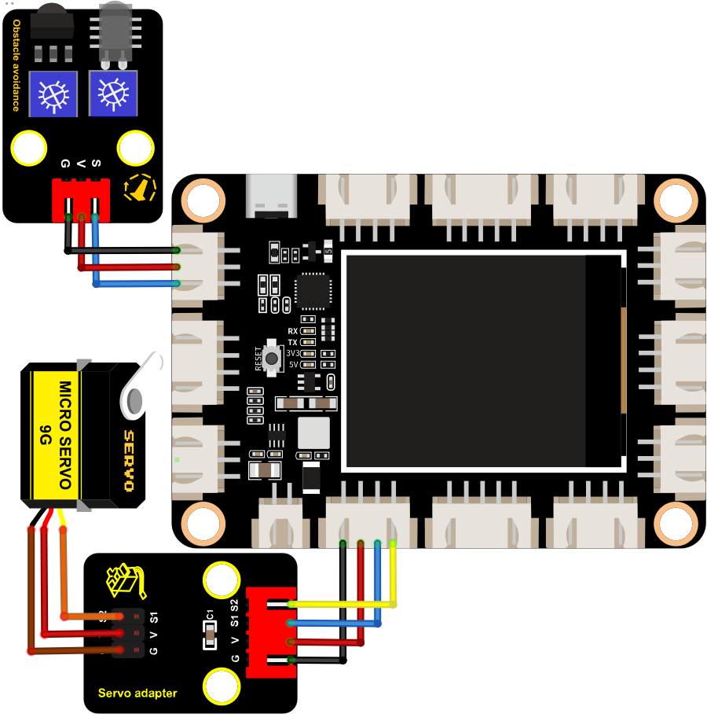

---

**4. 实验代码**

本项目中使用的代码保存在文件夹“<u>**...\项目代码\KidsBlock_代码**</u>”中，我们可以在此路径下打开代码文件''**26_Automatic_Induction_Door**"。

**注意：为了避免上传代码不成功，请上传代码前不要连接模块。代码上传成功后，拔下USB线断电，按照接线图正确接好模块后再用USB线连接到计算机上电，观察实验结果。**

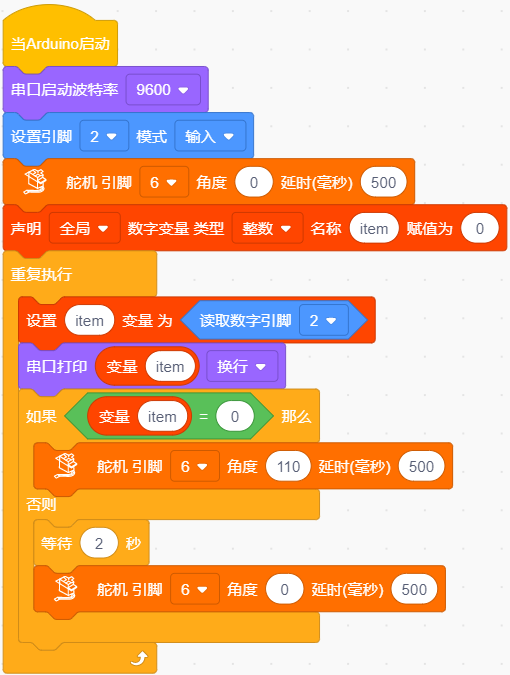

参照第01课的示例，导入提供的示例代码并连接好串口端口，然后上传示例代码。

---

**5. 实验结果**

代码上传成功后，拔下USB线断电，按照接线图正确接好模块后再用USB线连接到计算机上电。当避障传感器检测到障碍物时，避障传感器上SLED灯亮起，舵机转动，门打开；当避障传感器检测不到障碍物时，舵机转动，门关闭。

---

**6. 代码说明**

可以参照第05课，第18课和第25课的代码说明，这里就不多做介绍了。

---

第27课 入侵检测报警器

**1. 项目介绍**

上一课实验中我们学习了使用避障传感器检测障碍物模拟智能感应门。在这一实验课程中我们将人体红外热释传感器、红色LED模块和有源蜂鸣器模块组合实验，实现人体红外热释传感器检测到附近有人经过时，有源蜂鸣器响起，红色LED模块上LED闪烁的效果。

---

**2. 实验组件**

|    |     |  |
| ------------------------ | ---------------------------- | ------------------------ |
| 主板 x1  |人体红外热释传感器 x1  | 有源蜂鸣器模块 x1  |
| |   | | 
|红色LED模块 x1|3P线(反向) x3 | USB线  x1   | 

---

**3. 模块接线图**

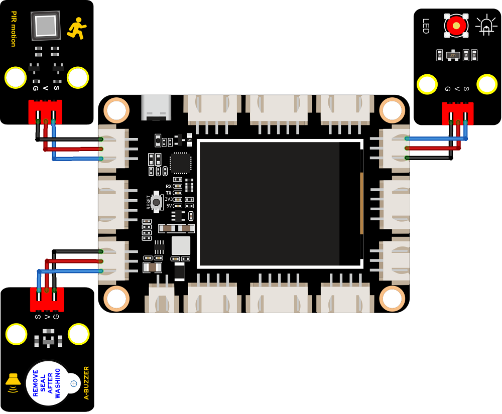

---

**4. 实验代码**

本项目中使用的代码保存在文件夹“<u>**...\项目代码\KidsBlock_代码**</u>”中，我们可以在此路径下打开代码文件''**27_PIR_Alarm**"。

**注意：为了避免上传代码不成功，请上传代码前不要连接模块。代码上传成功后，拔下USB线断电，按照接线图正确接好模块后再用USB线连接到计算机上电，观察实验结果。**

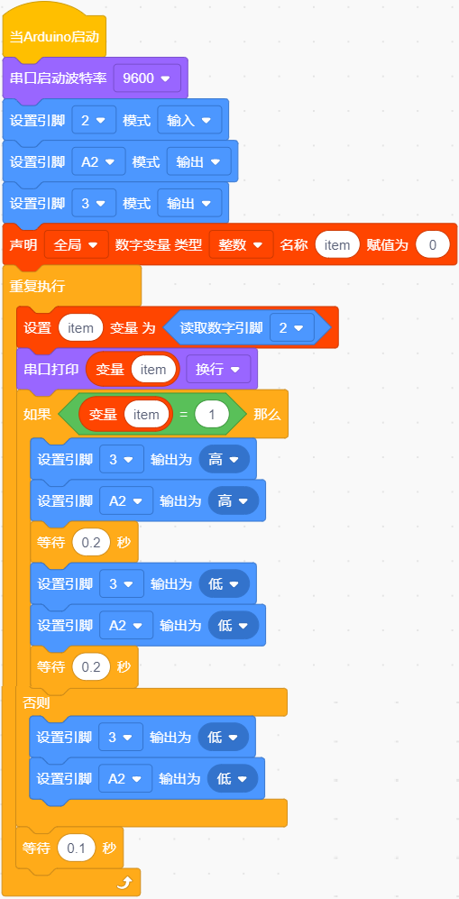

参照第01课的示例，导入提供的示例代码并连接好串口端口，然后上传示例代码。

---

**5. 实验结果**

代码上传成功后，拔下USB线断电，按照接线图正确接好模块后再用USB线连接到计算机上电。当人体红外热释传感器检测到附近有人经过时，人体红外热释传感器上的红灯灭，有源蜂鸣器发出警报，红色LED模块上的LED闪烁。

---

**6. 代码说明**

人体红外热释传感器读取数字电平信号并串口打印输出。

运动检测，检测到有人经过。

 
有源蜂鸣器响起发出警报。

红色LED模块上的LED点亮。

---

第28课 模拟智能窗户

**1. 项目介绍**

生活中能看到各种各样的智能产品，例如智能窗帘、智能窗户、智能电视、智能灯光等等。这一课我们来学习做一个智能窗帘，利用水滴水蒸气传感器模块检测雨水，然后通过设置舵机的角度来达到关窗和开窗的效果。

当然，这只是我们模拟的一个场景，主要用于加深我们的印象，达到对模块学以致用的效果。现实生活中，智能窗户并不是使用舵机来开关的。

---

**2. 实验组件**

|   | | | |
| ------------------------ | ------------------------ | -------------------- | ---------------------------- |   
|主板 x1  |水滴传感器 x1 | 舵机驱动模块 x1       |  舵机 x1 |
| |   |  |    |
| 3P线(反向) x1 | 4P线(反向) x1 |USB线 x1 |     | 

---

**3. 模块接线图**

---

**4. 实验代码**

本项目中使用的代码保存在文件夹“<u>**...\项目代码\KidsBlock_代码**</u>”中，我们可以在此路径下打开代码文件''**28_Smart_Window**"。

**注意：为了避免上传代码不成功，请上传代码前不要连接模块。代码上传成功后，拔下USB线断电，按照接线图正确接好模块后再用USB线连接到计算机上电，观察实验结果。**

注意：代码中的模拟值的阈值400可以根据实际情况设置。

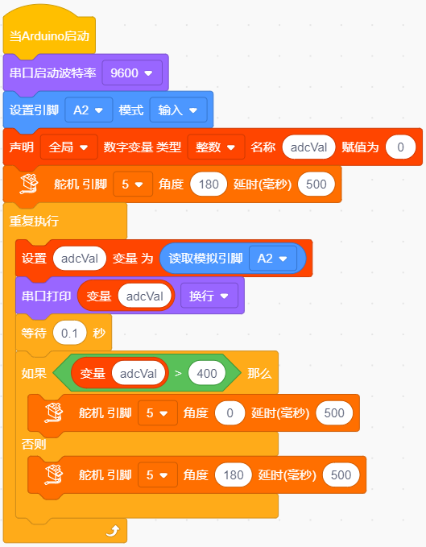

参照第01课的示例，导入提供的示例代码并连接好串口端口，然后上传示例代码。

---

**5. 实验结果**

代码上传成功后，拔下USB线断电，按照接线图正确接好模块后再用USB线连接到计算机上电。当水滴传感器检测到一定水量，舵机转动达到关窗的效果。否则舵机转动到另一个角度，达到开窗的效果。

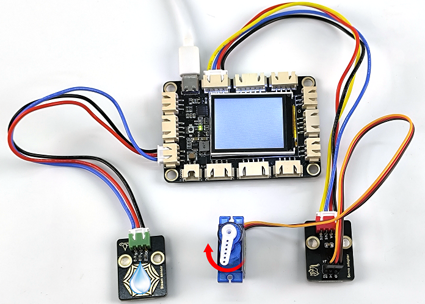

---

**6. 代码说明**

可以参照第12课，第18课和第25课的代码说明，这里就不多做介绍了。

---

第29课 夜光灯

**1. 项目介绍**

前面我们已经学习了光敏传感器的工作原理，在这一项目中，我们将光敏传感器和红色LED模块组合实验，实现光敏传感器检测到光照强度模拟值高于设定值时红色LED模块上的LED熄灭，低于设定值时红色LED模块上的LED点亮的效果。

---

**2. 实验组件**

|  | | |
| ------------------------ | ------------------------ | ------------------------ |
|主板 x1| 红色LED模块 x1   |光敏传感器 x1  |
|   |  |   |
| 3P线(反向) x2 | USB线 x1   |     |

---

**3. 模块接线图**

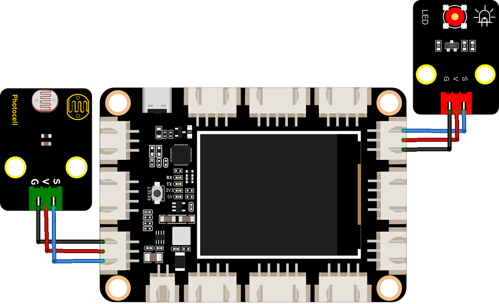

---

**4. 实验代码**

本项目中使用的代码保存在文件夹“<u>**...\项目代码\KidsBlock_代码**</u>”中，我们可以在此路径下打开代码文件''**29_Night_Lamp**"。

**注意：为了避免上传代码不成功，请上传代码前不要连接模块。代码上传成功后，拔下USB线断电，按照接线图正确接好模块后再用USB线连接到计算机上电，观察实验结果。**

注意：代码中的模拟值的阈值200可以根据实际情况设置。

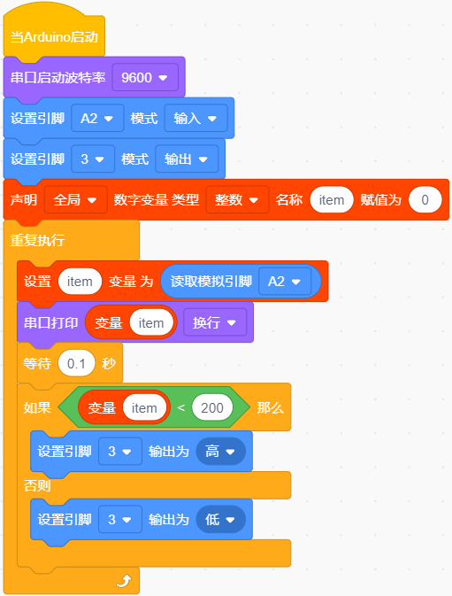

参照第01课的示例，导入提供的示例代码并连接好串口端口，然后上传示例代码。

---

**5. 实验结果**

代码上传成功后，拔下USB线断电，按照接线图正确接好模块后再用USB线连接到计算机上电，打开串口监视器，设置波特率为 **<u>9600</u>**。

串口监视器打印出光敏传感器检测到光照强度对应的模拟值，使用手机的照明灯对着光敏传感器模块上的光敏电阻照射时，当光敏传感器检测到光照强度的模拟值大于等于200时，红色LED模块上的LED熄灭；否则，低于200时，红色LED模块上的LED点亮，实现了夜光灯的效果。

---

**6. 代码说明**

可以参照第12课和第25课的代码说明，这里就不多做介绍了。

---

第30课 调光灯

**1. 项目介绍**

前面已经了解过旋转电位器的相关工作原理，接下来把旋转电位器与红色LED模块相组合，通过学习利用旋转电位器读取模拟值的方法和利用代码调节LED亮度的方法相组合来控制LED的亮度。设计代码时，模拟值的范围是0-1023，LED的亮度是由PWM值控制，范围为0-255。在这里，我们就需要用到映射功能，将0-1023数值映射到0-255。设置成功后，我们就可以通过旋转电位器，控制LED的亮度。

---

**2. 实验组件**

| ||  | 
| ---------------------------- | ---------------------------- | ------------------------ |
|主板 x1 | 红色蝌蚪模块 x1 | USB线  x1 |
|   ||      | 
| 旋转电位器 x1      |3P线(反向) x2 |     |

---

**3. 模块接线图**

---

**4. 实验代码**

本项目中使用的代码保存在文件夹“<u>**...\项目代码\KidsBlock_代码**</u>”中，我们可以在此路径下打开代码文件''**30_Dimming_Lamp**"。

**注意：为了避免上传代码不成功，请上传代码前不要连接模块。代码上传成功后，拔下USB线断电，按照接线图正确接好模块后再用USB线连接到计算机上电，观察实验结果。**

参照第01课的示例，导入提供的示例代码并连接好串口端口，然后上传示例代码。

---

**5. 实验结果**

代码上传成功后，拔下USB线断电，按照接线图正确接好模块后再用USB线连接到计算机上电。当旋转电阻器时，红色LED模块上的LED的亮度发生改变。

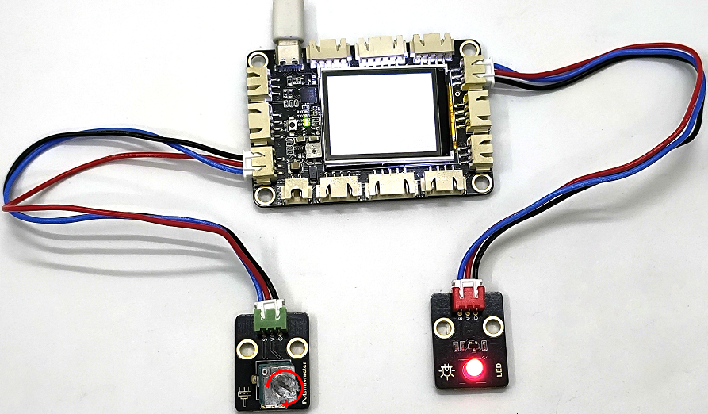

---

**6. 代码说明**

这是映射指令方块，可以将一个取值范围映射到另一个取值范围。

将旋转电位器的模拟值范围（0 ~ 1023）映射到红色LED的亮度范围（0 ~ 255）。

剩余的可以参照第12课的代码说明。

---

第31课 温湿度仪表 

**1. 项目介绍**：

在冬季时，空气中的湿度很低，就是空气很干燥，再加上寒冷，人体的皮肤就容易过于干燥而裂，所以需要使用加湿器给家里的空气增加湿度，但是怎么知道空气过于干燥了呢？那就需要检测空气湿度的设备，前面我们已经学习过了XHT11温湿度传感器的工作原理。在这一课我们将结合XHT11温湿度传感器和主板上的TFT显示屏来制作一个温湿度仪表，在TFT显示屏上显示XHT11温湿度传感器检测到环境中的温度和湿度。

---

**2. 实验组件**

|   |  |         |    |
| ------------------------ | ---------------------------- | ----------------------------- |----------------------------- |
|主板 x1| XHT11温湿度传感器 x1|3P线(反向) x1  |USB线  x1 |

---

**3. 模块接线图**

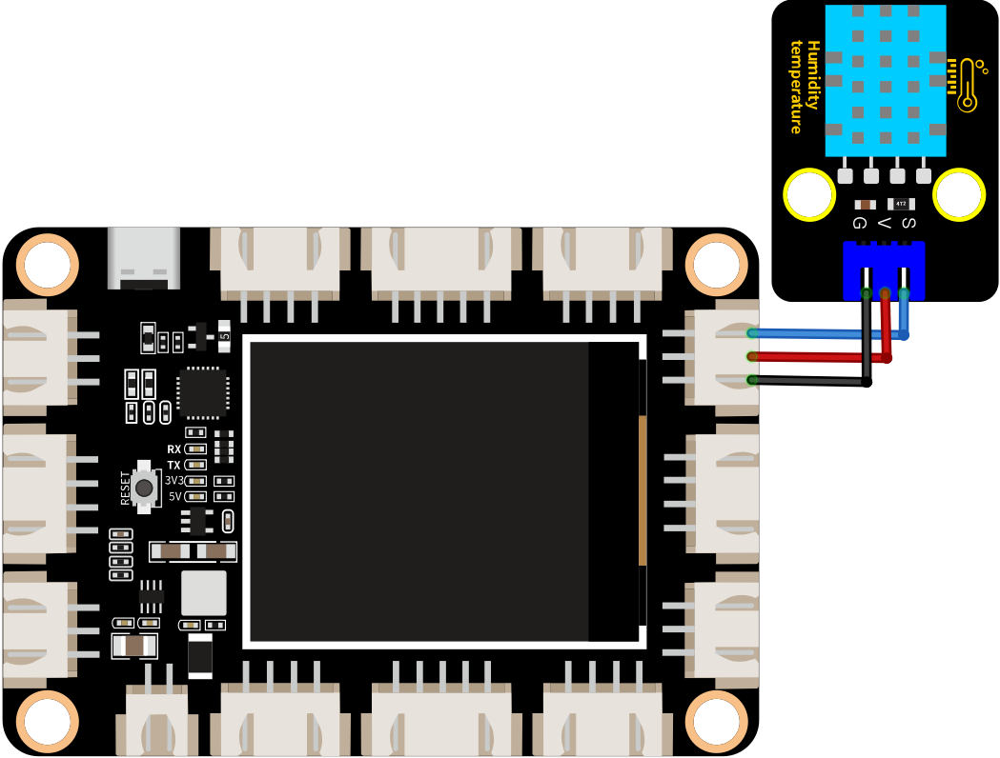

---

**4. 实验代码**

本项目中使用的代码保存在文件夹“<u>**...\项目代码\KidsBlock_代码**</u>”中，我们可以在此路径下打开代码文件''**31_Temperature-humidity_meter**"。

**注意：为了避免上传代码不成功，请上传代码前不要连接模块。代码上传成功后，拔下USB线断电，按照接线图正确接好模块后再用USB线连接到计算机上电，观察实验结果。**

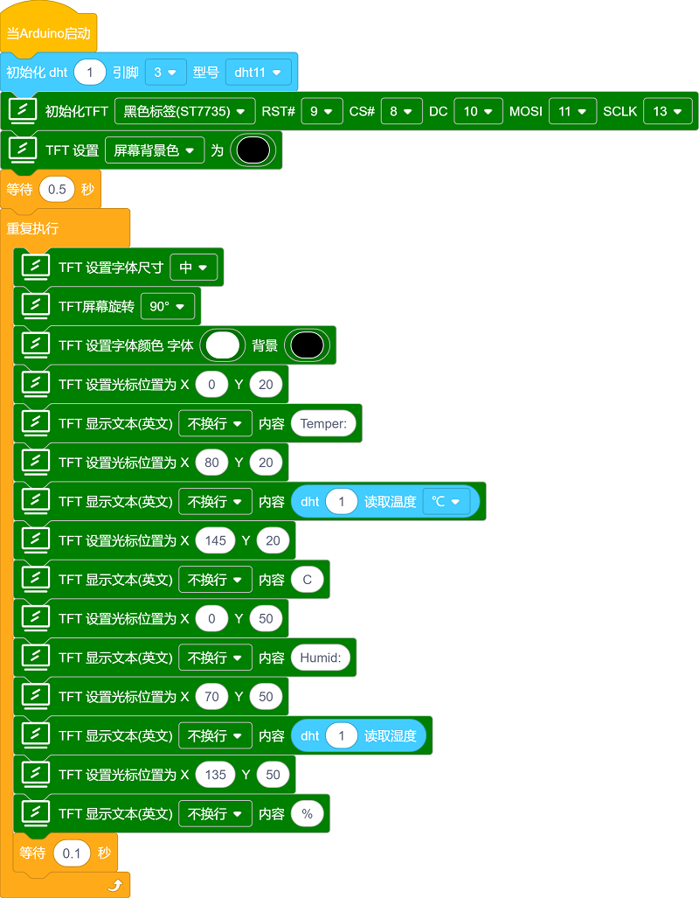

参照第01课的示例，导入提供的示例代码并连接好串口端口，然后上传示例代码。

---

**5. 实验结果**

代码上传成功后，拔下USB线断电，按照接线图正确接好模块后再用USB线连接到计算机上电，上传成功后可以在主板上的TFT显示屏看到XHT11温湿度传感器检测到环境中的温度值和湿度值。

---

**6. 代码说明**

可以参照第21课和第24课的代码说明，这里就不多做介绍了。

---

第32课 TFT显示屏显示TF卡图片 

**1. 项目介绍**：

本套件中的主板内置有TF卡槽，在TF卡保存图片文件，然后将TF卡插入TF卡槽，通过编写相关程序代码，这样TFT显示屏会显示TF卡中的图片相关信息。

---

**2. 实验组件**

|  |      |     | |
| ------------------------ | ---------------------------- | ----------------------------- |----------------------------- |
|主板 x1| TF卡 x1 | 读卡器 x1|USB线  x1|

---

**3. 将图片转入TF卡**

(1). 将TF卡插入读卡器

(2). 将读卡器(已经插有TF卡)插入电脑的USB口上。

(3). 鼠标左双击“**我的电脑(或此电脑)**”，在此页面可以看到“**U盘**”标志。鼠标右单击“**U盘**”标志，出现对话框，选择单击“**属性**”查看TF卡的文件系统是不是“**FAT32**”？如果是就可以了。

如果TF卡的文件系统不是“**FAT32**”，则需要修改TF卡的文件系统。鼠标右单击“**U盘**”标志，出现对话框，选择单击“**格式化**”，出现格式化页面，在此页面点击“**FAT(默认)**”后面的**下拉箭头**来选择“**FAT32**”，然后点击“**开始**”进行格式化。这样，TF卡的文件系统“**FAT**”更改成“**FAT32**”。

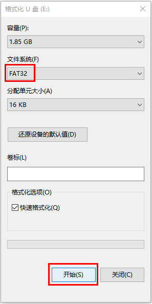

(4). 全部选中文件夹中的图片(**文件类型：BMP 图片文件(.bmp)**)，然后将选中的图片**发送到**(或**复制粘贴到**)读卡器中的TF卡(U盘)。（**特别注意：图片名字和格式都不能修改**）

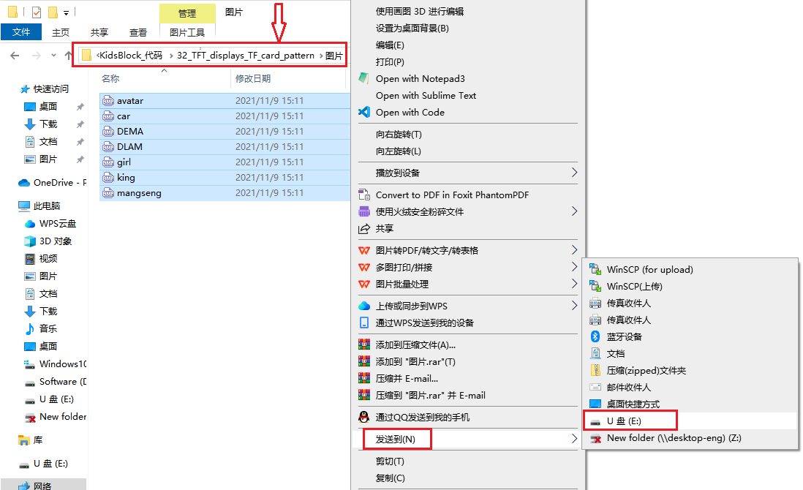

(5). 图片发送到TF卡(U盘)后，退出电脑上的读卡器中的TF卡(U盘)，将TF卡正确插入主板上的TF卡槽中。

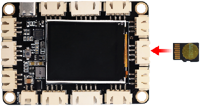

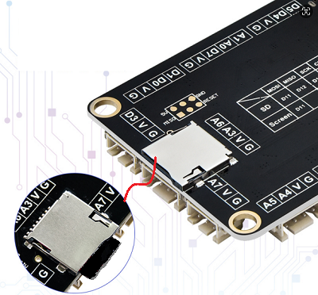

---

**4. 模块接线图**

---

**5. 实验代码**

本项目中使用的代码保存在文件夹“<u>**...\项目代码\KidsBlock_代码**</u>”中，我们可以在此路径下打开代码文件''**32_TFT_displays_TF_card_pattern**"。

**注意：为了避免上传代码不成功，请上传代码前不要连接模块。代码上传成功后，拔下USB线断电，按照接线图正确接好模块后再用USB线连接到计算机上电，观察实验结果。**

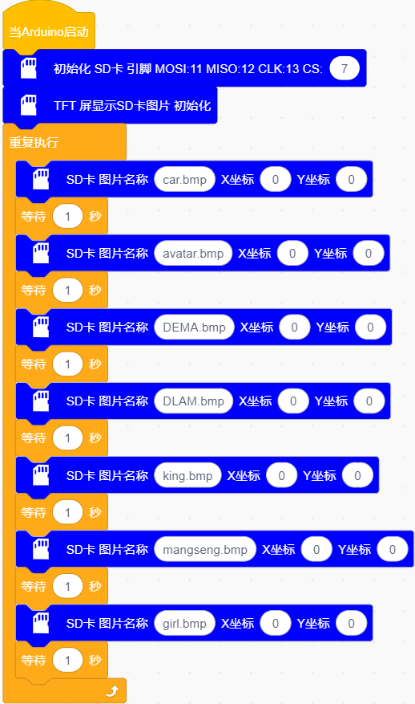

参照第01课的示例，导入提供的示例代码并连接好串口端口，然后上传示例代码。

---

**6. 实验结果**

代码上传成功后，拔下USB线断电，再用USB线连接到计算机上电，上传成功后可以在主板上的TFT显示屏看到循环显示TF卡上的图片文件。

.....

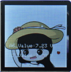

---

第33课 智能红外遥控灯

**1. 项目介绍**

在前面实验中，我们学会了点亮或熄灭LED、学会了使用红外接收模块，并将接收到的遥控器对应的键值打印出来。在这一实验课程中，我们将红外接收模块，黄色LED模块和红色LED模块组合实验，实现用红外遥控器控制红色LED和黄色LED的亮灭。

按“ ▲ ”键，红色LED和黄色LED都点亮；按“ ▼ ”键，红色LED和黄色LED都熄灭；按“ ① ”键，红色LED点亮；按“ ② ”键，黄色LED点亮；按“ ③ ”键，红色LED和黄色LED都熄灭的效果。

---

**2. 实验组件**

|  | |  |  |
| -------------------------------- | ---------------------------- | ------------------------ | ------------------------ |
|主板 x1|红外接收模块 x1 | 红色LED模块 x1 | 黄色LED模块 x1     |
|  |        |  |   | 
| Keyes 遥控器 x1 | 3P线(反向) x3 | USB线  x1 |   |

---

**3. 模块接线图**

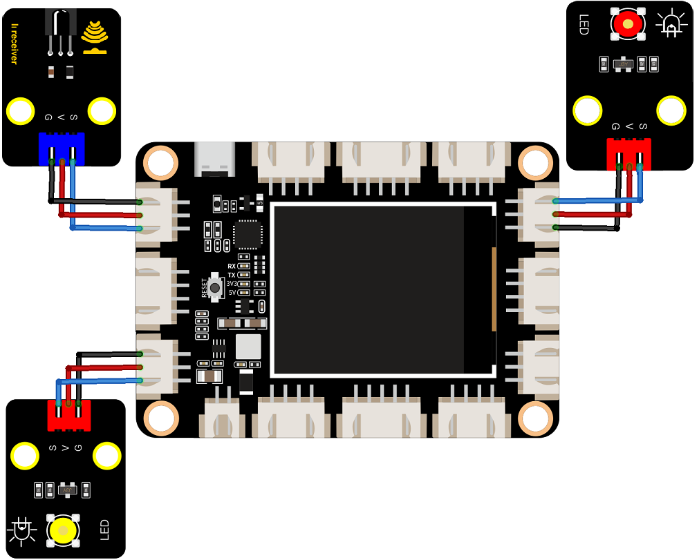

---

**4. 实验代码**

本项目中使用的代码保存在文件夹“<u>**...\项目代码\KidsBlock_代码**</u>”中，我们可以在此路径下打开代码文件''**33_Intelligent_IR_Control**"。

**注意：为了避免上传代码不成功，请上传代码前不要连接模块。代码上传成功后，拔下USB线断电，按照接线图正确接好模块后再用USB线连接到计算机上电，观察实验结果。**

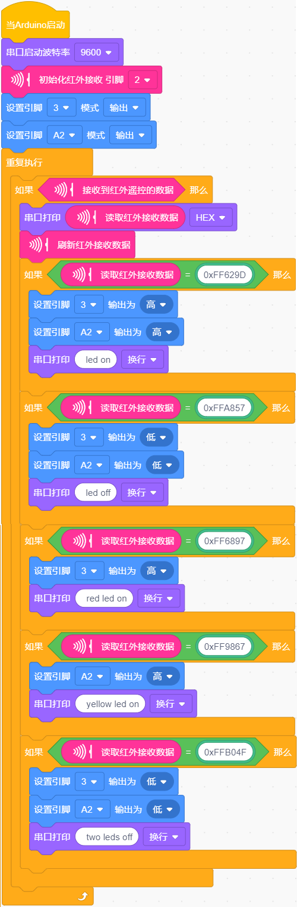

参照第01课的示例，导入提供的示例代码并连接好串口端口，然后上传示例代码。

---

**5. 实验结果**

代码上传成功后，拔下USB线断电，按照接线图正确接好模块后再用USB线连接到计算机上电，打开串口监视器，设置波特率为 **<u>9600</u>**。

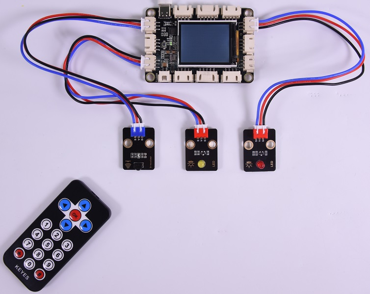

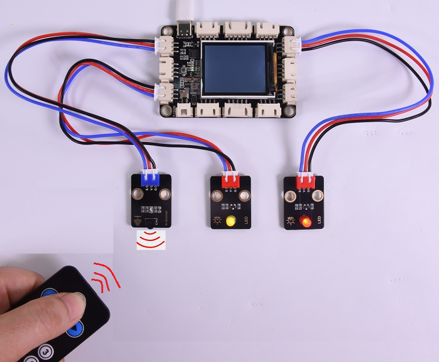

找到红外遥控器，拔出绝缘片，对准红外接收模块的红外接收传感器的接收头。第一次按下红外遥控器上的 “ **▲** ” 键，红色LED和黄色LED都点亮，实现开灯的效果。串口监视器打印出按下的按键值和红色LED和黄色LED的亮灯情况：“**<u>FF629D  led on</u>**” 。

按下红外遥控器上的 “ **▼** ” 键，红色LED和黄色LED都熄灭，实现关灯的效果。串口监视器打印出按下的按键值和红色LED和黄色LED的亮灯情况：“**<u>FFA857  led off</u>**” 。

按下红外遥控器上的 “ **①** ” 键，红色LED点亮。串口监视器打印出按下的按键值和红色LED亮灯情况：“**<u>FF6897  red led on</u>**” 。

按下红外遥控器上的 “ **②** ” 键，红色LED点亮。串口监视器打印出按下的按键值和黄色LED的亮灯情况：“**<u>FF9867  yellow led on</u>**” 。

按下红外遥控器上的 “ **③** ” 键，红色LED和黄色LED都熄灭。串口监视器打印出按下的按键值和红色LED与黄色LED的亮灯情况：“**<u>FFB04F  two leds off</u>**” 。

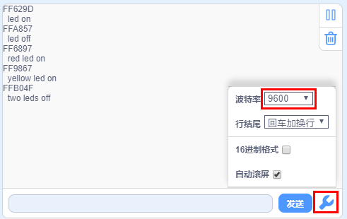

---

**6. 代码说明**

可以参照第02课，第20课和第25课的代码说明，这里就不多做介绍了。

---

第34课 楼道感应灯

**1. 项目介绍**

如今智能家居发展迅速，你使用过智能家居当中的智能楼道感应灯吗？在晚上或天黑时，当我们跺跺脚或者拍拍手时，智能楼道感应灯自动亮起；当没有声音或白天天亮时时，智能楼道感应灯处于熄灭状态。智能楼道感应灯上安装有光敏传感器和声音传感器，光敏传感器检测光照强度，声音传感器将外界声音的大小，转换成对应数值。智能楼道感应灯设置一个声音强度临界点，当光照强度低于某一值，声音转换后对应的数值超过该声音强度临界点时，灯光亮起一段时间。 

在这一实验课程中，我们将光敏传感器，声音传感器和红色LED模块组合实验，学习制作一个最简单的智能楼道感应灯。

---

**2. 实验组件**

|  ||  | |
| ------------------------ | ------------------------ | ------------------------ |------------------------ |
|主板 x1| 光敏传感器 x1  |声音传感器 x1     |一字螺丝刀 x1|
| |  |  |    |
| 红色LED模块 x1     | 3P线(反向) x3 | USB线 x1   |      |

---

**3. 模块接线图**

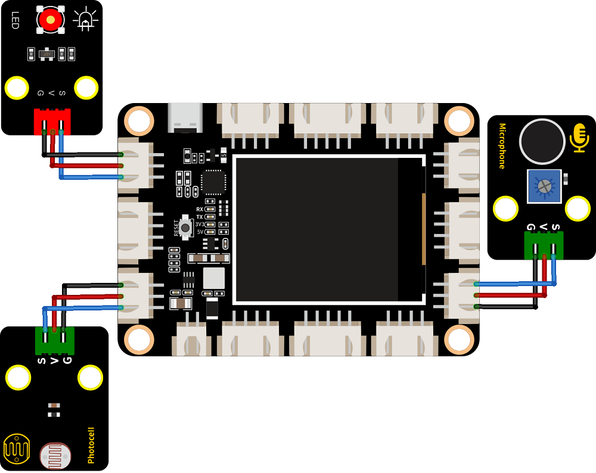

---

**4. 实验代码**

本项目中使用的代码保存在文件夹“<u>**...\项目代码\KidsBlock_代码**</u>”中，我们可以在此路径下打开代码文件''**34_Corridor_Sensing_Light**"。

**注意：为了避免上传代码不成功，请上传代码前不要连接模块。代码上传成功后，拔下USB线断电，按照接线图正确接好模块后再用USB线连接到计算机上电，观察实验结果。**

注意：代码中的模拟值的阈值可以根据实际情况设置。

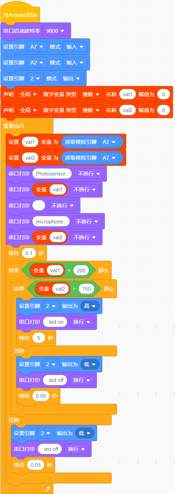

参照第01课的示例，导入提供的示例代码并连接好串口端口，然后上传示例代码。

---

**5. 实验结果**

代码上传成功后，拔下USB线断电，按照接线图正确接好模块后再用USB线连接到计算机上电，打开串口监视器，设置波特率为 **<u>9600</u>**。

串口监视器打印出声音传感器接收到的声音对应的模拟值和光敏传感器检测光照强度的模拟值。遮住光敏传感器光照使检测到的光照强度模拟值低于200时，对准MIC头大声说话，接收到的声音增大时模拟值也增大，当模拟值大于150时，红色LED模块上的LED亮起5秒，然后熄灭。这样就可以模拟智能楼道感应灯。（**注意：如果声音变化对应的模拟值没有变化并且一直都是数字0，需要用一字螺丝刀顺时针旋转电位器来调节。**）

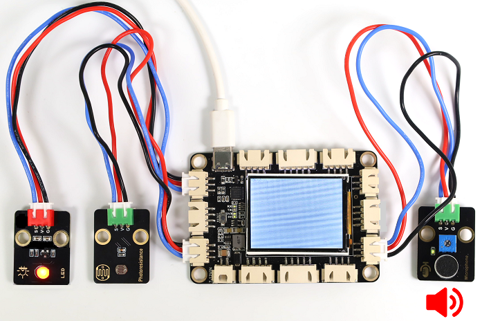

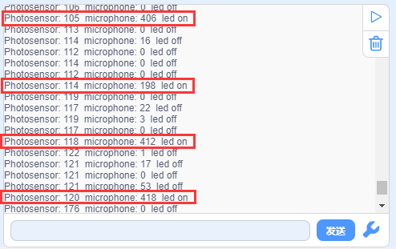

---

**6. 代码说明**

可以参照第12课和第25课的代码说明，这里就不多做介绍了。

---

第35课 控制舵机和LED

**1. 项目介绍**

前面已经学习过舵机，红色LED模块，自锁按键模块和旋转电位器等相关知识，那它们可不可以组合制成更复杂的实验呢？当然可以。则在本实验中，自锁按键控制红色LED模块上的LED亮起，然后旋转电位器控制舵机来回缓慢地转动。

---

**2. 实验组件**

|      |      | |
| ---------------------------- | ---------------------------- | ------------------------ |
|主板 x1| 旋转电位器 x1 |红色LED模块 x1 | 
|  |  | |
| 自锁按键 x1 | 舵机驱动模块 x1 | 舵机 x1 |
|   |  |  |
|3P线(反向) x3 | 4P线(反向) x1 | USB线  x1 |

---

**3. 模块接线图**

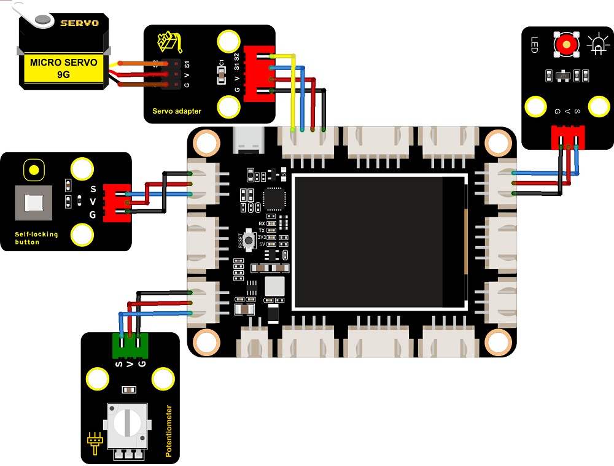

---

**4. 实验代码**

本项目中使用的代码保存在文件夹“<u>**...\项目代码\KidsBlock_代码**</u>”中，我们可以在此路径下打开代码文件''**35_Control_Servo_and_LED**"。

**注意：为了避免上传代码不成功，请上传代码前不要连接模块。代码上传成功后，拔下USB线断电，按照接线图正确接好模块后再用USB线连接到计算机上电，观察实验结果。**

参照第01课的示例，导入提供的示例代码并连接好串口端口，然后上传示例代码。

---

**5. 实验结果**

代码上传成功后，拔下USB线断电，按照接线图正确接好模块后再用USB线连接到计算机上电。按下自锁按键时，红色LED模块上的LED亮起，然后旋转电位器，舵机则来回缓慢地转动。

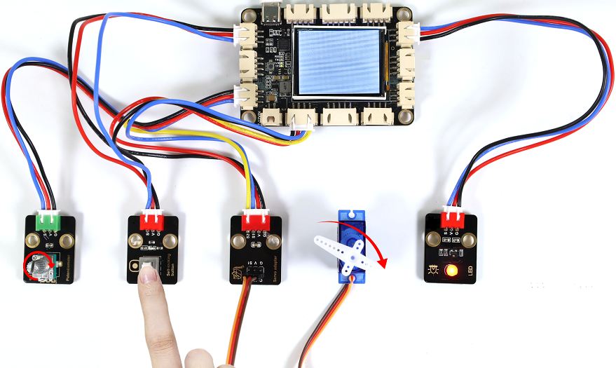

---

**6. 代码说明**

可以参照第05课，第12课，第18课和第25课的代码说明，这里就不多做介绍了。

---

第36课 模拟温度散热装置

**1. 项目介绍**

生活中，我们的电脑或者电路板芯片等器件会由于工作时间过长或者功耗过大的问题而发热严重，所以我们常常需要一个散热装置。

在前面的课程我们学习了如何使用温度传感器和电机模块，这一课我们学习把它们结合起来做成一个智能散热装置。当检测到环境温度高于某一个值时的时候，电机开启，从而达到降低环境温度、散热效果，再把此刻的温度值显示在四位数码管中。

---

**2. 实验组件**

|  |  |     |
| ------------------------ | ---------------------------- | ----------------------------- |
|主板 x1| TM1650四位数码管模块 x1 | 130电机模块 x1|
|  |   | |
|  NTC-MF52AT模拟温度传感器 x1 | 3P线(反向) x1|AA电池 x6 |
|     |  |  | 
| 4P线(反向) x2 |USB线 x1 | 电池盒 x1 |

---

**3. 模块接线图**

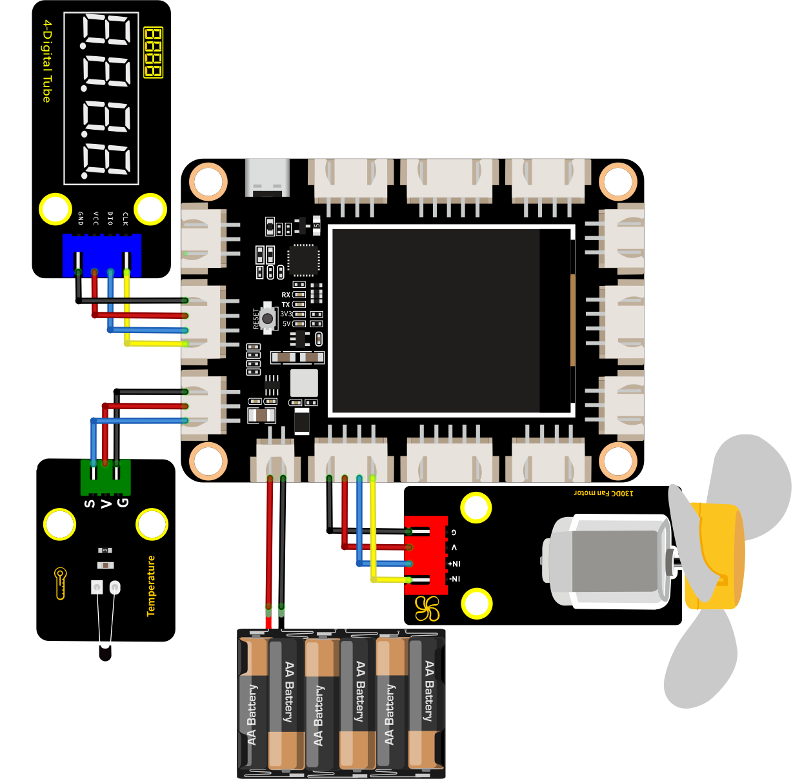

---

**4. 实验代码**

本项目中使用的代码保存在文件夹“<u>**...\项目代码\KidsBlock_代码**</u>”中，我们可以在此路径下打开代码文件''**36_Heat_abstractor**"。

**注意：为了避免上传代码不成功，请上传代码前不要连接模块。代码上传成功后，拔下USB线断电，按照接线图正确接好模块后再用USB线连接到计算机上电，观察实验结果。**

注意：代码中的温度阈值30可以根据实际情况设置。

参照第01课的示例，导入提供的示例代码并连接好串口端口，然后上传示例代码。

---

**5. 实验结果**

代码上传成功后，拔下USB线断电，按照接线图正确接好模块后，给主板外接电源供电（将装有电池的电池盒接到主板上）。上电后，可以在四位数码管模块上看到当前温度值，当温度超过代码中设定的30°C时，风扇转动，散热。

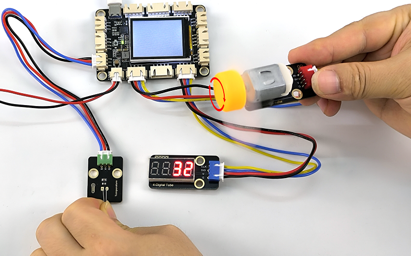

---

**6. 代码说明**

变量的设置与存储检测值，与前面我们学习的一样，也是通过设置一个温度的阈值（阈值30可以根据实际情况重新更改），超过这个阈值进行控制电机转动，四位数码管显示温度值。

---

第37课 超声波雷达

**1. 项目介绍**

蝙蝠飞行与获取猎物是通过回声定位的。回声定位：某些动物能通过口腔或鼻腔把从喉部产生的超声波发射出去，利用折回的声音来定向，这种空间定向的方法称为回声定位。科学家们从蝙蝠身上得到的启示发明了雷达，即雷达的天线相当于蝙蝠的嘴，而天线发出的无线电波就相当于蝙蝠的超声波，雷达接收电波的荧光屏就相当于蝙蝠的耳朵。

这一课我们就来学习制作一个简易雷达。将HC-SR04 超声波传感器、无源蜂鸣器、红色LED模块和TM1650四位数码管模块组合实验，利用距离大小控制无源蜂鸣器响起对应频率的声音、红色LED闪烁快慢或点亮，然后把这个距离显示在四位数码管上。这样就搭建好了一个简易的超声波雷达系统。

---

**2. 实验组件**

|  |  | |
| ---------------------------- | ---------------------------- | ----------------------------- |
|主板 x1  |HC-SR04 超声波传感器 x1      | 超声波转接模块 x1 |
|  |  |  | 
| 无源蜂鸣器 x1  | 红色LED模块 x1  | TM1650四位数码管 x1 |
| |  |   |
|3P线(反向) x2| 4P线(反向) x2 | USB线  x1  |
||| |
|电池盒 x1 |AA电池 x6 |   |

---

**3. 模块接线图**

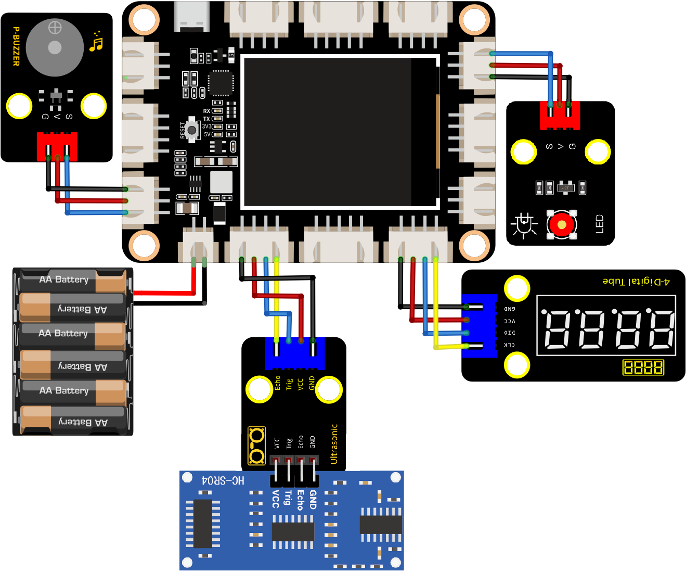

---

**4. 实验代码**

本项目中使用的代码保存在文件夹“<u>**...\项目代码\KidsBlock_代码**</u>”中，我们可以在此路径下打开代码文件''**37_Ultrasonic_radar**"。

**注意：为了避免上传代码不成功，请上传代码前不要连接模块。代码上传成功后，拔下USB线断电，按照接线图正确接好模块后再用USB线连接到计算机上电，观察实验结果。**

注意：代码中的距离阈值可以根据实际情况设置。

参照第01课的示例，导入提供的示例代码并连接好串口端口，然后上传示例代码。

---

**5. 实验结果**

代码上传成功后，拔下USB线断电，按照接线图正确接好模块后，给主板外接电源供电（将装有电池的电池盒接到主板上）。

当超声波传感器检测到障碍物距离范围在10cm 以内时，红色LED模块上的LED快速闪烁，并将检测到障碍物的距离显示在四位数码管上。同时无源蜂鸣器发出声响，起到提示的作用。

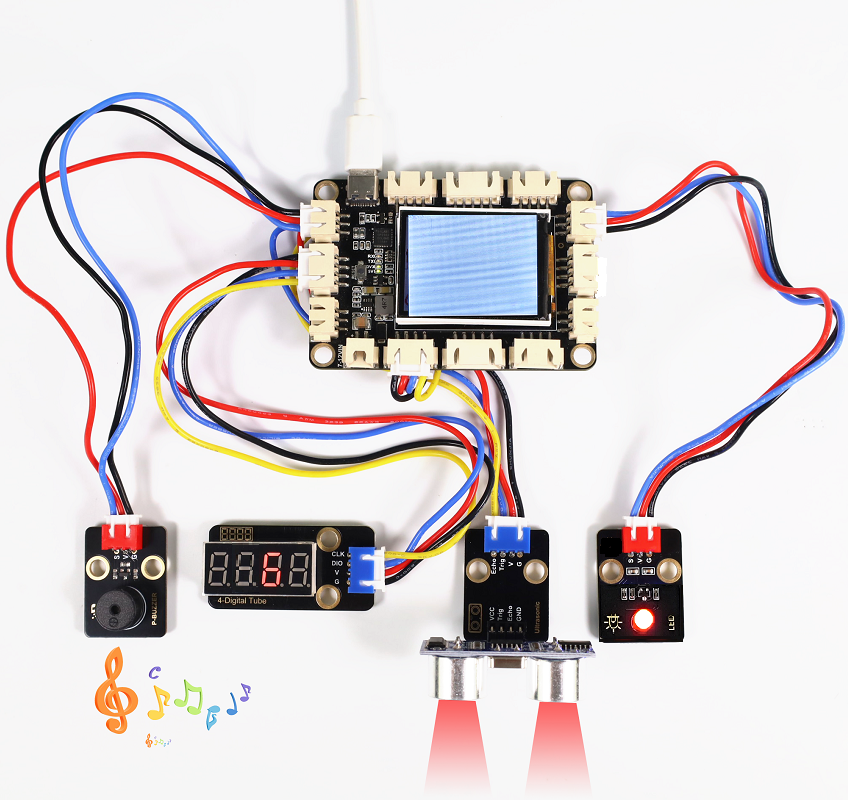

当超声波传感器检测到障碍物距离范围在10cm ~ 20cm 以内时，红色LED模块上的LED正常闪烁，并将检测到障碍物的距离显示在四位数码管上。同时无源蜂鸣器发出声响，起到提示的作用。

当超声波传感器检测到障碍物距离范围在20cm 以外时，红色LED模块上的LED点亮，并将检测到障碍物的距离显示在四位数码管上。同时无源蜂鸣器发出声响，起到提示的作用。

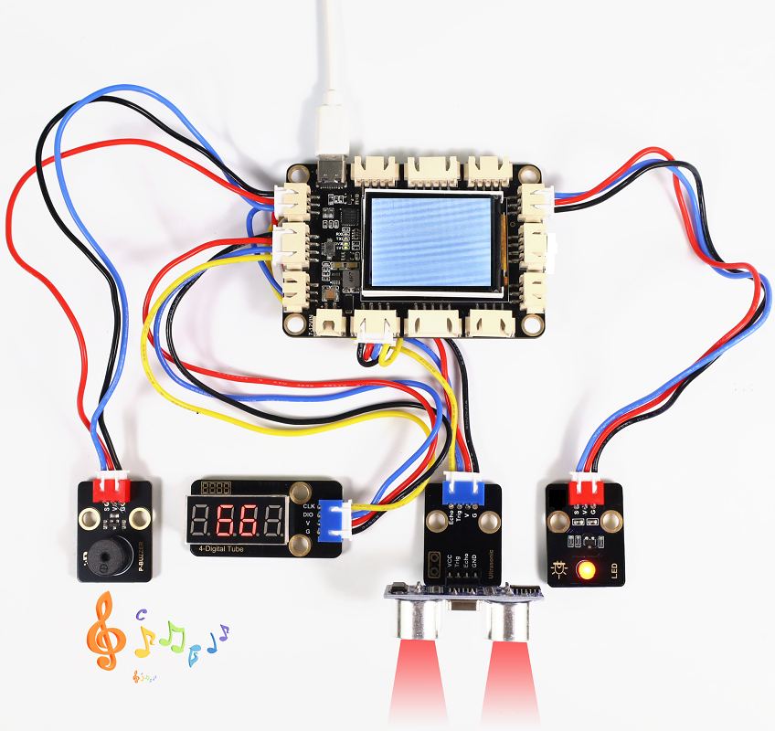

---

**6. 代码说明**

可以参照前面课程的代码说明，这里就不多做介绍了。

---
