---

**首先感谢选择keyes产品，我们将继续为你提供好的产品和服务!**

---

**关于keyes**

Keyes是KEYES Corporation旗下最畅销的品牌，我们的产品包括Arduino开发板、扩展板、传感器模块；树莓派、micro：bit扩展板和智能小车；以及为各阶段客户设计的完整入门套件。这些入门套件旨在为任何水平的客户学习Arduino、树莓派、micro：bit相关知识。

我们所有产品，均符合国际质量标准，在世界各地不同市场中，得到了极大的赞赏。 

欢迎从我们的官方网站查看更多内容：[http://www.keyes-robot.com](http://www.keyes-robot.com)

---

**售后服务**

1\. 如果发现某些东西丢失或损坏，或者学习套件时遇到一些困难。keyes会提供免费和快速的支持，如果您有任何疑问，请联系我们专业的销售人员。

2\. 欢迎提出建议和反馈，我们会根据您的反馈不断更新套件和教程，以使其更好。谢谢！

---

**产品安全**                               

1\. 本产品内含细小的零件（螺丝等），请放在儿童接触不到的地方，防止划伤或误食。8岁及以下儿童使用，请在大人监督下使用。

2\. 本产品包含导电部件(控制板和电子模块），请按照本教程的要求进行操作，不当的操作可能导致过热并且损害零件，请勿触摸并立即断开电路电源（请按照正确的方式安装电池）。

---

**版权**

keyes商标和徽标是KEYES DIY ROBOT co.,LTD的版权,任何人和公司在没有授权的情况下，不得复制，售卖，转卖，keyes品牌的产品。如果您有兴趣在当地售卖我们的产品，请联系我们专业的批发销售人员。

---

**Keyes STEM 电子积木传感器初级套件**

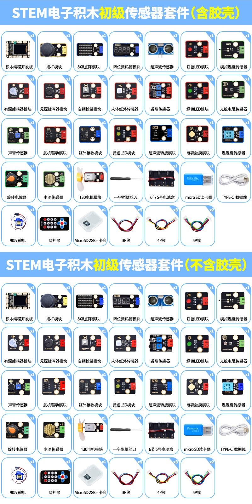 

# 产品介绍

您想学习编程吗？目前，编程已发展到较低年龄组，每个人都能编程将会是一种趋势。使用此产品和教程，您可以轻松了解并学习基于Arduino UNO 开发环境下STEM电子积木传感器/模块原理及使用方法，以及掌握如何通过编写程序使用它们。

Keyes STEM电子积木传感器初级套件主要包含了我们常用的传感器/模块，还有内置有TF卡槽和TFT显示屏的开发板和XH-2.54mm高温硅胶连接线，开发板上搭配丰富的XH2.5接口扩展使用，外围传感器即插即用，简单方便。开发板上四个螺丝定位孔，可搭配电子积木，完成简单的造型和创意性的实验。

为了让你对这STEM电子积木传感器/模块有更深入的了解，课程中我们提供了对应的原理图、接线方法、Arduino C 编程 + Mixly 图形化编程 + KidsBlock (基于Scratch) 图形化编程、实验结果和简单的代码说明等信息。通过这些课程，可以让我们对编程方法、逻辑、电子电路有了更深刻的理解。  

此外，如果您对本教程和工具包有任何困难或问题，您可以随时向我们咨询。

---

# 清单

| 序号 | KE3097| KE3097S | 规格 | 倍用量 |
| ---- | ------------------------ | ------------------------- | ------------------------------ | ------ |
| 1 |  | |主板| 1 |
| 2 |  | 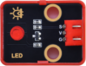 | 红色LED模块 | 1 |
| 3 |  | 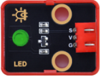 | 绿色LED模块 | 1 |
| 4 | 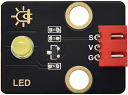 | 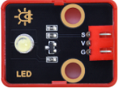 | 黄色LED模块 | 1 |
| 5|  |  | 有源蜂鸣器模块 | 1 |
| 6 | 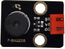 | 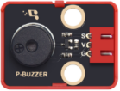 | 无源蜂鸣器模块| 1 |
| 7 |  |  | 自锁按键模块  | 1 |
| 8 |  | 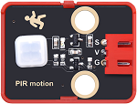 | 人体红外热释传感器 | 1 |
| 9 |  |  | 避障传感器 | 1  |
| 10 |  |  | NTC-MF52AT模拟温度传感器 | 1 |
| 11|  |  | 光敏传感器  | 1 |
| 12 |  |  | 声音传感器  | 1 |
| 13 | 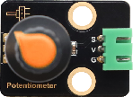 | 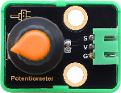 | 旋转电位器  | 1 |
| 14 |  |  | 红外接收模块  | 1  |
| 15 |  |  |XHT11温湿度传感器(兼容DHT11)| 1 |
| 16 |  | 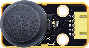 | 摇杆模块  | 1  |
| 17 | 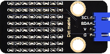 |  | HT16K33_8X8点阵模块  | 1  |
| 18 |  |  | TM1650四位数码管模块 | 1 |
| 19 |     |   | HC-SR04超声波传感器  | 1 |
| 29 |  | 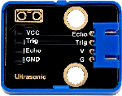 | 超声波转接模块 | 1  |
|21 |  |  | 电容触摸模块  | 1 |
| 22 |  |  | 130电机模块  | 1 |
| 23 |  |  | 水滴传感器  | 1  |
| 24 |   |   | 舵机驱动模块  | 1  |
| 25 |   |    | 舵机 配十字臂  | 1 |
| 26 | 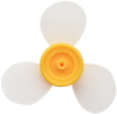 ||风扇叶|1|
| 27 |  |  | 遥控器  | 1 |
| 28 |   |    | USB线   | 1  |
| 29 |   |    | 3P线 (反向)| 5|
| 30 | 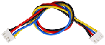  |    | 4P线 (反向)  | 3 |
| 31 |   |    | 5P线 (反向) | 2|
| 32|   |    | 一字螺丝刀 | 1  |
| 33 |     |      | TF卡  | 1      |
|34 |     |      | 读卡器  | 1      |
| 35 | 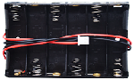    |      | 电池盒  | 1      |
|36 |     |      | AA(5号)电池(不提供，自备)  | 6 |

---

# 资料下载

特别注意：学习本套件的所有项目课程前，必须先下载项目课程的库文件及项目代码。

* [库文件](库文件.zip)

* [项目代码](项目代码.zip)

---

# 主板介绍

**1. 简介：**

在我们开始学习Keyes STEM电子积木传感器高级套件之前，首先介绍开发板，它是所有项目的核心。

这是一款基于Atmega328p的单片机开发板，包含Arduino UNO R3的所有功能，并且在UNO R3主板的基础上，我们做了一些改进，使它的功能更加强大。 在我们进行DIY电子产品实验时，我们经常会用到arduino系列单片机在Arduino IDE开发环境上编程设置。 该开发板是一款完全兼容Arduino IDE开发环境的控制板，开发板上集成了一块1.8寸TFT屏和TF卡槽（用于插入TF卡），便于显示实验内容和储存数据；可搭配丰富的XH2.5接口扩展使用，外围传感器即插即用，开发板上四个螺丝定位孔，可搭配电子积木，完成简单的造型和创意性的实验。

---

**2. 规格参数：**

- 微控制器：ATMEGA328P-AU
- USB转串口芯片：CP2102
- USB输入电压：DC 3.3V-5V
- VIN输入电压：DC 7~12V
- IO输出电流：80mA
- VCC输出最大电流：3A
- 最大功率：15W
- 数字I/O引脚：8个 (D0-D7)
- PWM通道：3个 (D3、D5、D6)
- 模拟输入通道（ADC）：8个 (A0-A7)
- Flash Memory：32 KB（其中引导程序使用0.5 KB）
- SRAM：2 KB (ATMEGA328P-AU)
- EEPROM：1 KB (ATMEGA328P-AU)
- 时钟速度：16MHz
- 工作温度范围：-10℃ ~ +50℃
- 尺寸：80mm * 51mm * 1.6mm

**各个接口和主要元件说明：**

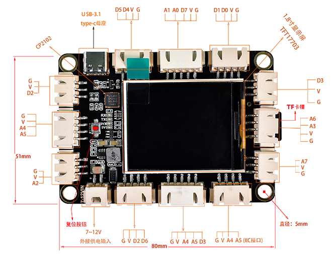

**特殊功能接口说明：**

- 串口通信接口：D0为RX、D1为TX

- PWM接口（脉宽调制）：D3，D5，D6

- 外部中断接口：D2(中断0)和D3(中断1)

- SPI通信接口：D10为DC，D11为MOSI，D12为MISO，D13为SCK

- IIC通信端口：A4为SDA，A5为SCL

---
