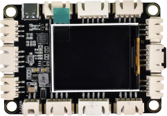

# 主板介绍

**1. 简介：**

在我们开始学习Keyes STEM电子积木传感器高级套件之前，首先介绍开发板，它是所有项目的核心。

这是一款基于Atmega328p的单片机开发板，包含Arduino UNO R3的所有功能，并且在UNO R3主板的基础上，我们做了一些改进，使它的功能更加强大。 在我们进行DIY电子产品实验时，我们经常会用到arduino系列单片机在Arduino IDE开发环境上编程设置。 该开发板是一款完全兼容Arduino IDE开发环境的控制板，开发板上集成了一块1.8寸TFT屏和TF卡槽（用于插入TF卡），便于显示实验内容和储存数据；可搭配丰富的XH2.5接口扩展使用，外围传感器即插即用，开发板上四个螺丝定位孔，可搭配电子积木，完成简单的造型和创意性的实验。

---

**2. 规格参数：**

- 微控制器：ATMEGA328P-AU
- USB转串口芯片：CP2102
- USB输入电压：DC 3.3V-5V
- VIN输入电压：DC 7~12V
- IO输出电流：80mA
- VCC输出最大电流：3A
- 最大功率：15W
- 数字I/O引脚：8个 (D0-D7)
- PWM通道：3个 (D3、D5、D6)
- 模拟输入通道（ADC）：8个 (A0-A7)
- Flash Memory：32 KB（其中引导程序使用0.5 KB）
- SRAM：2 KB (ATMEGA328P-AU)
- EEPROM：1 KB (ATMEGA328P-AU)
- 时钟速度：16MHz
- 工作温度范围：-10℃ ~ +50℃
- 尺寸：80mm * 51mm * 1.6mm

**各个接口和主要元件说明：**

**特殊功能接口说明：**

- 串口通信接口：D0为RX、D1为TX

- PWM接口（脉宽调制）：D3，D5，D6

- 外部中断接口：D2(中断0)和D3(中断1)

- SPI通信接口：D10为DC，D11为MOSI，D12为MISO，D13为SCK

- IIC通信端口：A4为SDA，A5为SCL
