# 产品清单

| 序号 | KE3097| KE3097S | 规格 | 倍用量 |
| ---- | ------------------------ | ------------------------- | ------------------------------ | ------ |
| 1 |  | |主板| 1 |
| 2 | 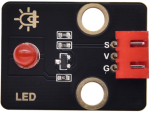 |  | 红色LED模块 | 1 |
| 3 | 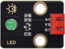 |  | 绿色LED模块 | 1 |
| 4 |  | 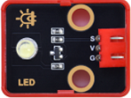 | 黄色LED模块 | 1 |
| 5|  |  | 有源蜂鸣器模块 | 1 |
| 6 |  | 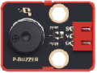 | 无源蜂鸣器模块| 1 |
| 7 |  |  | 自锁按键模块  | 1 |
| 8 |  |  | 人体红外热释传感器 | 1 |
| 9 |  |  | 避障传感器 | 1  |
| 10 | 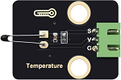 |  | NTC-MF52AT模拟温度传感器 | 1 |
| 11|  |  | 光敏传感器  | 1 |
| 12 |  |  | 声音传感器  | 1 |
| 13 |  | 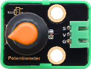 | 旋转电位器  | 1 |
| 14 |  | 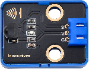 | 红外接收模块  | 1  |
| 15 | 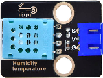 | 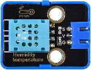 |XHT11温湿度传感器(兼容DHT11)| 1 |
| 16 | 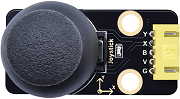 |  | 摇杆模块  | 1  |
| 17 | 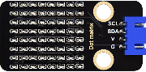 |  | HT16K33_8X8点阵模块  | 1  |
| 18 |  |  | TM1650四位数码管模块 | 1 |
| 19 |     |   | HC-SR04超声波传感器  | 1 |
| 29 | 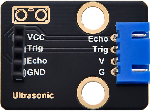 |  | 超声波转接模块 | 1  |
|21 |  |  | 电容触摸模块  | 1 |
| 22 |  |  | 130电机模块  | 1 |
| 23 | 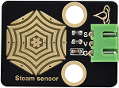 |  | 水滴传感器  | 1  |
| 24 |   |   | 舵机驱动模块  | 1  |
| 25 | 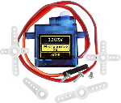  |    | 舵机 配十字臂  | 1 |
| 26 | 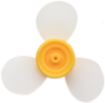 ||风扇叶|1|
| 27 |  |  | 遥控器  | 1 |
| 28 |   |    | USB线   | 1  |
| 29 |   |    | 3P线 (反向)| 5|
| 30 |   |    | 4P线 (反向)  | 3 |
| 31 |   |    | 5P线 (反向) | 2|
| 32|   |    | 一字螺丝刀 | 1  |
| 33 |     |      | TF卡  | 1      |
|34 |     |      | 读卡器  | 1      |
| 35 |     |      | 电池盒  | 1      |
|36 |     |      | AA(5号)电池(不提供，自备)  | 6 |

